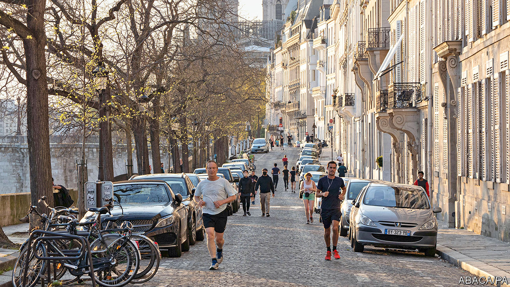

## Rush-hour runners

# The curious etiquette of jogging in Paris

> Sweaty people in shorts are everywhere. Philosophers disapprove

> Apr 23rd 2020PARIS

Editor’s note: The Economist is making some of its most important coverage of the covid-19 pandemic freely available to readers of The Economist Today, our daily newsletter. To receive it, register [here](https://www.economist.com//newslettersignup). For our coronavirus tracker and more coverage, see our [hub](https://www.economist.com//coronavirus)

FIRST THE Paris town hall shut the city’s gyms, on national orders. Next it locked the parks and closed riverside paths. Then it banned running during the day, between 10am and 7pm. This latest ruling was designed to separate joggers from daytime shoppers queuing for essentials on the city’s narrow pavements. But the result has been an evening rush hour, as joggers emerge from confinement all at the same time to squeeze in a run before supper.

Paris has imposed some of Europe’s tightest rules on outdoor exercise. In Amsterdam or Berlin joggers can run when they like, so long as they respect social distancing. In most regions Italians can go jogging, even if just in a tight circle around their homes. Only Spain has enforced truly drastic rules, having banned all outdoor exercise (and kept children inside for the past six weeks).

Has confinement revealed a hitherto hidden French passion for le jogging? A poll suggests that in normal times only 10% of the French go running regularly. A mere 6m people belong to a gym in France, well below the 11m in Germany or 10m in Britain. Parisians are expected to be shaped by nature, not machines. During lockdown some improbably dressed joggers have been spotted pounding the streets, complete with the occasional jaunty silk scarf.

When in 2007 Nicolas Sarkozy broke with the formality of presidential tradition by leaving the Elysée palace in running shorts, one commentator linked it to his politics: “Jogging is of course about performance and individualism, values that are traditionally ascribed to the right.” Purists deplored the casual look. Intellectuals sniffed at the vulgarity. Jogging, said Alain Finkielkraut, a philosopher, did nothing for the soul or the mind; it was mere “body management”. Instead he praised la promenade, as practised by Aristotle or Rimbaud. A meditative walk, argued Mr Finkielkraut, is a “sensitive, spiritual experience”. Perhaps this explains the Paris rules. For now, daytime jogging may be banned, but people can still walk—even if only for an hour, around their homes—at any time of the day. Whatever they are thinking.

Dig deeper:For our latest coverage of the covid-19 pandemic, register for The Economist Today, our daily [newsletter](https://www.economist.com//newslettersignup), or visit our [coronavirus tracker and story hub](https://www.economist.com//coronavirus)

## URL

https://www.economist.com/europe/2020/04/23/the-curious-etiquette-of-jogging-in-paris
