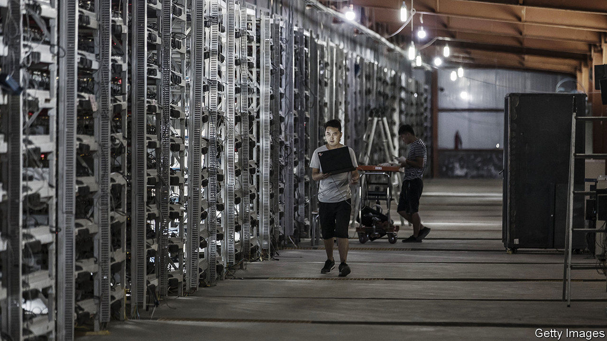

## Virtually money

# China aims to launch the world’s first official digital currency

> Little by little, the central bank will acquire more power to track how money is used

> Apr 23rd 2020SHANGHAI

CENTRAL BANKS have had a busy pandemic. Along with injecting vast amounts of money into the financial system, they have cleaned vast amounts of it—literally. From America to South Korea, central banks have quarantined and disinfected potentially contaminated banknotes. This hassle should make them all the more interested in a digital-currency pilot now under way in China. If successful, it could change how central banks manage both liquidity and physical cash.

Dozens of central banks have started looking at whether to issue digital currencies. But only a few have run trials and none has gone as far as China, which appears set to become the first country to put a central-bank digital currency (CBDC) into limited use. China’s four largest commercial banks began internal tests this month. The city of Suzhou will give some to government employees next month to cover transportation costs, according to state media. Citic Securities, a brokerage, forecast on April 16th that China would formally launch the digital yuan later this year.

China began exploring the concept in 2014 because of the technological upheaval in its financial system. A decade ago it was cash-dominated; last year mobile transactions reached 347trn yuan ($49trn), accounting for four of every five payments. An official digital currency could help address a risk from this transition. Were mobile-payment systems to fail or a crisis to erupt, people might want cash. But there is less and less of it in circulation. Enter the CBDC: people could move into “official” digital money in central-bank-authorised mobile wallets. They would also be able to transfer cash even when offline—for instance, via Bluetooth. A screenshot of one mobile wallet in testing recently spread online. It looked sufficiently reassuring, showing an image of a one-yuan note stamped with a central-bank serial number.

But the bigger prize for China is the new powers that would come with a CBDC. China’s version will be a centralised currency, rather like the anti-bitcoin. Officials will be able to track all digital cash in circulation, making it much harder to launder money or evade taxes. The central bank could also use coding to control how the money is used. For example, if it issues CBDC to a commercial bank for lending on to small businesses, it could ensure that the money is activated only once transferred to a small firm. And China might find it easier to make nominal interest rates negative: cash would no longer be an alternative to bank deposits because negative interest rates could apply to digital cash itself.

These powers are still some way off. Given the risks inherent to such a transformation, China will phase in the CBDC very gradually. Citic Securities estimates that it will take several years for the digital yuan to replace just about 10% of all physical cash in China. For now central banks must continue to worry about money-laundering—both illegal and antiviral.■

## URL

https://www.economist.com/finance-and-economics/2020/04/23/china-aims-to-launch-the-worlds-first-official-digital-currency
