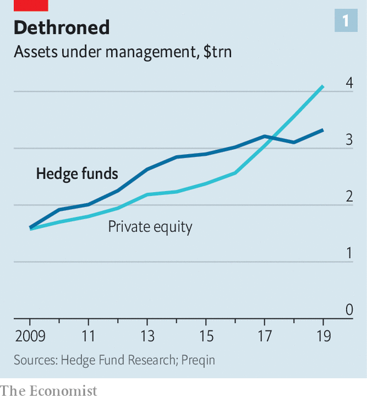
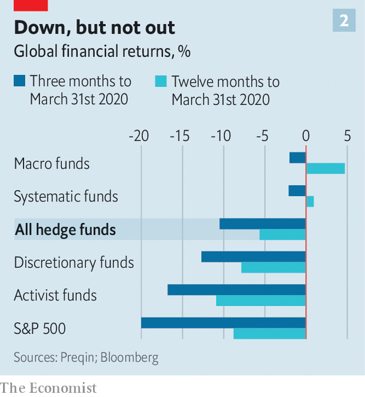

## Back in the game

# Hedge funds hope the slump will make them relevant again

> Seismic shifts in capital allocation have contributed to a rotten decade

> Apr 25th 2020NEW YORK

Editor’s note: The Economist is making some of its most important coverage of the covid-19 pandemic freely available to readers of The Economist Today, our daily newsletter. To receive it, register [here](https://www.economist.com//newslettersignup). For our coronavirus tracker and more coverage, see our [hub](https://www.economist.com//coronavirus)

HEDGE FUNDS have had a rotten decade. Star managers were once perceived to be infallible “masters of the universe” who made money for wealthy individuals and big institutional investors in both good times and bad. But steep losses during the global financial crisis of 2007-09 tarnished that reputation, and subsequent returns have failed to resurrect past success. The result has been a humbling comedown. Many of the hedge-fund industry’s biggest names—like Leon Cooperman, who ran Omega Advisors, and Eric Mindich, once the youngest-ever partner at Goldman Sachs—have thrown in the towel, returned investors’ capital and converted their hedge funds into family offices.

These woes have been exacerbated by seismic shifts in the allocation of capital. As hedge-fund profits wilted, institutional investors—such as pension funds and university endowments, which make up the bulk of hedge funds’ clientele—saw little reason to pay meaty fees for mediocre performance. Investors turned to cheap index funds instead, or sought out the juicier returns dangled by private-equity and property funds. Having managed more capital than their private-equity peers for much of the past decade, by 2019 the hedge-fund industry was a fifth smaller than private equity (see chart 1). Index funds, or “passive” investors, have eclipsed both. The Bank for International Settlements, a club of central banks, estimates that almost half of the roughly $30trn invested in American equities is now passively managed.

Hedge-fund managers have long warned that these trends in investment allocation might pan out poorly for investors in a crisis. The financial-market chaos wrought by the pandemic has tested that claim, and hedge funds have been vindicated, though only partially. They have not made big gains. And they have experienced outflows: figures released by Hedge Fund Research on April 22nd suggest that these amounted to 1% of assets under management in the first quarter. Still, they have, so far, lost less than the market. And there are early signs that the crisis could benefit the industry in the longer term, if it causes investors to appreciate the benefits of hedging their equity exposure, and to shift away from illiquid assets.

How you think hedge funds have performed during the market turmoil depends on how stern a test you apply. If you think their purpose is to make steady returns, regardless of how markets fare, then most have failed. On average, the value of their portfolios has fallen by 10.5% (see chart 2). But they have at least beaten the market: the S&P 500 fell by 20% in the first three months of the year. True, average annualised returns of the S&P 500 in the past five years, at 4.6%, still beat those of the average hedge fund, at 3%. But the goal for most institutional investors is not to achieve the juiciest returns; it is to generate good returns that are steady and low-risk. If hedge funds beat the market during times of stress, they become a source of portfolio diversification that is useful to endowments and pension schemes.

By and large, machines have done better than humans. Around a third of hedge-fund assets are managed in so-called “systematic” funds, which write investment rules based on historical-data analysis and use algorithms to execute trades. On average, these have done best: systematic investors have seen the value of their assets slip by only 2.1% this year. The Medallion fund, the flagship fund run by Renaissance Technologies and set up by Jim Simons in 1988, was up by 24% in March. By contrast, discretionary funds, which are run by human managers picking and choosing trades, are down by 12.7%.

Systematic-fund managers offer a few explanations for their better relative performance. Carter Lyons of Two Sigma, one such fund, claims that systematic investments have done well because they can diversify more. “A systematic fund may take several thousand positions, whereas a discretionary manager may only have 100.” That helps keep systematic portfolios’ losses down when markets are tumbling. Others claim that consistency has helped. “The great thing about systematic processes is that they stick to their knitting,” says Luke Ellis, the chief executive of Man Group, the third-biggest hedge-fund manager in the world. Some of its discretionary funds have done well, but its best performing ones have been systematic.

Some bets have come off better than others. Macro strategies, which place bets on economic developments, have fared best on average, down just 2%. But Bridgewater Associates, a big macro fund, has done poorly, brought down by its risk-parity strategy (see [article](https://www.economist.com//finance-and-economics/2020/04/25/how-risk-parity-investment-strategies-unravelled)).

At the bottom of the heap are activist funds, which buy stakes in companies in the hope of changing their strategies or management. These were down 16.8% on average at the end of March. Activists may have suffered as a result of loading up on shares at lofty valuations earlier in the year. According to Lazard, an investment bank, activists deployed $2.8bn of capital per week in February. With corporate deals off the table and shareholder meetings postponed, they might spy fewer opportunities to take on company bosses.

Varied though their performance has been, hedge funds still look appealing when compared with many private-equity funds. The pandemic seems likely to pose the most financial danger to highly leveraged businesses—precisely the type of firm that private-equity funds tend to invest in. Buy-out firms themselves do not disclose returns, but some of their investors—like banks—must. This month one of America’s largest lenders admitted to writing down its private-equity investments by 20% in the first quarter.

Another drawback of private equity may prove to be its illiquidity. Pension funds and university endowments have outgoings that are more or less fixed. Stable cash flows in normal times meant that they became more comfortable with illiquid assets. Few will be prepared for a situation in which the economy is shuttered and pension contributions and tuition payments dry up. Large institutional investors might face an unprecedented need for cash.

It is still too soon to know which funds will navigate the crisis best, let alone how the pandemic will reshape investment decisions in the longer term. “Returns in March will end up being just one piece of the puzzle,” says Mr Ellis. Many investors claim they are using the turmoil to make long-term bets that may not have lifted returns yet. But the early signs are that hedge funds might not come out too badly. The pendulum seems likely to swing back towards holding liquid assets, and hedge funds appear to be doing well enough that they might benefit from the reallocation.

If hedge funds were once a flashy way to generate extra returns for rich individuals, they have since become more pedestrian—reliable sources of diversification for big institutional investors. In turbulent times, perhaps that is enough. ■

Dig deeper:For our latest coverage of the covid-19 pandemic, register for The Economist Today, our daily [newsletter](https://www.economist.com//newslettersignup), or visit our [coronavirus tracker and story hub](https://www.economist.com//coronavirus)