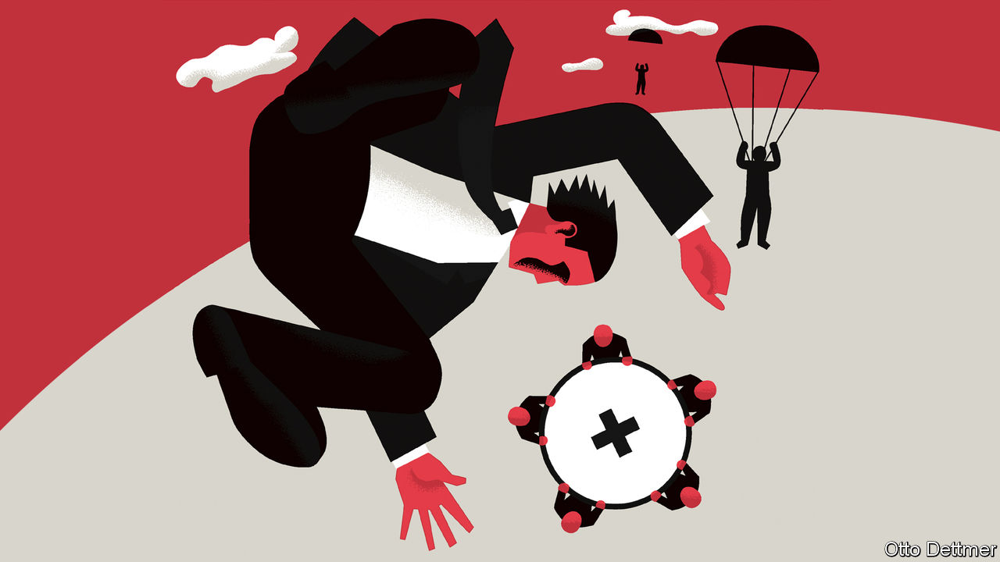

## Free exchange

# How to think about moral hazard during a pandemic

> Economists are rightly relaxed about the risks for now

> Apr 25th 2020

Editor’s note: The Economist is making some of its most important coverage of the covid-19 pandemic freely available to readers of The Economist Today, our daily newsletter. To receive it, register [here](https://www.economist.com//newslettersignup). For our coronavirus tracker and more coverage, see our [hub](https://www.economist.com//coronavirus)

COVID-19 CONFRONTS humanity with a host of testing moral decisions. When hospital capacity is limited, which patients should get access to life-saving equipment? For how long should virus-limiting restrictions on public activity remain in place, given the immense cost of such measures? To this list, some add another: how generous should public assistance to struggling households and firms be, when such aid could encourage the abuse of state-provided safety-nets? Worries like these, concerning what social scientists call moral hazard, have been relatively muted during the pandemic, and appropriately so. But hard questions about risk and responsibility cannot be put off for ever.

Moral hazard describes situations in which the costs of risky behaviour are not entirely borne by those responsible for that behaviour, so encouraging excessive risk-taking in the future. A fire-insurance policy, for example, might lead homeowners to behave more recklessly—say, by not changing the batteries in their smoke detectors—because the cost of any damage is partly covered by the insurer. Moral-hazard worries often arise during crises, when governments face pressure to save struggling institutions for the sake of the economy as a whole. Overly generous support for teetering banks might limit the short-term cost of a crisis but could lead to more risk-taking and worse crises in the future, if financiers bet that the government will save their skins again the next time. Walter Bagehot, a former editor of this newspaper, coined his famous rule for lenders of last resort—to lend freely against good collateral in times of crisis, but at a penalty rate—in an effort to balance these competing concerns.

Rarely has the scope for moral hazard seemed as massive as now. To slow the spread of covid-19, countries have shuttered much of their economies. And in order to prevent lost sales and jobs from translating into spikes in bankruptcies and poverty, governments have pumped huge amounts of aid to households and firms. Economists at the IMF reckon that governments across advanced economies could run fiscal deficits that, on average, exceed 10% of GDP in 2020. America’s deficit is projected to widen to as much as 15% of GDP. On top of direct spending measures, many countries have made available a vast amount of loans and loan guarantees. Rich countries have also extended assistance to others, by allowing some poor countries to delay their debt payments, for example.

Central banks, too, have acted. For the first time, America’s Federal Reserve is buying risky high-yielding debt and bonds issued by state and local governments. It has done so in order to prevent markets from seizing up and leading to cascading defaults and economic catastrophe. But its involvement in new markets could shift perceptions of risk in the future. Lending standards for some debt securities had already deteriorated in the years before the pandemic. The possibility of a standing Fed backstop could lead to far more borrowing on dubious terms. State governments facing long-term budget crunches may tackle those problems with less urgency in the expectation of Fed help, increasing the cost of any future default or bail-out. Robert Kaplan, president of the Federal Reserve Bank of Dallas, has expressed concern that the Fed’s extraordinary actions could let institutions that had borrowed recklessly before the pandemic off the hook. Similar worries have arisen in other contexts. A handful of Republican senators, for instance, have fretted that more generous unemployment-insurance payments could create a mob of workers eager to be laid off.

Economists, though, have been remarkably relaxed about the risks of moral hazard from pandemic-fighting measures, for a number of reasons. For a start, these policies shield people and institutions from the full costs of the pandemic by design. Without them, people and firms might try to get by as they normally do, spreading the virus and prolonging the outbreak. Timing matters, too. Preventing economic devastation and market panic as lockdowns were imposed required massive, urgent action. Interventions crafted to minimise moral hazard—by directing help to the most deserving individuals and firms, and closely monitoring their actions to detect and stop bad behaviour—would have distributed aid too slowly, and stingily, to avert catastrophic economic harm.

Moreover, moral-hazard worries apply to risks that may reasonably be reduced—by putting batteries in the smoke detector, say. Even the most prudent firm or household, though, would struggle to withstand a shock that deprives them of nearly all their income for months on end. Assistance in these times is less likely to distort future behaviour than are bail-outs during more mundane periods of hardship. Governments can claim that the help is a one-off, warranted by an unprecedented disaster.

Questions of moral hazard cannot be put off for ever, though. Some will become more pressing as the pandemic ebbs. Economies will need plenty of support to recover. Aid at that point will have to be crafted carefully in order to provide reasonable assistance while also establishing when special, pandemic-era rules no longer apply. If some guarantees or public assistance cannot be rolled back, new oversight and regulatory capacity might be needed to prevent bad behaviour.

In the years after the pandemic, even harder choices loom. Covid-19 may seem a uniquely devastating and global disaster. But the threat posed by climate change means that such extraordinary natural calamities might not be so infrequent. It might thus become harder for governments to credibly declare that aid provided during such disasters is a one-off, as is needed to discourage reckless behaviour and to stop dangerous risks from accumulating. Governments are right to help without hesitation now, but the years ahead will force societies to demand more personal, and collective, responsibility. ■

Dig deeper:For our latest coverage of the covid-19 pandemic, register for The Economist Today, our daily [newsletter](https://www.economist.com//newslettersignup), or visit our [coronavirus tracker and story hub](https://www.economist.com//coronavirus)