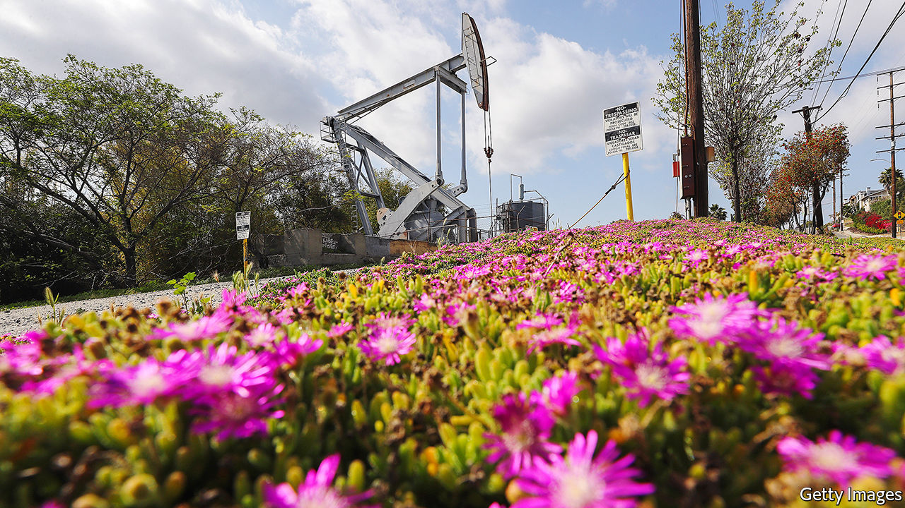
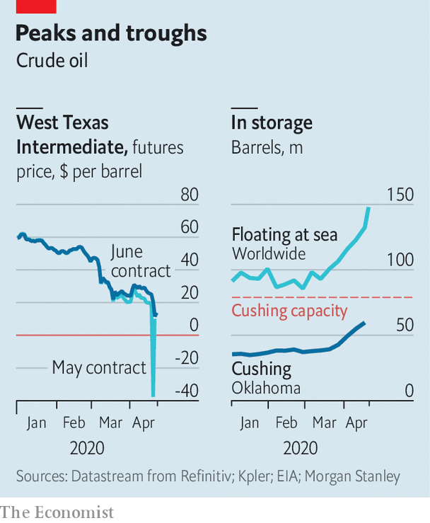

## Tick tock

# Oil markets have a timing problem

> As crude inventories rise, so does the pressure on the market

> Apr 25th 2020NEW YORK

Editor’s note: The Economist is making some of its most important coverage of the covid-19 pandemic freely available to readers of The Economist Today, our daily newsletter. To receive it, register [here](https://www.economist.com//newslettersignup). For our coronavirus tracker and more coverage, see our [hub](https://www.economist.com//coronavirus)

FOR MORE than a century, oil has been among the world’s most vital commodities. On April 20th it became less than worthless. The price of the May futures contract for West Texas Intermediate (WTI) crude plunged to the hitherto unfathomable level of -$40. The price of Brent crude, the international benchmark, sank too, before both seemed to recover, with the front-month contracts settling at $13.78 for WTI and $20.37 for Brent on April 22nd. But oil markets still have a timing problem.

As governments try to contain the spread of covid-19, demand for oil has fallen faster and farther than at any point in history. Production has been slower to ebb, so storage tanks are filling up. The Organisation of the Petroleum Exporting Countries (OPEC) and its allies this month announced a historic deal to cut production. On April 20th America’s president, Donald Trump, said his government might buy as much as 75m barrels of crude for America’s strategic reserve. But output is unlikely to drop quickly enough to bring oil markets into balance in May, June or even later this summer. As crude inventories rise, so does the pressure on the market.

The May contract for WTI, though idiosyncratic in some ways, exemplifies the disaster scenario. The contract’s last day of trading was April 21st. The price plunged on April 20th, as traders realised they owned crude to be delivered to Cushing, Oklahoma, in May, but that Cushing would probably have no available tanks to store it.

The pressure on the global market is less extreme, but not entirely dissimilar. On April 12th OPEC and its allies promised to restrain output by 9.7m barrels a day in May and June, their biggest ever cut. The accord was too late, though, to deal with the implosion of demand in April. The International Energy Agency expects oil demand to sink by 29m barrels a day this month, compared with April 2019, equivalent to a third of global supply.

The agreement may be insufficient to deal with continued declines in demand in May, too, not least because the actual cuts are less impressive than the headline suggests. Not all of the more than 20 parties to the deal may comply. Moreover, Saudi Arabia, Russia and others in the group agreed to cut output not from the levels of February, but from an even higher base. The collective cut, compared with February of this year, is therefore closer to 7.5m barrels a day, reckons Bernstein, a research firm.

It is unclear if or when deeper cuts will come. Mr Trump helped broker the OPEC deal—America is now the world’s biggest crude producer—and is weighing further measures to support prices. But any purchase for America’s strategic reserves would require the approval of Congress. Regulators in Texas are mulling a cap on that state’s production, but a meeting on April 21st ended without agreement.

Market-driven declines in production are more likely, particularly after the nightmare of the May WTI contract. But so far companies’ declared cuts have been too tepid: they are often loth to stop production, as restarting a well can be costly. Bernstein therefore expects global supply to exceed demand in the second quarter by more than 13m barrels a day.

In the meantime, storage across America is filling up rapidly, and could reach tank tops in June. On April 22nd the country’s Energy Information Administration reported that crude inventories had reached 519m barrels, close to the record of 535m set in 2017. Brent crude is seaborne and therefore less vulnerable to transport and storage problems than landlocked WTI. But it too faces constraints. The volume of oil stored on ships has jumped by 70% since the beginning of March, according to Kpler, a market-data firm. And even more oil is borne on ships still steaming towards onshore crude tanks, which Reid I’Anson of Kpler estimates are already about 85% full.

Unprecedented circumstances are bringing unprecedented behaviour. Oil is usually stored in giant ships such as a Suezmax, or the aptly named Very Large Crude Carrier, or onshore near big ports or population centres, such as Rotterdam or New York. Ben Luckock of Trafigura, a big trader, says firms such as his are now considering rail cars, small barges or even parked trucks. The price of a contract for a major crude benchmark may not sink again to -$40. But as inventories rise, oil markets continue to test the realm of possibility. ■

Dig deeper:For our latest coverage of the covid-19 pandemic, register for The Economist Today, our daily [newsletter](https://www.economist.com//newslettersignup), or visit our [coronavirus tracker and story hub](https://www.economist.com//coronavirus)

## URL

https://www.economist.com/finance-and-economics/2020/04/25/oil-markets-have-a-timing-problem
