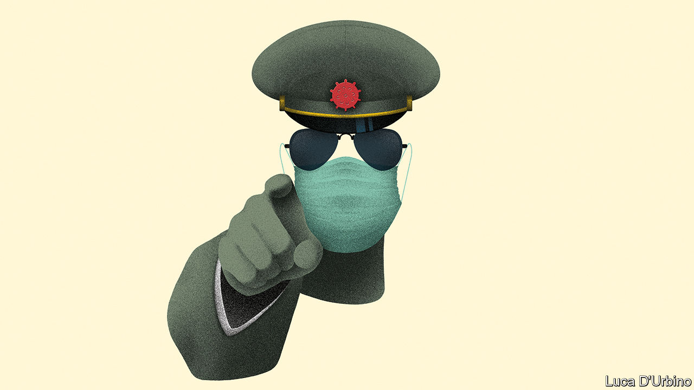

## A pandemic of power grabs

# Autocrats see opportunity in disaster

> The world is distracted and the public need saving. It is a strongman’s dream

> Apr 23rd 2020

Editor’s note: The Economist is making some of its most important coverage of the covid-19 pandemic freely available to readers of The Economist Today, our daily newsletter. To receive it, register [here](https://www.economist.com//newslettersignup). For our coronavirus tracker and more coverage, see our [hub](https://www.economist.com//coronavirus)

ALL THE world’s attention is on covid-19. Perhaps it was a coincidence that China chose this moment to tighten its control around disputed reefs in the South China Sea, arrest the most prominent democrats in Hong Kong and tear a hole in Hong Kong’s Basic Law (see [article](https://www.economist.com//china/2020/04/23/china-moves-to-squeeze-hong-kongs-freedoms)). But perhaps not. Rulers everywhere have realised that now is the perfect time to do outrageous things, safe in the knowledge that the rest of the world will barely notice. Many are taking advantage of the pandemic to grab more power for themselves (see [article](https://www.economist.com//international/2020/04/23/would-be-autocrats-are-using-covid-19-as-an-excuse-to-grab-more-power)).

China’s actions in Hong Kong are especially troubling. Since Britain handed the territory back to China in 1997, Hong Kong has been governed under the formula of “one country, two systems”. By and large, its people enjoy the benefits of free speech, free assembly and the rule of law. Foreign firms have always felt safe there, which is why Hong Kong is such an important financial hub. But China’s ruling Communist Party has long yearned to crush Hong Kong’s culture of protest. Article 22 of the Basic Law (a kind of mini-constitution) bans Chinese government offices from interfering in Hong Kong’s internal affairs. That was always understood to include its Liaison Office in Hong Kong. But on April 17th the office, China’s main representative body in the territory, said it was not bound by Article 22. This suggests that it plans to step up its campaign to curtail Hong Kong’s freedoms.

Xi Jinping’s incremental power grab in Hong Kong is one of many. All around the world, autocrats and would-be autocrats spy an unprecedented opportunity. Covid-19 is an emergency like no other. Governments need extra tools to cope with it. No fewer than 84 have enacted emergency laws vesting extra powers in the executive. In some cases these powers are necessary to fight the pandemic and will be relinquished when it is over. But in many cases they are not, and won’t be. The places most at risk are those where democracy’s roots are shallow and institutional checks are weak.

Take Hungary, where the prime minister, Viktor Orban, has been eroding checks and balances for a decade. Under a new coronavirus law, he can now rule by decree. He has become, in effect, a dictator, and will remain so until parliament revokes his new powers. Since it is controlled by his party, that may not be for a while. Hungary is a member of the European Union, a club of rich democracies, yet it is acting like Togo or Serbia, whose leaders have just assumed similar powers on the same pretext.

Everywhere people are scared. Many wish to be led to safety. Wannabe strongmen are grabbing coercive tools they have always craved—in order, they say, to protect public health. Large gatherings can be sources of infection; even the most liberal governments are restricting them. Autocrats are delighted to have such a respectable excuse for banning mass protests, which over the past year have rocked India, Russia and whole swathes of Africa and Latin America. The pandemic gives a reason to postpone elections, as in Bolivia, or to press ahead with a vote while the opposition cannot campaign, as in Guinea. Lockdown rules can be selectively enforced. Azerbaijan’s president openly threatens to use them to “isolate” the opposition. Relief cash can be selectively distributed. In Togo you need a voter ID, which opposition supporters who boycotted a recent election tend to lack. Minorities can be scapegoated. India’s ruling party is firing up Hindu support by portraying Muslims as covid-19 vectors.

Fighting the virus requires finding out who is infected, tracing their contacts and quarantining them. That means more invasions of privacy than people would accept in normal times. Democracies with proper safeguards, like South Korea or Norway, will probably not abuse this power much. Regimes like China’s and Russia’s are eagerly deploying high-tech kit to snoop on practically everyone, and they are not alone. Cambodia’s new emergency law places no limits on such surveillance.

False information about the disease can be dangerous. Many regimes are using this truism as an excuse to ban “fake news”, by which they often mean honest criticism. Peddlers of “falsehood” in Zimbabwe now face 20 years in prison. The head of a covid-19 committee under Khalifa Haftar, a Libyan warlord, says: “We consider anyone who criticises to be a traitor.” Jordan, Oman, Yemen and the United Arab Emirates have banned print newspapers, claiming that they might transmit the virus.

Judging by what has already been reported, power grabbers on every continent are exploiting covid-19 to entrench themselves. But with journalists and human-rights activists unable to venture out, nobody knows whether the unreported abuses are worse. How many dissidents have been jailed for “violating quarantine rules”? Of the vast sums being mobilised to tackle the pandemic, how much has been stolen by strongmen and their flunkeys? A recent World Bank study found that big inflows of aid to poor countries coincided with big outflows to offshore havens with secretive shell companies and banks—and that was before autocrats started grabbing covid-related emergency powers. Better checks are needed.

“Right now it is health over liberty,” says Thailand’s autocratic prime minister, Prayuth Chan-ocha. Yet many of the liberty-constricting actions taken by regimes like his are bad for public health. Censorship blocks the flow of information, frustrating an evidence-based response to the virus. It also lets corruption thrive. Partisan enforcement of social distancing destroys the trust in government needed if people are to follow the rules.

Where does this lead? Covid-19 will make people poorer, sicker and angrier. The coronavirus is impervious to propaganda and the secret police. Even as some leaders exploit the pandemic, their inability to deal with popular suffering will act against the myth that they and their regimes are impregnable. In countries where families are hungry, where baton-happy police enforce lockdowns and where cronies’ pickings from the abuse of office dwindle along with the economy, that may eventually cause some regimes to lose control. For the time being, though, the traffic is in the other direction. Unscrupulous autocrats are exploiting the pandemic to do what they always do: grab power at the expense of the people they govern. ■

Dig deeper:For our latest coverage of the covid-19 pandemic, register for The Economist Today, our daily [newsletter](https://www.economist.com//newslettersignup), or visit our [coronavirus tracker and story hub](https://www.economist.com//coronavirus)