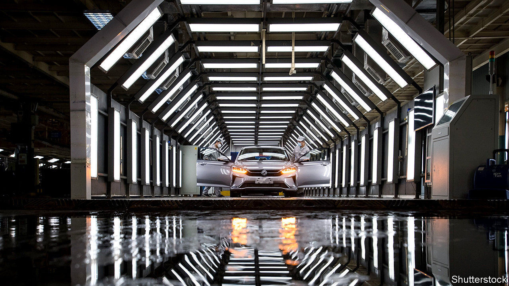
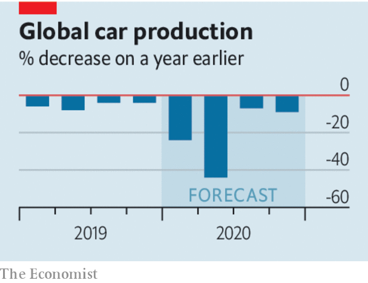

## Pimp the ride

# The car industry faces a short-term crisis and long-term decline

> It can still be viable, with the right fixes

> Apr 25th 2020

EVEN BEFORE the recession, investors were deeply pessimistic about the car industry. Sitting on $1.3trn-worth of legacy investments in factories that rely on a technology that ought to become obsolete—the internal-combustion engine—the likes of Ford, Renault and Volkswagen don’t exactly look well positioned for the 21st century. Now, with car sales collapsing, a dinosaur business that employs 10m people directly faces a moment of truth (see [article](https://www.economist.com//briefing/2020/04/25/the-worlds-car-giants-need-to-move-fast-and-break-things)). Long synonymous with hubris and the inept allocation of capital, it needs to look to the future.

Executives say they are better placed today than in 2008-09, when General Motors and others received bail-outs. Most firms have more cash and bigger margins. But this logic gets them only so far. Production in Europe and North America is now 50-70% lower than a year ago. Car firms have high fixed costs, so when they run below capacity they lose money fast. The top eight Western carmakers could burn over $50bn of cash this quarter, reckons Jefferies, a bank. At that rate, they may run out of money by the end of the year.

There are other dangers. As recession bites, people may default on car loans, many of which are owed to carmakers’ finance arms. The value of second-hand cars is dropping, harming these finance arms through their leasing operations. There may be a permanent fall in commuting, as more people work from home—road-passenger numbers in China are still 57% below their pre-covid level. This prospect helps explain why oil prices have collapsed (see [article](https://www.economist.com//finance-and-economics/2020/04/25/oil-markets-have-a-timing-problem)). Investors are jumpy—on April 17th Ford raised $8bn of debt at painful interest rates of 8.5-9.6%. The only firm that commands their confidence is Tesla, an electric-car specialist, whose shares are up by 64% this year.

Given its carbon footprint, isn’t there an argument for the creative destruction of the car industry? If only it were that simple. Millions of jobs are at risk and the big firms account for about 60% of the industry’s investment, a rising share of which is, belatedly, going into green technologies. Adaptation would be far preferable to extinction. And yet there is a risk that government aid ossifies car firms before they have modernised. State “cash for clunkers” subsidies—which are on the menu in Germany—could encourage consumers to buy dirty, internal-combustion-engine cars. On March 31st America watered down emissions standards in order to help Detroit. Subsidies for idling workers help in the short run, but if they go on for long they risk preventing firms from shifting resources from old to new technologies.

The industry should take control of its own fate. Car firms need to be pioneers in operating factories under new health protocols, from redesigning the choreography of assembly lines to providing health tests for workers. Big Western firms are starting to re-open some plants. This won’t be lucrative, but it will stem short-term losses.

Firms should also avoid slashing investment indiscriminately, as they did in 2007-09 when capital spending dropped by 29%. Most car firms have two parts, a vast legacy operation and a small, loss-making, fast-growing one making hybrid and fully electric cars. The danger is that they cut spending on the new bit, slowing the development of battery technologies and the launch of new electric models. Better to pare dividends, loss-making foreign adventures and legacy investments.

The final priority is consolidation. Too many mid-sized carmakers are clinging to their global aspirations, despite a number of mergers in recent years, such as Geely’s purchase of Volvo and Fiat Chrysler’s planned union with PSA (Fiat’s biggest shareholder owns shares in the parent company of The Economist). The world still has more than 1,000 factories making legacy cars. Renault and Nissan continue their halfway house of an alliance, which brings more complexity than synergy. Adapt, invest in the future and join forces. That is the way to a viable car industry—for the climate, workers and investors, too.■