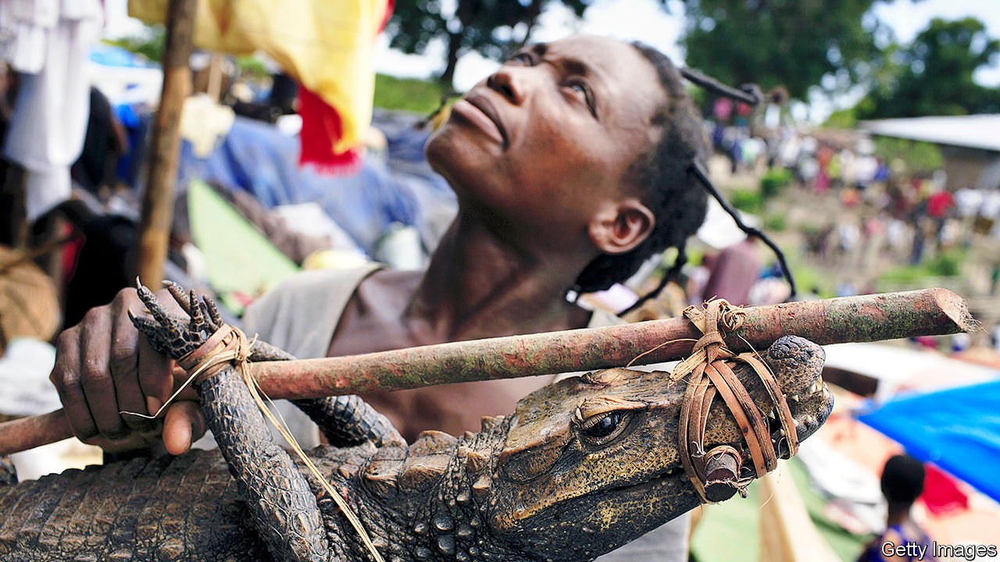

## On wet markets, Thailand, abortion, covid-19, house names, management

# Letters to the editor

> A selection of correspondence

> Apr 23rd 2020

I read your article on the trade in African bush meat (“[A crocodile hunter’s tears](https://www.economist.com//middle-east-and-africa/2020/03/19/the-toils-and-spoils-of-congos-crocodile-killers)”, March 21st). HIV may have been transmitted from chimpanzees to people as a result of bush meat. The SARS epidemic probably jumped from an animal to people in a shop selling traditional Chinese medicines in Guangdong province. These shops often have cages with live animals, such as civet cats and ant-eating pangolins. A million pangolins may have been exported from Africa to China in the past decade, and the pangolin is a possible origin of covid-19.

The Chinese government has closed traditional-medicine shops in Wuhan and elsewhere. They did the same after SARS, but then allowed them to reopen as the number of cases fell. We need an international effort to abolish all trade in exotic mammals and to push back in every way possible against the bush-meat market. Chinese traditional-medicine shops and bush meat expose all of us to lethal animal viruses capable of killing millions, destroying the world economy and threatening the extinction of some species. It needs only a tiny step to stop pandemics before they start.

I was once taken to an African restaurant in Gabon and given roast civet cat and fricassee of pangolin, and yes, you are expected to eat the scales.

MALCOLM POTTSSchool of Public HealthUniversity of California, Berkeley

It is only fair to make those responsible for the outbreak of covid-19 share in the costs. That should motivate a change in attitude that reduces the risk of similar events in the future. One possibility is to tax exports from countries that allow wet markets that trade in wild or exotic animals. Such a tax can be easily avoided if a country can prove that it has closed those markets.

This is not a populist or nationalist proposal. The world must simply change its attitude towards this trade and not let it revert to how it was before the outbreak, which is what happened after SARS.

TORBEN JUNG LAURSENFlensburg, Germany

Regarding your article on Thailand’s handling of covid-19 (“[Sigh-am](https://www.economist.com//asia/2020/04/02/thailands-economy-was-suffering-before-the-virus)”, April 4th), the Thai authorities have been praised for their comprehensive response. Johns Hopkins University ranked Thailand as the sixth-most prepared country in the world for pandemics. Thailand’s economic fundamentals remain strong and should propel further growth after the crisis eases. The government has responded with stimulus packages and relief measures equal to 12% of GDP.

Moreover, it is not correct to say that measures such as the Eastern Economic Corridor (EEC) have been ineffective. Since its launch, the value of investment applications in the EEC has nearly quadrupled, to $22bn in 2018. The total planned investment from 2019 to 2023 is set at around $50bn.

Finally, Thailand’s international standing has become stronger after last year’s elections and our chairmanship of ASEAN. As far as free-trade agreements are concerned, Thailand is pursuing talks with many partners, including the European Union, which has announced its readiness to resume negotiations.

PISANU SUVANAJATAAmbassador of ThailandLondon

I was encouraged to see The Economist report on the increasing access to safe abortions around the world (“[From backstreet to mail-order](https://www.economist.com//international/2020/03/05/abortions-are-becoming-safer-and-easier-to-obtain-even-where-they-are-illegal)”, March 7th). As you noted, “in America abortion is a battleground”. In Australia, however, the issue of providing access to safe abortions is rarely discussed, least of all in Parliament, despite general public support. The issue is particularly relevant as the legislature in Western Australia is currently discussing legislation that would create 150-metre safe-access zones around reproductive-health clinics, making it the second-last Australian state to do so (Tasmania first introduced safe-access zones in 2013).

My hope is that these shielded areas, along with increased access to clinics and work to reduce the stigma of the procedure, will help secure a future where girls (I am 16) and women in my community truly have unimpeded access to safe abortions.

MIA FRASERPerth, Australia

I know of no evidence to support your contention that “the fatality rate in any country will depend primarily on the quality of care it can provide” in treating covid-19 (“[Where will it be the worst?](https://www.economist.com//international/2020/03/12/fatality-rates-for-covid-19-could-vary-enormously)”, March 14th). Rather, it will depend primarily on the immunological resilience of the populations affected, whether weakened by age, chronic disease or malnutrition, and whether or not critical public-health interventions have been adopted. Without virucidal drugs, respiratory support will alter the course of infection in fewer people than we doctors care to admit.

The reality, seldom appreciated by the public, is that health care will play a relatively small part in reducing overall mortality in this as in previous pandemics. Vaccines will in time help damp down the incidence of disease but only long after the first waves have abated. Dismal scientists, using models as fantastical as those of epidemiologists, will attempt to weigh the health benefits of lockdown against its costs in terms of reduced economic productivity, lost public-sector investment and quality of lost life years in a multitude of ways.

The National Health Service, the central pillar of Britain’s welfare state, symbolises collective endeavour. All health systems form part of the fabric of civic life. They reinforce societal norms through the personal experiences of providers and users. This strengthening of communal bonds and mutual responsibility may, for all we know, be as salutogenic as the biomedical interventions that health services have to offer.

DR STEPHEN GILLAMHolt, Norfolk

Looking at covid hotspots reminds me of a dialogue from Daniel Defoe’s “A Journal of the Plague Year”, in which the narrator’s brother tries to persuade him to flee plague-stricken London, over his objections that his business would suffer. “Is it not as reasonable,” the brother asks, “that you should trust God with the chance or risque of losing your trade, as that you should stay in so imminent a point of danger, and trust him with your life?”

AUGUSTUS HANEYNew York

Just to add to readers’ letters on naming houses in Britain ([March 28th](https://www.economist.com//letters/2020/03/26/letters-to-the-editor)), arriving in St Andrews to take up a post at the university in the 1960s, and being informed by the town council that it would not supply his house with a number, but require him to choose a name for it, a young don erected the following sign: High Entropy.

ANDREW DAWSONWorcester

The “[Hard choices](https://www.economist.com//briefing/2020/04/04/the-hard-choices-covid-policymakers-face)” (April 4th) being made because of the pandemic, and the methods used to assess the likely path of the disease, sound like an adage familiar to any risk manager: all models are wrong, but some are useful.

CHRIS MATTENLondon

## URL

https://www.economist.com/letters/2020/04/23/letters-to-the-editor
