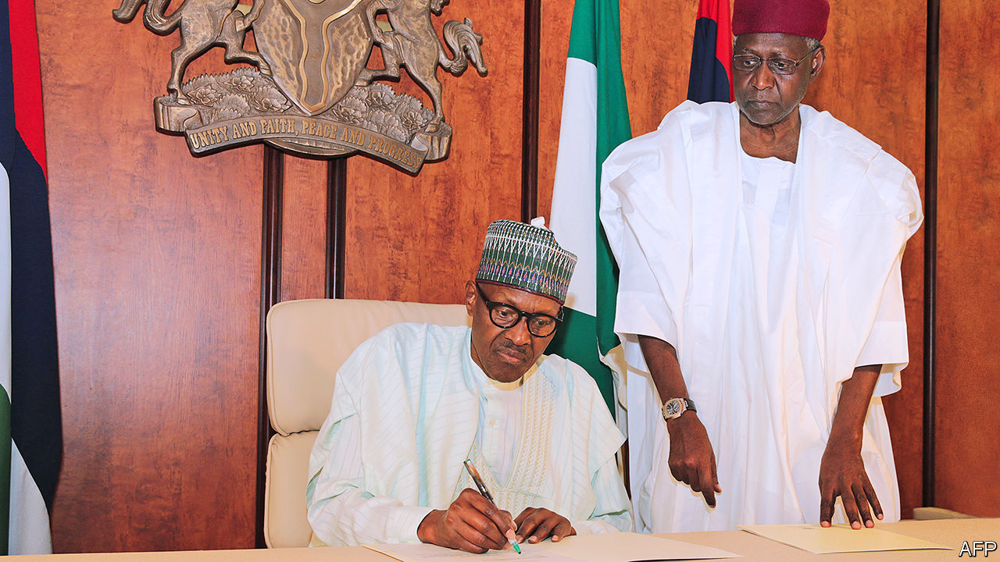

## The parable of the bag of cash

# Abba Kyari, who tried to clean up Nigeria, dies of covid-19

> The president’s chief of staff was dismayed by the state’s decay

> Apr 23rd 2020

Editor’s note: The Economist is making some of its most important coverage of the covid-19 pandemic freely available to readers of The Economist Today, our daily newsletter. To receive it, register [here](https://www.economist.com//newslettersignup). For our coronavirus tracker and more coverage, see our [hub](https://www.economist.com//coronavirus)

IT WAS A rare display of emotion by Muhammadu Buhari, Nigeria’s phlegmatic president. In a written tribute to Abba Kyari, his chief of staff, who died in Lagos on April 17th after catching covid-19, Mr Buhari told of how his “dearest friend” of more than 40 years tried to improve governance and reduce corruption in Africa’s most populous country. He was “the very best of us”, wrote the president.

While Mr Kyari was alive, others were much less kind. Many saw him as the figurehead for a shadowy cabal that controlled policy and appointments, and granted favours and contracts. Cabinet ministers grumbled that they could not get past his door to discuss important issues with a distant and apathetic president. Mr Kyari’s economic thinking, which seemed stuck in the 1970s, was also criticised.

There was some truth to these accusations. Yet there is also a broader parable of Mr Kyari. It is one of a largely honourable man who went to the heart of a thoroughly corrupt and dysfunctional system, aiming to reform it—but who struggled to overcome its inertia amid a series of crises.

Like his ascetic boss (pictured, seated), Mr Kyari (standing) was a man of modest habits, at least by the standards of Nigeria’s elite. He was known to turn down offers of free upgrades to first class (he thought it vulgar) before taking his seat in business class on British Airways flights. His weaknesses were for books on political economy and plates of well-done kippers at the Dean Street Townhouse in London.

The corruption and decay of Nigeria’s state, and the inequality they bred, dismayed and worried him. Nigeria had to change, he argued. The question was whether it would be through orderly reform or chaotic breakdown.

When seeing your correspondent one evening in Abuja, Mr Kyari pointed to a bag stuffed with $100 bills. It had been “forgotten” by an earlier visitor—the boss of an energy company—who sheepishly came to collect it after getting an earful. “Much too much of our work is spent on stopping our own people stealing,” Mr Kyari said.

The chief of staff, who had studied law at Cambridge University and been in charge of a successful bank before Mr Buhari hired him in 2015, thought the state should play a big role in the economy. He would speak fondly of British Rail in the 1970s before it was privatised (an era of strikes and awful food, as Brits remember it). And he clashed with the IMF when it urged Nigeria to liberalise its fixed exchange rates. But he was, in essence, a pragmatist who thought ideology was a distraction from the bigger tasks of enforcing the rule of law and improving governance.

He was also cursed with bad luck. Mr Buhari took power after a crash in oil prices that pushed the country into recession and starved it of the money needed to fight the jihadists of Boko Haram. Mr Kyari had hoped that Mr Buhari’s second term would provide an opportunity to liberalise the corrupt oil and gas industries by making contracts and licences more transparent and taking them out from under the thumb of politicians. Yet covid-19 may well dash those plans, just as it has deprived Mr Buhari’s administration of its rudder. ■

Dig deeper:For our latest coverage of the covid-19 pandemic, register for The Economist Today, our daily [newsletter](https://www.economist.com//newslettersignup), or visit our [coronavirus tracker and story hub](https://www.economist.com//coronavirus)