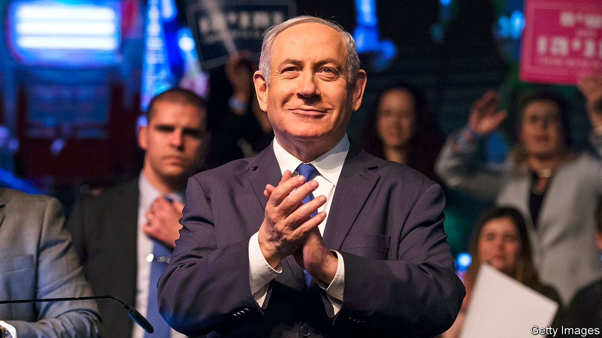

## Bibi wins again

# Israel has a new government at last

> And Binyamin Netanyahu has got most of what he wanted

> Apr 23rd 2020JERUSALEM

COVID-19 HAS caused much misery. But on April 20th it helped end Israel’s political deadlock. After three inconclusive elections in the span of a year, the country’s two biggest parties, Likud and Blue and White, put aside their differences and agreed to form a “national-emergency unity government”. Under the deal, Binyamin Netanyahu, the long-serving prime minister (pictured), remains in the post for another 18 months. Then he will hand over to Benny Gantz, the leader of Blue and White, who will serve as deputy prime minister and defence minister in the meantime.

The agreement was signed just two weeks before the deadline that would have triggered a fourth election. The relief is palpable. According to one poll, only 31% of the public believe that Mr Netanyahu will honour the agreement and make way for Mr Gantz when his time is up. But the alternative—yet another bitter election campaign, while the country is under lockdown and entering a recession—sounded worse. Nearly two-thirds of the public supports the new government, with only about a fifth opposing it.

Entering the coalition talks, Mr Gantz held a strong hand. A majority of lawmakers in the Knesset (Israel’s parliament) endorsed him to be prime minister and he had control of parliamentary business. But his supporters were divided on much else and refused to sit together in government. Some wanted Mr Gantz to threaten Mr Netanyahu, who faces corruption charges, with a law banning indicted politicians from forming a government. He refused, instead signalling that he would break his biggest campaign promise and team up with the prime minister, causing a split in the opposition (and within his own party).

Mr Gantz has tried to put a brave face on his decision. “The sad truth is that an entire country has been paralysed for two years under a caretaker government,” he said, while chastising his former partners for “preferring political victories over winning the battle against coronavirus”.

The prime minister was surely pleased. Mr Netanyahu, who heads a bloc of religious and nationalist parties, is likely to remain the real power in Israel even if he does give up the premiership in November 2021. He commands the allegiance of nearly three-quarters of the governing coalition. One of Mr Gantz’s colleagues will control the justice ministry, ensuring that Mr Netanyahu’s corruption trial proceeds as scheduled on May 24th (virus permitting). But it is expected to drag on—and will certainly be followed by an appeal to the Supreme Court if Mr Netanyahu loses. In the meantime, he has retained the power to veto senior judicial appointments, including those of Supreme Court judges.

The agreement delays any move to annex the occupied territories, as envisaged by President Donald Trump’s peace plan, until July at the earliest. Mr Netanyahu campaigned on moving aggressively; Mr Gantz opposed unilateral annexation. The deal says it should proceed in a way that does not harm Israel’s interests, “including the needs for preserving regional stability, protecting existing peace agreements and aspiring for future ones.” Mr Netanyahu will probably have the final say.

The outbreak of covid-19 has led to more co-operation between Israelis and Palestinians. But annexation of territory that the Palestinians regard as part of their future state would probably kill any hope of a two-state solution to the Israeli-Palestinian conflict and could ignite violence. Mr Netanyahu will obviously want to avoid that, but he may feel he needs to move before November, when his chum Mr Trump may be voted out of office.

At home Mr Netanyahu faces a weak and fragmented opposition. Blue and White has split into four different parties. One of them, Yesh Atid, is led by Yair Lapid, who apologised “to everyone who I convinced over the past year to vote for Benny Gantz and Blue and White. I didn’t believe your votes would be stolen.” Once-dominant Labour, the party of Israel’s founders, is down to three members of the Knesset, two of whom will be joining the government. Mr Gantz, meanwhile, is now bound to protect Mr Netanyahu—or risk not becoming prime minister. ■