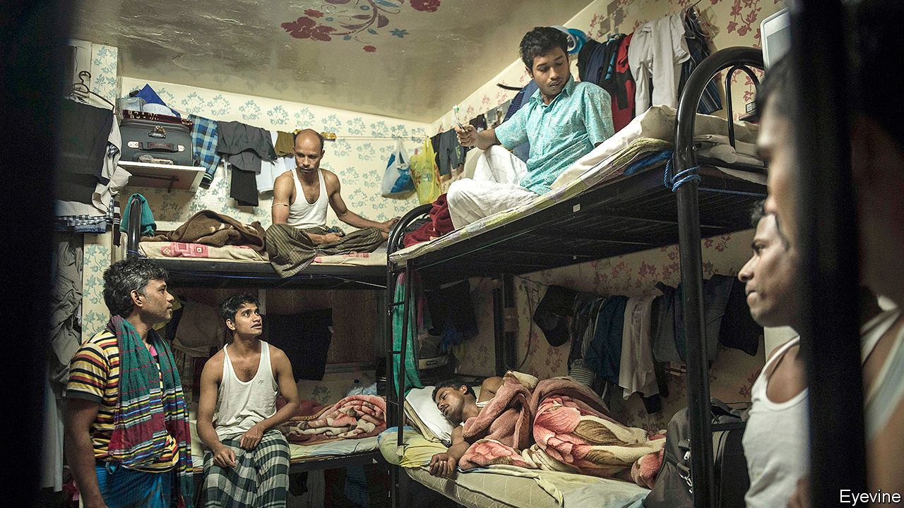
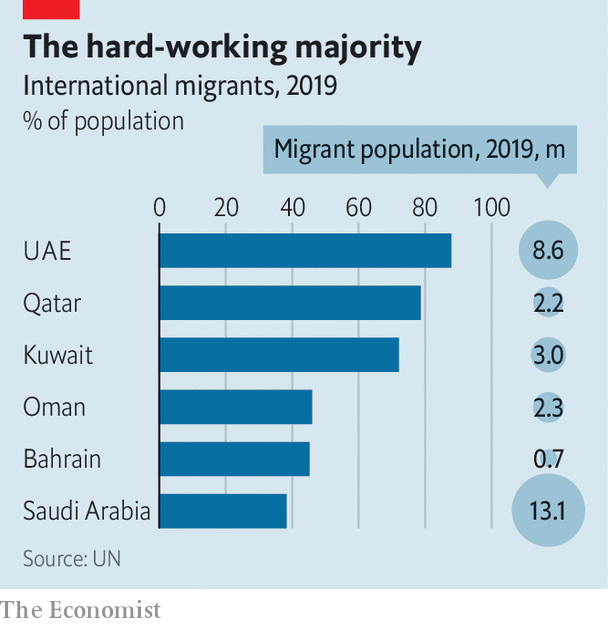

## Covid in the camps

# Migrant workers in cramped Gulf dorms fear infection

> Governments have been slow to help them

> Apr 23rd 2020BEIRUT

Editor’s note: The Economist is making some of its most important coverage of the covid-19 pandemic freely available to readers of The Economist Today, our daily newsletter. To receive it, register [here](https://www.economist.com//newslettersignup). For our coronavirus tracker and more coverage, see our [hub](https://www.economist.com//coronavirus)

FOR WELL-OFF foreigners in Qatar, as in other Gulf states, social distancing is almost a way of life. Comfortable salaries pay for suburban villas or seaside flats; private cars are ubiquitous. For the labourers who make up the bulk of Qatar’s 2.8m people, though, it is all but impossible. In the Industrial Area, a working-class district south-west of Doha, the capital, some residents sleep eight to a room, with scores of men sharing bathrooms and kitchens. Such living conditions are the perfect environment for a virus to spread.

The six members of the Gulf Co-operation Council (GCC) acted early to contain the novel coronavirus. By mid-March most had begun to impose restrictions on movement and travel. But after weeks of slow growth, new cases are rising quickly. Confirmed infections in Saudi Arabia more than doubled in the week from April 14th. Qatar has more cases than Ukraine, which is 16 times more populous. Although GCC governments do not release data on the nationalities of those infected, anecdotal evidence suggests that the virus is spreading fastest among labourers.

Qatar has received most attention. On March 11th it reported 238 cases of the virus in a single residential compound in the Industrial Area, home to more than 360,000 people. It sealed off dozens of streets, an area of nine square kilometres (3.5 square miles). Workers, put on leave, were allowed out only to buy food or other essentials.

State media in Saudi Arabia and the United Arab Emirates (UAE), which have been in a diplomatic spat with Qatar since 2017, enthusiastically covered the outbreak as proof of Qatari callousness. But the situation is the same in other Gulf states. The Saudi health ministry said on April 5th that 53% of confirmed cases involved foreigners. The share is probably higher now: migrants account for about four in five recent cases. The holy city of Mecca, with a large population of foreigners, has more confirmed infections than Riyadh, a city three times the size. Doctors in the UAE report a similar trend among migrants.

Governments have taken some laudable steps. Testing is free for labourers, and health ministries have been serious about expanding it. Qatar has carried out 70,000 tests. The UAE is doing more than 25,000 a day. Most countries have also pledged to pay for covid-19 treatment regardless of the patient’s nationality. But they have done far less about the teeming environments in which millions of migrants live and work.

Almost everything in Dubai is closed. Anyone leaving home must apply for a permit granted for a few essential purposes. Only one family member may travel; speed cameras on the highways are used to catch outlaws. Construction workers are exempted from the lockdown, however. They pile onto buses to and from job sites. Contractors have limited the number of passengers, but it is hard to keep two metres apart. Workers on Qatar’s football World Cup stadiums and Dubai’s World Expo facilities have been diagnosed with the virus.

Other workers have the opposite problem. Entire sectors of the economy, from hospitality to retail, are closed. Thousands of employees have already been dismissed or furloughed. Their numbers will grow: migrants are the first to lose their jobs during a downturn. The IMF’s latest forecast is a 2% contraction in Saudi Arabia this year and 4% in Bahrain, Qatar and the UAE. It was released before the recent meltdown in oil markets, so even those numbers may prove too rosy. Charities are already answering calls from migrants who struggle to afford food.

Gulf states would like to send the newly unemployed home. But their home countries are not always eager to take back (and quarantine) thousands of jobless citizens. India, which supplies millions of workers to the Gulf, went into lockdown on March 25th and halted all commercial flights. It says it cannot bring back all its citizens until the measures end, no earlier than May 3rd. The UAE’s labour ministry has threatened to limit the number of future work visas for countries that “have not been responsive” about repatriating their citizens. Ethiopia is quietly grumbling about a wave of deportations from Saudi Arabia.

State media have tried to downplay any discrimination. One gauzy ad from the UAE tells foreigners that they are part of a “family” of 10m. But some prominent figures have denounced migrants as a vector for disease. Hayat al-Fahad, a Kuwaiti actress, said in a television interview that the country was “fed up” with the foreigners who make up two-thirds of the population and suggested putting them in the desert. An Emirati social-media personality defended her comments by explaining that she only meant Asian labourers: “Do you expect that we…equate a Bengali worker with an Egyptian worker? God forbid!” (Many Gulf citizens criticised both their remarks.)

The social contract in the GCC has always been transactional. Foreigners are paid more than they would earn in their home countries. Even unskilled labourers toiling in the heat make enough to send back remittances. In return they accept a state of permanent transience. Residency is tied to employment: no matter how long you work in the Gulf, you will probably have to leave once you cease being useful. Even wealthy expats are being reminded that they are outsiders. Many of those who happened to be travelling when the lockdown began now cannot get back to their homes in Qatar or Dubai. Some are separated from spouses or parents. Far from bringing people together, the virus underscores how far apart they are. ■

Dig deeper:For our latest coverage of the covid-19 pandemic, register for The Economist Today, our daily [newsletter](https://www.economist.com//newslettersignup), or visit our [coronavirus tracker and story hub](https://www.economist.com//coronavirus)