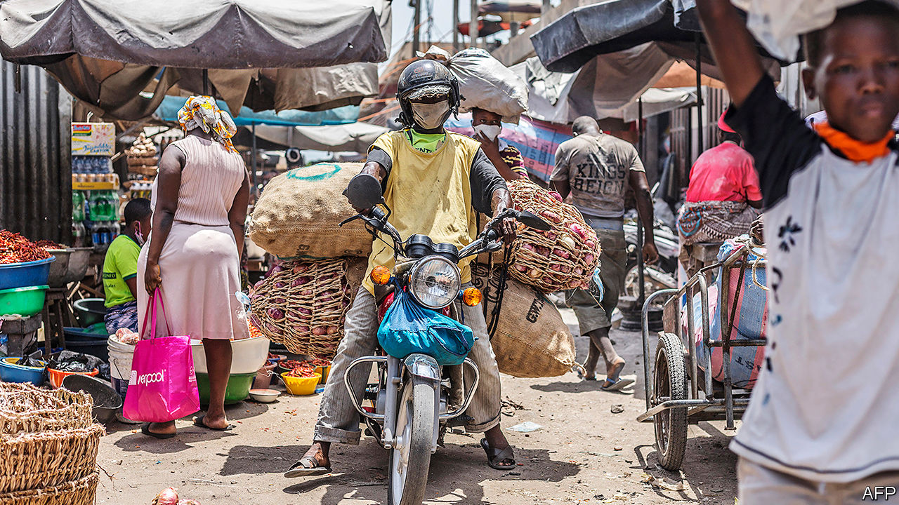
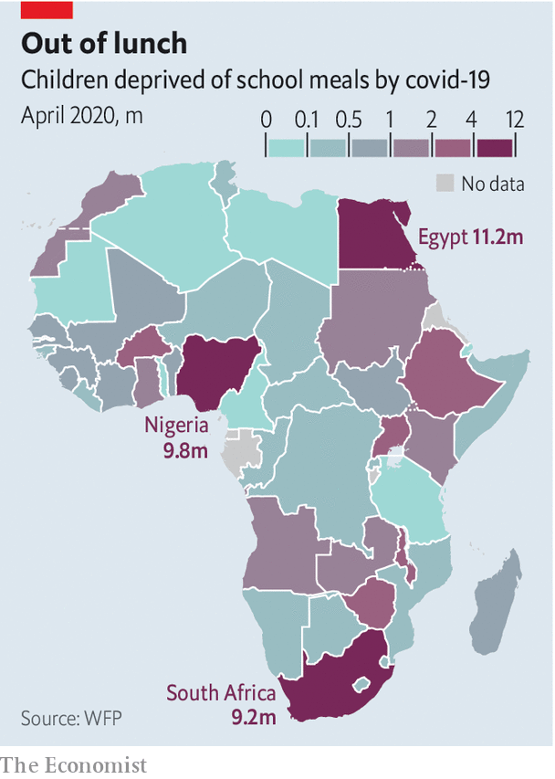

## A bumpy road from plot to plate

# The race to feed Africa during a pandemic

> There is plenty of food, but getting it to people is a challenge

> Apr 23rd 2020GOMA AND KAMPALA

Editor’s note: The Economist is making some of its most important coverage of the covid-19 pandemic freely available to readers of The Economist Today, our daily newsletter. To receive it, register [here](https://www.economist.com//newslettersignup). For our coronavirus tracker and more coverage, see our [hub](https://www.economist.com//coronavirus)

“ONCE THE market was closed, all my knowledge was over,” sighs Brian Kayongo, a spare-parts trader from Kampala, Uganda’s capital. Until the covid-19 lockdown he spent most of his time in the city. He knew about spark plugs, not seeds. But now he is planting maize and beans on a patch of land he has rented in a nearby village. Everybody there is digging, he says. Even the young people who turned up their noses at farming have “surrendered” to the tyranny of the hoe.

Mr Kayongo is less worried about the virus than how to eat. And he is not alone. The UN’s World Food Programme (WFP) warns that the number of people who are “acutely hungry”, most of them in Africa, could double this year. The World Bank forecasts that agricultural production in sub-Saharan Africa will fall by 3-7%, and food imports by 13-25%, depending on how freely trade flows. Yet there is plenty of food in the world. If the pandemic creates hunger, it will be policy failures, not crop failures, that are mainly to blame.

The nightmare scenario would be a repeat of the food crisis in 2007-08, when the world’s governments hoarded staple grains, making prices soar. Africa imports more than a quarter of its cereals. Much of the rice that Ghana gobbles up comes from Vietnam—which has restricted exports. Shiploads of Indian rice bound for Senegal and Benin have been stranded in gridlocked ports. In normal times several west African countries spend more than half their export earnings buying food. As the prices of their own commodities fall and their currencies weaken, they will have even less purchasing power than before.

Fortunately world food systems today are “in a very different situation” from the crisis of 2007-08, says David Laborde of the International Food Policy Research Institute (IFPRI), a think-tank in Washington. Back then export restrictions blocked about 11% of the calories that flowed through global markets. In the pandemic similar measures have affected only 3% of supplies. The oil price was rocketing in 2007; now traders cannot give it away. World food stocks are high. Prices for rice are up, but not to crisis levels. South Africans can partly shift consumption to home-grown maize after a bumper crop, says Ferdi Meyer of the Bureau for Food and Agricultural Policy, a research group.

Instead, covid-19 is hitting people’s pockets. In African cities the average household allocates half its expenditure to food. That budget has shrunk as economies nosedive and lockdowns close the informal businesses in which most workers hustle. The IFPRI estimates that 80m more Africans, mostly in cities, could see their incomes drop below the equivalent of $1.90 a day (though its model does not account for domestic stimulus packages).

Several governments have tried to help by handing out food or regulating prices. But there have been problems. In Uganda four officials overseeing distribution were arrested on suspicion of fraudulently inflating prices. In Kibera, a slum in Kenya’s capital, Nairobi, women were trampled and police fired tear-gas as thousands of people jostled for a giveaway from well-wishers. It would be simpler just to give cash, which can be sent to people on their mobile phones.

The other priority is to keep food moving. Only a fifth of the food in Africa is eaten by the families that grow it, calculate researchers at Michigan State University. The rest moves down long supply chains, via lorries, processors and wholesale markets, before trickling out through millions of informal traders. Those with land can fall back on their own crops for a time. But even the poorest rural households buy nearly half their food (by value). Many are only part-time farmers, topping up their earnings with transport, trade or wage labour.

Hastily devised lockdowns are clogging up this system’s capillaries. Queues of lorries have jammed border posts and some local prices have spiked, perhaps because of hoarding. Governments designate food as an essential service, but security forces still beat up street vendors. Nigerian police have put up the bribes they extort from drivers. The Kenyan force has shot market traders. In Zimbabwe they have confiscated and burned produce, apparently to punish farmers for breaking a travel ban.

As lockdowns persist, food systems have settled into new patterns. Some Nigerian markets open for four hours at a time, on alternate days, to allow for cleaning in between. In Uganda vendors sleep in their stalls. Meanwhile, subtle disruptions have appeared. A trader in Uganda says it has become costlier to transport maize, because trailers which would normally ferry cement in the other direction travel empty. Bukola Osuntade of Babcock University in Nigeria says some poultry farmers are thriving, since most abattoirs for slaughtering cows and goats have closed down.

Less fortunate are the petty traders who carry food across African borders. On a normal day over 30,000 of them shuttle between Goma, in the Democratic Republic of Congo, and Gisenyi, in Rwanda, lugging sacks of potatoes and herding goats. Now only lorries can cross. Enterprising traders have clubbed together to hire them, but must pay the taxes that they previously dodged. Prices of rice, beans and foufou (maize or cassava flour) on the Congo side have doubled; bananas are going for three times the usual rate.

Processors are stretched, too. Bernard Wainaina, who manages a Kenyan flour mill, describes an initial rush, then a sudden drop in demand. To maintain social distancing he has sent half his workers home. A survey of 106 food processors in seven African countries by TechnoServe, a non-profit in Washington, found that fewer than a third were operating with a full staff. Over half had been hit by disrupted supplies of raw materials, packaging and spares, and had distribution problems.

The strongest link is production itself: farmers can always keep digging. A few commercial operations, such as Ethiopian vegetable growers, are struggling to find workers. But there is no sign of a big labour shortage, as on west African farms when Ebola hit. Input markets are another matter. Narcis Tumushabe, the boss of one of Uganda’s biggest seed companies, says he has sold only a fifth of what he expected this season. “We may be forced to sell the seed as flour for food,” he warns.

The most vulnerable parts of Africa are those already reeling from war, pests or drought. “Covid-19 is like a crisis within a crisis,” says Abebe Haile-Gabriel of the UN’s Food and Agriculture Organisation. In east Africa a plague of locusts that ravaged crops earlier this year is returning, many times bigger than before. Pesticides to fight them have been delayed in transit.

The WFP says more than 5m people in the central Sahel will go hungry in the coming lean season. In Zimbabwe, cursed with drought and recession, over a quarter of the population get food handouts. In Uganda rations for 1.4m refugees have been cut by 30%. The funding shortfall was not caused by the pandemic, but shows what happens when donors lose focus.

Away from crisis zones the threat is not starvation, but a slow-burning struggle which may last long after lockdowns are lifted. More than 50m children in sub-Saharan Africa are missing school meals (see chart). As hardship bites, many families will switch to less nutritious diets, cutting out things like fruit and vegetables, or simply eating less. Claude Bahati, a laid-off cleaner in Goma, gulps down water every morning to fill his empty stomach. “We used to eat twice a day, now we only eat once,” he says. “If this confinement continues then we will die.”

That need not happen. Most African countries locked down early, so may be able to ease up quickly. In the meantime new initiatives are sprouting, from delivery apps connecting vendors with customers to an efflorescence of mutual aid. Markets are being redesigned. Traders’ associations, customs officials and TradeMark East Africa, a donor-funded outfit in Nairobi, are piloting “safe trade zones” at borders, with temperature checks, masks and sanitisers. Policymakers on the continent and beyond should keep food flowing. They must not let an unprecedented shock become a hunger crisis. ■

Dig deeper:For our latest coverage of the covid-19 pandemic, register for The Economist Today, our daily [newsletter](https://www.economist.com//newslettersignup), or visit our [coronavirus tracker and story hub](https://www.economist.com//coronavirus)