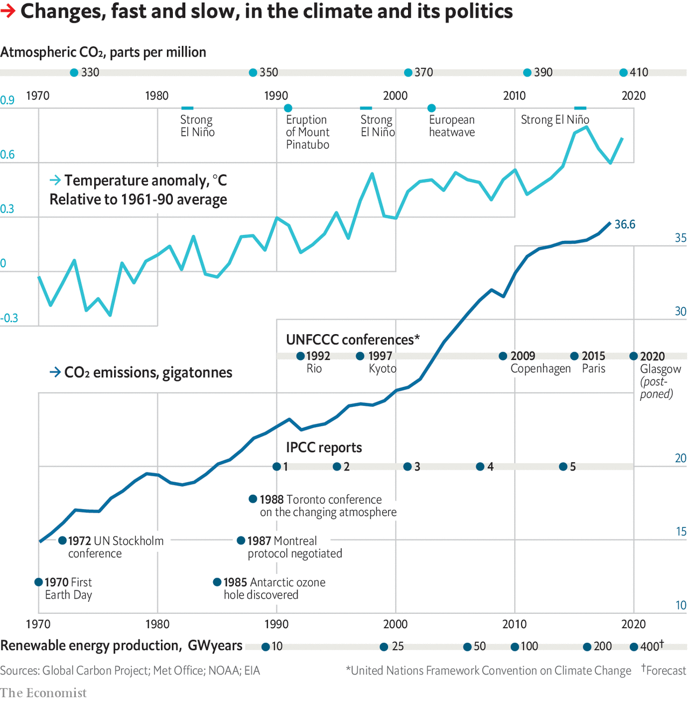

## The problematic politics of climate change

# Why tackling global warming is a challenge without precedent

> The first of six weekly briefs looks at the history of efforts to limit greenhouse-gas emissions

> Apr 23rd 2020

Editor’s note: This is the first in a series of climate briefs. To read the others, and more of our climate coverage, visit our hub at [economist.com/climatechange](https://www.economist.com//news/2020/04/24/the-economists-coverage-of-climate-change)

IN JUNE 1988 scientists, environmental activists and politicians gathered in Toronto for a “World Conference on the Changing Atmosphere”. The aspect of its changing that alarmed them most was the build-up of carbon dioxide, a greenhouse gas. In the late 1950s, when systematic monitoring of the atmosphere’s carbon-dioxide level began, it stood at around 315 parts per million (ppm). By that summer, it had reached 350ppm—and a heatwave was bringing record temperatures to much of North America.

The week before the Toronto conference James Hansen, a climate scientist at NASA, had pointed to the heatwave when telling the US Senate that it was time “to stop waffling…and say that the evidence is pretty strong that the greenhouse effect is here”. The Toronto conference took a similar view, calling for an international effort to reduce global carbon-dioxide emissions by 20% by 2005.

A mere four years later a global compact against climate change had been signed. Even with a boost from the end of the cold war, which made global action on shared concerns seem newly possible and provided an opening for a new eschatology to replace that of nuclear Armageddon, that seemed like a remarkable political success on the part of those pressing for action.

Unfortunately, a global agreement to act is not the same thing as global action. Fossil fuels are the bedrock of industrial society. Even though the alternative of renewable energy has, since 1988, become far more plausible, a decisive move away from fossil carbon still means a wrenching and unprecedented shift.

To many convinced environmentalists that shift seems self-evidently worthwhile. It fits with an ideology that commits them to lives that have less impact on the natural world. But in the face of climate change, individual willingness to sacrifice the fruits of a high-energy lifestyle is not enough. People, and countries, that do not share such motivations must act, too.

The challenge of climate politics is to overcome these differences by negotiating ways forward that can gain general assent. It is a challenge that, despite those remarkable four years, has not been met. Instead of emissions in 2005 being 20% lower than they were in 1988, they were 34% higher. By 2017 they were 22% higher still.

The Toronto attendees’ belief that an international agreement could bring down carbon-dioxide emissions rested in part on an agreement reached a year before to limit the production of ozone-destroying chemicals, most notable among them the chlorofluorocarbons (CFCs) used in fridges and spray-cans. That Montreal protocol looked like a template in two ways.

The first was that it was global. Since the 1960s the environmental movement had increasingly taken “saving the planet” as its rhetorical focus. But practical environmental protections, such as clean-air regulations, almost all worked on a national, or at most regional, basis. Because the world’s CFCs are thoroughly mixed together before they reach the stratosphere’s ozone layer, the Montreal protocol had to be genuinely global, and thus balance the needs of developed and developing countries.

The second was that the Montreal protocol required remarkable faith in science. Unlike most pollution controls, which try to reduce harm already being done, it called for expensive action to deal with a problem that, despite the dramatic discovery of the Antarctic ozone hole in 1985, was not yet hurting people. It was based instead on the likelihood of future catastrophe.

Climate scientists realised that an emissions-reduction agreement on greenhouse gases would need a similarly strong consensus on their dangers. This led to the creation in late 1988 of the Intergovernmental Panel on Climate Change (IPCC). Including researchers from governments, academia, industry and non-governmental organisations, the processes of the IPCC required governments to sign off on its conclusions, so reducing their ability to ignore them.

The IPCC’s first assessment of climate-change science, published in 1990, predicted that if greenhouse-gas emissions continued to rise unchecked, the world would warm by 0.2-0.5°C (0.4-0.9°F) every decade over the course of the 21st century, and that sea-level would rise 3-10cm a decade. Changes in the three decades since fit with the low end of both predictions.

Two years later, at an “Earth Summit” in Rio de Janeiro, the UN’s members agreed on a framework convention on climate change (UNFCCC) which committed them to the “stabilisation of greenhouse-gas concentrations…at a level that would prevent dangerous anthropogenic interference with the climate system”.

Despite the fact that such stabilisation implied impressive cuts in emissions, the treaty set no targets along the lines of Toronto’s 20% by 2005. They were to be worked out later. In years to come those negotiations on emission cuts came to dominate discussions between the parties to the treaty, sidelining the vital question of how to help countries, especially poor ones, adapt to the now inevitable changes. To talk of such adaptation was equated with capitulating on emission cuts.

Specific emission cuts were agreed upon five years after Rio, in Kyoto. They were not global in extent, applying only to developed countries, which were responsible for most of the emissions. They were not ambitious either. And the Kyoto protocol was never ratified by America, then the largest global emitter.

The UN imprimatur gave the UNFCCC universal legitimacy. But fashioning a treaty that all could accept had meant producing one with little practical power. The UNFCCC lacked any mechanism for making countries commit to ambitious action, let alone binding them to such commitments.

If all countries had shared an urgent interest in action, those shortcomings would not have mattered. But they did not. The costs of environmental improvements tend to fall on a few groups—typically, those doing the polluting. In domestic environmental politics, progress typically relies on going some way to placate those groups while increasing the enthusiasm for action among others and the public.

If emissions had been down to just a few companies, as with CFCs, or sectors of the economy, as with the smogs tackled by clean-air acts, such trade-offs might have been possible internationally. But fossil-fuel use permeated rich economies. Those countries knew the cost of reducing them could be severe—and that the benefits would accrue mostly to people in other countries and future times.

These difficulties were exacerbated by attempts to weaken public support for climate action. Fossil-fuel companies and their political allies, understood how important a scientific consensus on future damage was to the case for action. The result was a campaign to make the science look at best dubious, and at worst fraudulent, which went beyond noting that many environmental scientists were committed environmentalists and pointing out truly open questions (the wide range of the uncertainties in the first IPCC report has been slow to narrow). In doing so it helped produce an environment in which some right-wing politicians felt able to oppose all cuts to emissions, with notable successes in America and Australia.

Another source of resistance to emissions reduction was the rise of China. Its GDP, measured at purchasing-power parity and in real terms, increased sevenfold in the 20 years after Rio. Its carbon-dioxide emissions more than tripled, from 2.7bn to 9.6bn tonnes. China showed no real interest in curbing this world-changing sideeffect, and because it was a developing country it was not even notionally obliged to do so by the Kyoto protocol—despite the fact that, before that protocol was ten years old, China was a bigger emitter than America. Resentment over this was one of the reasons some developed countries became increasingly unhappy with their commitments. China’s unwillingness to offer real action contributed to the near collapse of attempts to move beyond Kyoto at the Copenhagen summit of 2009.

Six years after Copenhagen, though, the UN process made its biggest step forward since Rio: the Paris agreement. This, at last, set a specific global target. Atmospheric greenhouse-gas levels were to be stabilised by the second half of this century at a level that would see an increase of the average global temperature over its preindustrial level well below 2°C, with strenuous efforts made to keep it down to 1.5°C. All the countries, developed and developing, that signed were required to commit to domestic actions towards that aim.

There were several reasons for the success: prior talks between America and China; skilful French diplomacy; canny negotiation by developing countries. Perhaps the most important one, though, was that the cost of renewable energy was tumbling and investments in the field booming. Reducing emissions while continuing high-energy lifestyles felt newly possible.

Perhaps it will be. But the reductions the countries offered in Paris were too small to meet the 2°C target. That insufficiency has seen a new generation of climate activists demand greater ambition at the next big UNFCCC meeting, originally to be held this year in Glasgow but now postponed because of the covid-19 pandemic. There remains no way for them to force action on people and countries who do not share their passion and commitment. ■

Sign up to our fortnightly climate-change newsletter [here](https://www.economist.com//theclimateissue/)

Dig deeper:Climate brief 2: [How modelling articulates the science of climate change](https://www.economist.com//schools-brief/2020/05/02/how-modelling-articulates-the-science-of-climate-change)Climate brief 3: [Humanity’s immense impact on Earth’s climate and carbon cycle](https://www.economist.com//schools-brief/2020/05/09/humanitys-immense-impact-on-earths-climate-and-carbon-cycle)Climate brief 4: [Damage from climate change will be widespread and sometimes surprising](https://www.economist.com//schools-brief/2020/05/16/damage-from-climate-change-will-be-widespread-and-sometimes-surprising)[The Economist’s climate-change hub](https://www.economist.com/https://economist.com/climatechange)

## URL

https://www.economist.com/schools-brief/2020/04/23/why-tackling-global-warming-is-a-challenge-without-precedent
