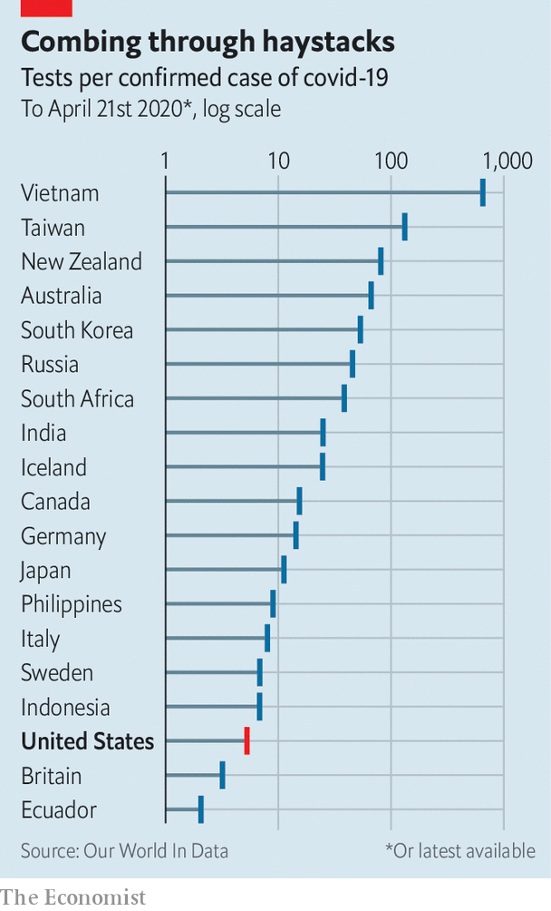
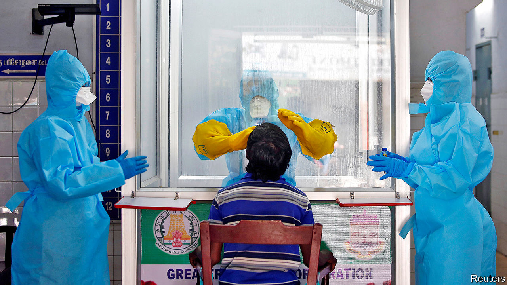

## Covid-19

# How to build and deploy testing systems at unprecedented scale

> Countries will have to do it to end their lockdowns safely

> Apr 23rd 2020

Editor’s note: The Economist is making some of its most important coverage of the covid-19 pandemic freely available to readers of The Economist Today, our daily newsletter. To receive it, register [here](https://www.economist.com//newslettersignup). For our coronavirus tracker and more coverage, see our [hub](https://www.economist.com//coronavirus)

SARS-CoV-2, the virus that causes covid-19, is an unobtrusive piece of biological machinery. It spreads parasitically through the respiratory tracts of human beings, often without provoking symptoms in those who carry it. Yet for some, particularly the old, it is deadly. This combination of properties make the pandemic both dangerous and difficult to stop. As of April 22nd it had killed 182,000 people.

So far, every country that has reduced covid-19 infection to low levels has relied to some degree on “social distancing”—that is, either encouraging or forcing people to stay at home, and to keep well apart if they find that they have to go out—to prevent the virus from spreading. On top of this many are in any case fearful to go out, lest they catch the illness. Without a vaccine or therapeutic drugs, neither of which is guaranteed, countries therefore face a future of bouncing in and out of lockdown every few months, with infection rates ebbing and flowing in response. The result will be mounting death tolls, depressed economies and confidence-sapping uncertainty. This can, however, be partly ameliorated by extensive testing for the virus. Testing enables the government to keep tabs on the disease, reveals which social-distancing measures work, and, if those testing positive remain at home, instils confidence in the public that it is safe to go out.

America is in a particularly tight spot. Parts of its government responded slowly to the pandemic to start with, and it now faces high levels of infection that are spread across the country. In response, a consensus is emerging among its scientists, economists and public-health officials that a massive increase in testing capacity—creating a system that can test millions of people a day for the virus—will be needed to get the place out of lockdown safely. A testing system of this kind has never been built before. It will be expensive, costing tens, possibly hundreds of billions of dollars in America alone. But it offers a way to return to something approaching normal life with a degree of confidence that the pandemic is under control.

The goal of this new testing regime would be to track down every carrier of the virus so that those at risk of spreading it could be isolated. The contacts of anyone who tested positive would be traced and tested as soon as possible, to cut off further chains of transmission. Trevor Bedford, who studies viruses and immunity at the Fred Hutchinson Cancer Research Centre in Seattle, has said that what is currently known about the virus suggests that the system must track down and isolate all of an infected person’s contacts within 48 hours of their positive test if the transmission chain is to be broken. If testing and tracing can do this, then people can go safely about their lives.

Currently, the test employed to find out if someone is infected looks for the virus itself using a technique called reverse transcription-polymerase chain reaction (RT-PCR). This starts by sticking a Q-tip-like swab deep into the nose or throat of the individual to be tested, to retrieve a sample of mucus that may or may not contain the virus. This sample is then run through a process (reverse transcription) that copies any fragments of viral RNA (the molecule in which SARS-Cov-2’s genes are written) into DNA, a chemical more easily handled by established testing methods. These first amplify the quantity of DNA present (the polymerase chain reaction), and then run it through a detector to find out what it is. Other tests, which look for antibodies produced when someone comes into contact with the virus, are being devised as well. These will also be able to find out who has been infected in the past.

The number of tests of all kinds that America needs in order to lift its lockdown safely is a matter of debate. Plans floated in recent weeks by various think-tanks have come up with vastly different figures. All are large. That by a working group at the Edmond J. Safra Centre for Ethics at Harvard University, published on April 20th, suggests America will need to test between 5m and 20m people per day, which is 2-6% of the population. Another, put forward on April 21st by experts convened by the Rockefeller Foundation, outlines ideas that could get America to 30m tests per week in eight months’ time.

That would not be easy. By the time this edition of The Economist is published, America will have carried out more than 4.5m SARS-CoV-2 tests since it began the process in February. Over the first two weeks of April, the average number of tests was around 1m a week. The country has struggled to get to even this level of testing, so expanding it ten or 100 times will be a big challenge.

The Rockefeller plan suggests current testing numbers in America can be tripled by bringing into the programme laboratory capacity that exists already, but which is not being used. That would involve identifying all American high-throughput laboratories that can be adapted for the task, sorting out the regulatory approvals they will need and stumping up the money.

Some states are already doing this. Those with big research universities, such as Massachusetts (home to Harvard and the Massachusetts Institute of Technology, MIT, among others), have an advantage here. The Broad Institute, a joint MIT-Harvard enterprise run by Eric Lander, one of the leaders of the Human Genome Project, has begun doing SARS-CoV-2 tests and might, when up to speed, be able to manage to do 1m of them a day. In other places commercial laboratories could be put to the task. In Wisconsin Exact Sciences, a firm that specialises in cancer tests, has rejigged a large part of its laboratory to process 20,000 covid-19 tests a week.

Making more use of so-called point-of-care machines would be another way to increase testing capacity. These small boxes are already used to test for viruses in thousands of hospitals and clinics around the world, and adapted versions have recently been introduced to detect SARS-CoV-2. Point-of-care machines can process throat swabs in around 15-30 minutes. Ramping up production of them would be useful in bringing testing capacity to, say, rural areas where collecting and returning throat swabs to a big central laboratory might take too long. The supply chains for electronics and reagents for these machines, however, rely heavily on China, and so building more of them now might not be easy.

The jump from 3m tests per week to 30m will need big, new labs on the scale of the Broad to be dotted around the country. Each of these would process hundreds of thousands of tests a day, using robotics and automation. Testing needs to become simpler, too. Collecting samples for RT-PCR tests is invasive, and the tests themselves are complicated. Scaling the process up to millions a day is an “impossible” mission according Severin Schwan, the boss of Roche, a Swiss pharmaceutical giant that makes point-of-care testing machines.

Other testing methods are possible, but as yet unproven. Scientists at Rutgers University in New Jersey recently demonstrated a way to look for signs of the virus in spit samples (which are easy to obtain) instead of throat swabs (which are notoriously difficult and uncomfortable to collect). On April 13th America’s Food and Drug Administration (FDA) granted spit tests an emergency-use authorisation. Generic spit kits that can be tweaked to do this are already widely available and can be transported to processing laboratories at ambient temperatures.

All this new testing infrastructure will require trained people to run it, says Scott Becker of America’s Association of Public Health Laboratories. Much of the handling of samples in laboratories is routine stuff, so people can be trained quickly to do it. But analysing the results needs highly trained experts—and in some states such people must be licensed, too. Those analysts who currently exist are already putting in extended shifts, says Mr Becker, and this cannot be sustained over a pandemic that will be “a long, long haul”.

Swabbing the noses or throats—or even collecting the spittle—of millions of people a day would also require a huge number of new hires. For now, teams from America’s National Guard have been helping with that in outbreak hotspots, such as some prisons, and at drive-through testing sites. And then there are the 300,000 contact-tracers that America would need, according to another group of experts who assessed that matter recently, to get in touch with those who have been in recent proximity to people who test positive. New contact-tracers can, however, be trained in a day, so lots of those who have suddenly found themselves without a job might be redeployed as such. San Francisco, for example, has put librarians to the task. The thousands of members of America’s Peace Corps who have had to return from duty abroad because of the pandemic might also usefully be deployed for this purpose.

The supply of reagents and components needed to run millions of tests a day must be secured, too. Until now, one of the main obstacles to their mass production has been the lack of a strong signal from the federal government that more are needed—though that changed on April 21st when Congress approved the spending of $25bn on testing. The two main suppliers of nasal swabs in America, Copan and Puritan, make just 6m a week between them. Roche says that it is currently capable of supplying “millions” of tests per month. That a firm like Roche is still thinking in terms of tests per month, rather than tests per day or per week, does, though, suggest there is a long road ahead.

Paul Romer, a professor at New York University and winner of the 2018 Nobel prize in economics, who also advised on the Rockefeller Foundation’s work, says that university laboratories have already shown they could get around supply issues in the ramping-up of testing. “If you look at reagent bottlenecks, people have found other reagents that they can swap out instead of the FDA-approved ones. They’ve shown you don’t even need to include the RNA extraction [from throat-swab samples] that requires these reagents.” Freeing universities and research institutions from red tape would be crucial, he believes, in ensuring any efficiencies and new discoveries that simplify or speed up testing are able to spread rapidly.

Scaling up testing infrastructure will also face regulatory hurdles. For example, swabs on their way to be tested are classified as a biohazard in the United States, and require special containers and shipping protocols. Building and managing such an unprecedented amount of testing capacity in such a short space of time will also need co-ordination. The Harvard group proposes the formation by the federal government of a Pandemic Testing Board to oversee these decisions. It would be composed of leaders from business, government and academia, among others, and would be given powers to oversee the construction of laboratory capacity and to ensure the supply and distribution of the materials needed to carry out the tests themselves.

The cost for all this? The Harvard group estimates around $15bn per month and that it would need to be in operation for a year or more, depending on when (and if) treatments and vaccines became available. That price tag may seem eye-watering, but lockdown costs far more. Estimates place the cost to America of the pandemic at up to $400bn a month. Given the alternative, building the largest medical-testing system the world has ever seen is a steal. ■

Dig deeper:For our latest coverage of the covid-19 pandemic, register for The Economist Today, our daily [newsletter](https://www.economist.com//newslettersignup), or visit our [coronavirus tracker and story hub](https://www.economist.com//coronavirus)

## URL

https://www.economist.com/science-and-technology/2020/04/23/how-to-build-and-deploy-testing-systems-at-unprecedented-scale
