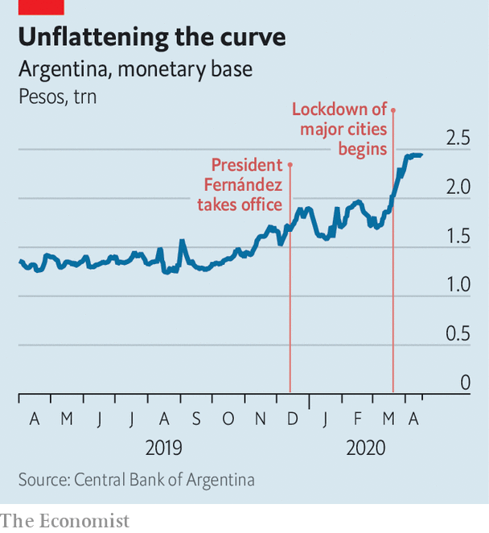

## The Peronist and the pandemic

# Argentina’s make-or-break moment

> President Alberto Fernández has dealt well with the pandemic. Debt talks may be harder

> Apr 23rd 2020BUENOS AIRES

Editor’s note: The Economist is making some of its most important coverage of the covid-19 pandemic freely available to readers of The Economist Today, our daily newsletter. To receive it, register [here](https://www.economist.com//newslettersignup). For our coronavirus tracker and more coverage, see our [hub](https://www.economist.com//coronavirus)

UNTIL RECENTLY advisers to Argentina’s president, Alberto Fernández, quoted the old saw that crisis brings opportunity. Inaugurated in December, he is dealing with two calamities that no one can blame him for: a deep recession inherited from his predecessor, Mauricio Macri, and the covid-19 pandemic. Argentines give Mr Fernández high marks for his response. On becoming president he raised taxes and froze pensions and salaries to stabilise public finances. He acted early to slow the spread of covid-19, shutting borders, business and most transport by decree on March 12th. People who break the rules face fines and prison sentences.

The lockdown is having an effect. On April 23rd Argentina had 3,288 confirmed cases of covid-19 and 159 deaths from it. That is far fewer than in Spain, which has roughly the same number of people (though it may be an underestimate). Mr Fernández’s approval rating has soared. A recent poll by Poliarquía puts it at 81%. “I didn’t think of him as a leader,” says Gabriel Más, a farm worker. “I do now.”

But both Mr Fernández and the country he leads are entering a dangerous phase. Pressure to ease the lockdown is building before the pandemic has peaked. And the government has begun a gambit to support the economy that may end up weakening it further. Success would be the making of his presidency and brighten the future of his Peronist political movement. Failure could be disastrous for both. “Will he be the creator of a new political hegemony, or author of social chaos if he generates economic havoc?” asked Jorge Fontevecchia, a media mogul, in a newspaper column.

On April 16th the economy minister, Martín Guzmán, demanded that creditors accept new securities to replace $65bn-worth of bonds, almost 40% of foreign-currency debt. This does not come out of the blue. Mr Macri had sought to stretch out debt payments. In appointing Mr Guzmán, a specialist in debt negotiation, Mr Fernández made it clear that he would give greater priority to restoring growth than to paying creditors.

The pandemic greatly increases the urgency. With revenue crushed by recession, the government is on track to run a primary deficit, ie, before interest payments, of at least 4% of GDP this year. The Central Bank is printing money to keep the government going, which risks driving up inflation, already at 50%. Over the next two years Argentina’s scheduled payments of foreign-currency debt are nearly as large as its foreign-exchange reserves of less than $44bn. “Argentina can’t pay [creditors] anything right now,” says Mr Guzmán. So far, though, bondholders are unsympathetic. Argentina’s demand “does not represent the product of good-faith negotiations”, complained one group that holds about 16% of the debt.

The mood in the Casa Rosada, the presidential palace, is grim. Argentina may be headed for its ninth default. “Between pandemic and debt, now maybe default, it looks like double jeopardy,” says a presidential adviser. The consequences of default would be grisly. Output, squeezed by the lockdown, would shrink by far more than the 5.7% forecast by the IMF for this year. The peso would plunge, pushing inflation even higher. Unemployment and poverty would soar. Despite a history of default, “even we may not recognise what’s coming: economic meltdown and social unrest, alongside a pandemic,” warns Sergio Berensztein, a political analyst.

The government wants to wring the maximum relief it can from bondholders without triggering that disaster. Mr Guzmán is seeking a modest “haircut” of 5.4% on the principal (which would save the government $3.6bn) and a dramatic 62% cut in interest payments. These payments would start low, at just 0.5%, and late, beginning in 2023, when an election is due. They would peak in 2029 at less than 5%. Under this plan, the government would save $37.9bn on its interest bill.

The absence of even a token payment until May 2023 will stiffen creditors’ resistance. With no prospect of money coming in, they could spend the next three years lobbying and litigating for a better deal. They complain that the government has been slow to disclose its strategy for servicing the debt that would remain. The plans it has released so far do not take into account the effects of covid-19. “If you’re a creditor, told to wait three years, you need to hear the plan,” says a source close to both investors and the government.

There is little time to resolve the tussle. The Fernández team put a 20-day limit on negotiations. But the real deadline is May 22nd, the end of the 30-day grace period for a missed $500m payment. “There is recognition that default is much more likely than not,” says the presidential adviser.

Veterans of past renegotiations hold out hope of an agreement. Argentina’s offer preserves much of the face value of the debt. There may be wriggle-room in the schedule for repayment. The price of Argentina’s existing bonds rose after it made its proposal, a sign that the offer is more appealing than investors were expecting. Government negotiators are “pushing it to the cliff-edge, as they must, to remind all that default is a disaster for all”, says a former finance minister.

Mr Fernández is using brinkmanship, too, in his battle with the pandemic. “Quarantine, social distancing, will extend beyond April,” said Pedro Cahn, a government epidemiologist. Even then, “we have to expect many more cases and many more deaths.” Workers in private hospitals say that the government’s low numbers for covid-19 cases and fatalities reflect a lack of testing. They fear “dramatic loss of life” when the virus peaks, probably in early June, in poor neighbourhoods that ring Buenos Aires and in other cities.

Mr Fernández is trying to shield poor Argentines from the consequences of the lockdown, in part by taxing richer ones. The government has given bonus payments to welfare recipients, informal workers and people who work in health care, policing and supermarkets. It has imposed new freezes on prices of food and medical supplies. Congress may reconvene to levy a tax on Argentines’ worldwide assets. The “patriotic” tax will “kill the chicken that lays the eggs for future recovery”, warns Aldo Abram, an economist.

The pre-existing recession makes the trade-off between public health and economic growth even more painful than it is for most countries. Under pressure from trade unions and business, Mr Fernández has allowed organisations in 11 sectors, including export industries and refuges for victims of domestic violence, to reopen. But he is likely to rule out a quick return to normality like that advocated by Brazil’s president, Jair Bolsonaro, who makes light of covid-19. Mr Fernández knows that the pandemic is more merciless than Argentina’s creditors. ■

Dig deeper:For our latest coverage of the covid-19 pandemic, register for The Economist Today, our daily [newsletter](https://www.economist.com//newslettersignup), or visit our [coronavirus tracker and story hub](https://www.economist.com//coronavirus)