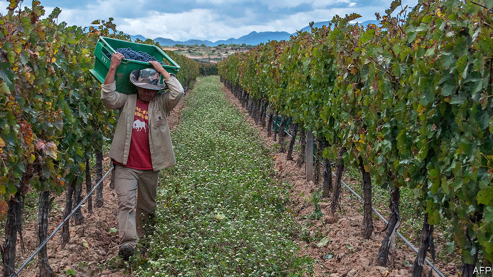

## High varietals

# Bolivia’s other intoxicating export—fine wine

> A newcomer to tipple’s top table

> Apr 23rd 2020LA PAZ

IN 2010 the Netherlands’ Centre for the Promotion of Imports from developing countries, which is financed by the government, sent Cees van Casteren to Bolivia. His mission was to help Bolivia’s vintners break into Europe. It was a tough assignment. Back then, Bolivia’s main winemakers—Kohlberg, Campos de Solana and Aranjuez, all family-owned—competed fiercely to sell cheap wine to a tiny protected domestic market. The intoxicating export for which Bolivia is famous is cocaine.

The idea that Bolivia might aspire to bottle something better is not silly. Spanish priests made wines there in the 16th century. The modern industry started in the 1960s, when the Kohlbergs brought vines from Europe to make wine to relieve a family member’s heart condition.

Bolivia’s vineyards in the Andean region of Tarija are among the world’s highest, at 2,000 metres (6,500 feet) above sea level. Intense sunshine gives grapes’ skins more tannin and wide daily temperature swings increase the acidity of their juice. That makes tannats, malbecs and cabernet sauvignons “fresh”, and “spicier” than lower-altitude wines, says Mr van Casteren, one of 394 “masters of wine”.

But putting them on European tables has not been easy. The first step was to bring the feuding families together to agree on how to spend the Dutch aid and to come up with a shared brand for Bolivian wines. “They wouldn’t even sit together at the same table,” says Mr van Casteren. No one showed up to the first meeting he called. Eventually, they forged friendships on tours of European vineyards.

Bolivian vintners cannot compete against Argentines and Chileans as mass producers for a global market. The cost of planting a hectare of vines is 20% higher than in Mendoza, Argentina’s top winemaking region, says Luis Pablo Granier, a co-owner of Campos de Solana. Bolivian vineyards have one-third of Mendoza’s yield per hectare. Bolivia is landlocked, so freight costs are high. An overvalued currency makes the Bolivians less competitive. So the families agreed to make better wines. Prodded by Mr van Casteren, they bought oak casks for ageing and upgraded irrigation systems. Prizes followed.

Big sales and high profits have not. Bolivia’s producers are too small to attract interest from European distributors and cannot themselves afford to market and distribute. To expand they would need to buy more land. But arable land in Tarija suitable for irrigation is scarce and expensive. Bolivian vintners have planted just 4,000 hectares (10,000 acres), a fraction of Argentina’s 220,000 hectares of vineyards.

They hope that locals will develop more of a thirst for the good stuff. Bolivia’s 11m people drink just 14m litres (3m gallons) of wine a year, a 20th of consumption in Belgium, which has the same number of people. Before covid-19, the National Association of Winegrowing Industries predicted volume would grow by 7% a year. Bolivian producers are protected by tariffs on imports of up to 40%. But those encourage contraband wine, especially from Argentina. A third of wine consumed in Bolivia is smuggled through the southern border.

The temptation is to go down-market, especially after the economic shock from covid-19. But the Bolivians are loth to give up their newly won reputation for quality. “We’ve realised that is where our strength is,” says Mr Granier. Now they have to convince oenophiles at home and abroad.■

## URL

https://www.economist.com/the-americas/2020/04/23/bolivias-other-intoxicating-export-fine-wine
