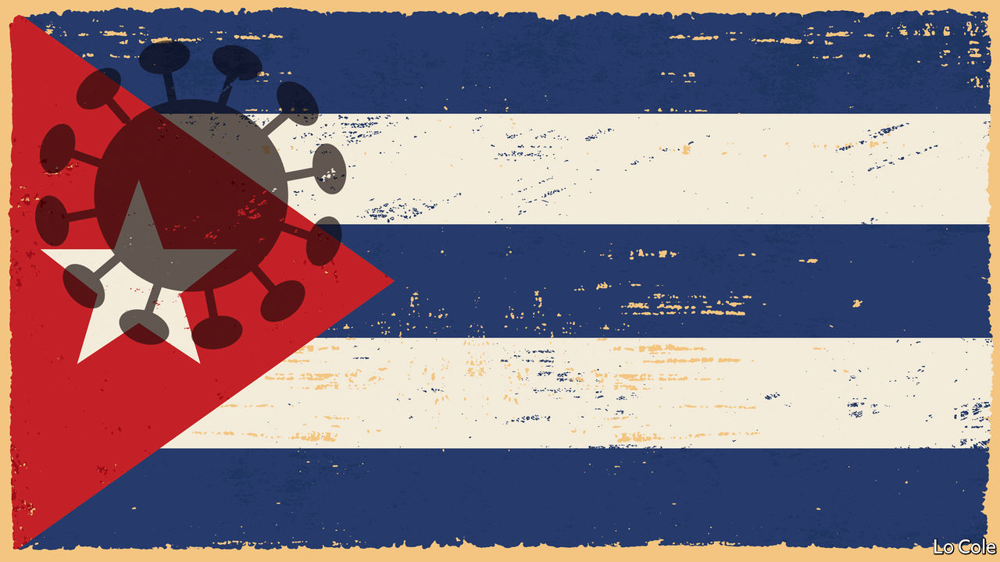

## Bello

# Cuba on the edge

> It is better placed to tackle covid-19 than to cope with its economic impact

> Apr 23rd 2020

Editor’s note: The Economist is making some of its most important coverage of the covid-19 pandemic freely available to readers of The Economist Today, our daily newsletter. To receive it, register [here](https://www.economist.com//newslettersignup). For our coronavirus tracker and more coverage, see our [hub](https://www.economist.com//coronavirus)

IT IS THE dream of every exile to die in the home country, but not in the circumstances of Víctor Batista Falla. A member of a wealthy banking family, he left his native Cuba in 1960 when Fidel Castro’s revolution moved towards communism. He devoted his life to publishing the work of exiled writers and thinkers, especially of social-democratic and liberal persuasions. Last month he visited Cuba for the first time in 60 years. On April 12th he died, aged 87, in a Havana hospital, of covid-19. He had probably brought it with him from Madrid, where he had lived for decades.

Since the 1990s Cuba has been open to mass tourism and family visits. It is not surprising that it is vulnerable to covid-19, like the rest of Latin America and the Caribbean. As of April 23rd it had reported 1,189 cases and 40 deaths. In proportion to its population, that is similar to Argentina’s caseload.

Even as it has failed to offer Cubans prosperity or freedom, communism has provided them with good health. For decades the regime has overproduced doctors and spent more than the regional average on health care as a share of GDP. That has paid off in another way, too. Sending health professionals abroad generates 46% of the island’s export earnings, not to mention diplomatic prestige. (The state, for which they all work, keeps most of their foreign wages.)

A particular Cuban strength is the health system’s ability, characteristic of a dictatorship, to mobilise the population for public-health action. The government prepared for the virus as early as January. When cases were reported from March 11th it was quick to isolate the patients, and trace and test their contacts. On March 20th, with only 21 confirmed cases, it banned all tourist arrivals, confined vulnerable groups, shut down educational facilities and suspended interprovincial public transport.

Yet neither health care nor the economy are what they were when Cuba enjoyed lavish subsidies from the Soviet Union. The health system has suffered spending cuts, the loss of doctors who no longer practise because of low official salaries, and shortages of supplies. Drought and poor infrastructure have led to water shortages. There is another risk factor: almost 20% of Cubans are over 60, more than anywhere else in Latin America.

So covid-19 poses a severe test, just as it does elsewhere in Latin America. It comes when Cuba’s economy was already under great strain. Cuba failed to reform even as the United States, under Donald Trump, has stepped up sanctions and Venezuela, Cuba’s ally, has cut subsidised oil.

These pressures have exacerbated the state-dominated economy’s chronic inability to generate foreign exchange. The closure of the tourist industry makes that even worse. The Economist Intelligence Unit, our sister company, reckons that imports will fall to $9.1bn this year, from $11.7bn in 2015.

Shutting borders has ended black-market food imports, while the curbs on transport have cut domestic deliveries to Havana, the capital. The government lacks sufficient supplies to add items to the state ration-book all Cubans receive. There are long queues outside meagrely stocked state supermarkets. Miguel Díaz-Canel, who replaced Fidel’s brother, Raúl, as Cuba’s president two years ago, admitted this month that social distancing has been hard to impose and complained of the “indiscipline and irresponsibility” of some Cubans.

Worse may be in store. At the front of Cubans’ minds is fear of another “special period”, as Fidel Castro called it, when the economy shrank by 35% in the early 1990s with the end of Soviet aid. That came with widespread power cuts and other shortages. Pavel Vidal, a Cuban economist at the Javeriana University in Cali, Colombia, reckons that GDP could fall by around 10% this year. Although the plunge in global oil prices will help, Cuba will still need shipments from Venezuela. “On that depends whether or not there are power cuts and another special period,” he says.

The Trump administration, in which Cuban-Americans play a significant role, is counting on tightening pressure to cause the collapse of communism. That is unlikely. In its island fastness, with its mixture of coercion and paternalism, the regime Fidel created has outlasted not just him but the lifelong resistance of people like Mr Batista. The immediate result of Mr Trump’s reversal of Barack Obama’s opening towards Cuba was to halt a cautious process of market reform. Coronavirus is likely to push it off the agenda altogether.

Dig deeper:For our latest coverage of the covid-19 pandemic, register for The Economist Today, our daily [newsletter](https://www.economist.com//newslettersignup), or visit our [coronavirus tracker and story hub](https://www.economist.com//coronavirus)