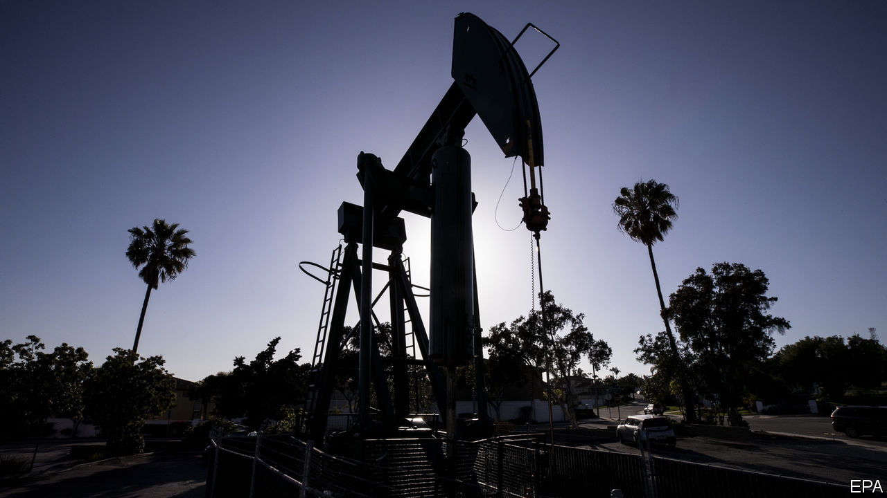
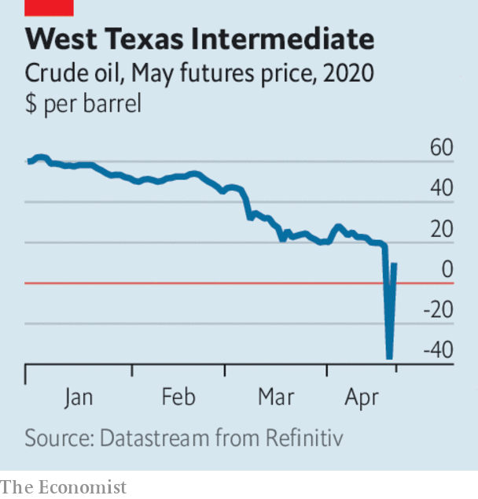

# Business this week

> Apr 23rd 2020

Oil prices tanked amid forecasts that demand will tumble this year. Brent crude dropped below $16.50 a barrel, a two-decade low. May contracts for West Texas Intermediate, the benchmark for American oil, fell into negative territory for the first time, plunging at one point to -$40 a barrel, meaning traders in effect paid for someone else to hold the commodity. Concern that storage facilities at a key delivery point were full, just as the contracts were due to be settled, added to the panic. Prices surged later in the week after Donald Trump stoked tensions with Iran. See [article](https://www.economist.com//finance-and-economics/2020/04/25/oil-markets-have-a-timing-problem).

Baker Hughes, one of the world’s biggest providers of oilfield services, recorded a $10bn quarterly loss, in part because it has had to write down the value of its assets.

China’s GDP shrank by 6.8% in the first quarter, year on year, the first contraction in decades. The economy is expected to pick up later this year, though not enough to meet the government’s ambitions. China’s untrammelled growth since the end of the Mao era has boosted countless global industries. Many hope that the quarter’s decline is just a pause, not an end, to the boom.

The news about the Chinese economy did not stop BHP and Rio Tinto, the world’s two biggest mining companies, from giving upbeat assessments about their business in China. BHP noted that most industrial activity had restarted there and that if a second wave of infections was avoided, steel production could rise this year.

Alibaba, China’s biggest e-commerce company, said it would invest 200bn yuan ($28bn) in cloud computing over the next three years. Alibaba faces fierce competition over cloud services in its home market, and is eager to challenge Amazon and Microsoft in international markets.

Cyril Ramaphosa, South Africa’s president, announced a huge stimulus package worth 500bn rand ($26bn) to shore up the economy, which was already struggling before covid-19, and fell into recession late last year. Millions of people rely on informal work to make ends meet, which has been made harder by a strict lockdown enforced by the army. The government has turned to the IMF and other global institutions for emergency health-care funding.

Legislation to provide more than $300bn in additional aid to small businesses wound its way through Congress. The money earmarked for firms to retain workers in the recent $2trn stimulus act has already run out amid huge demand.

Facebook invested $5.7bn in Jio Platforms, a telecoms and tech firm that is part of the Reliance Industries empire in India, giving it a stake of 10%. Over the past five years, 560m people in India have gained access to the internet. Facebook wants to tap that potential, noting the opportunity for connecting Jio’s small-business service with WhatsApp so that shoppers can have “a seamless mobile experience”. See [article](https://www.economist.com//business/2020/04/25/facebook-bets-on-a-different-sort-of-e-commerce-in-india).

Revenue at Huawei rose by 1.4% in the first quarter compared with the same three months last year, to 182bn yuan ($25.7bn). That was fairly impressive given the trade war and the outbreak of covid-19 in China, the telecoms-equipment maker’s base country, though it was far below the 39% growth it chalked up a year earlier. The pandemic has delayed the roll-out of 5G networks in many countries, a key and controversial element of Huawei’s business. The company, which is privately held, did not state a net profit.

United Airlines raised $1bn in a sale of new shares, a week after securing from the government a direct grant worth $3.5bn and a low-interest loan of $1.5bn in a rescue deal.

After the British Treasury reportedly asked Virgin Atlantic to re-submit its request for a bail-out, said to be worth £500m ($620m), Sir Richard Branson offered to put his private island in the Caribbean up as collateral in order to secure the funds. His Virgin Group retains a 51% stake in the airline. Meanwhile, Virgin Australia fell into administration after failing to obtain a bail-out in Canberra.

Netflix signed up another 15.8m subscribers in the first quarter, twice as many as it had forecast, as people confined to their homes binged on its programming. Netflix now has 183m users worldwide. Its share price is trading at record highs. One potential hitch is that its production pipeline, the source of recent hits such as “Tiger King”, has ground to a halt because of the lockdowns. See [article](https://www.economist.com//node/21784550).

Coca-Cola said that despite a solid start to the year, revenue fell in the latest quarter, when lockdowns came into force. For this month, its sales of soft drinks have tumbled by 25%, as restaurants and small stores shut. By contrast Procter & Gamble reported a bumper quarter, boosted by shoppers stockpiling toilet roll, cleaning products and washing powder. However, sales from grooming gear were down a snip.

## URL

https://www.economist.com/the-world-this-week/2020/04/23/business-this-week
