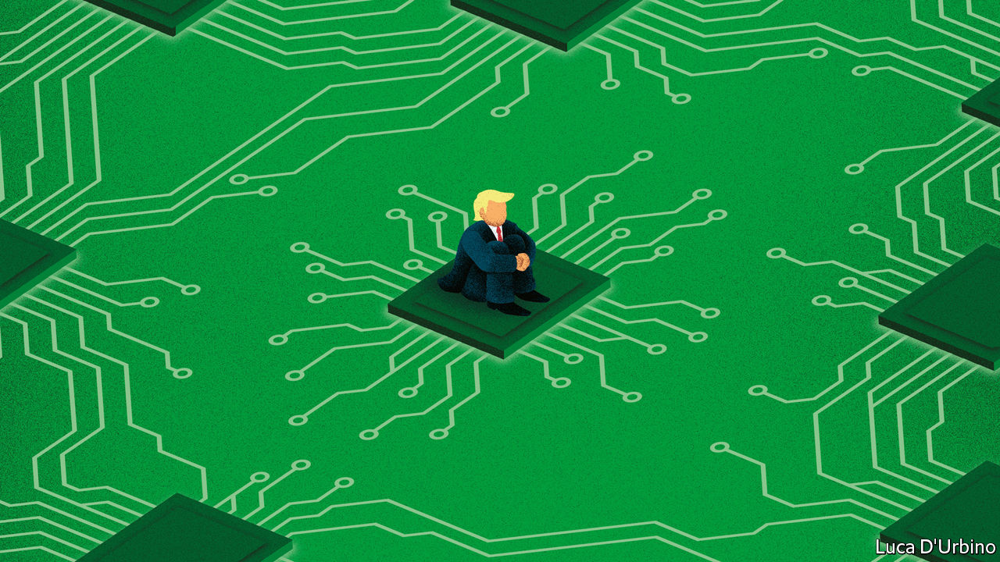

## Some body to hold

# The fight with Huawei means America can’t shape tech rules

> The protocols for the future are being written in standards bodies that US companies cannot attend

> Apr 23rd 2020

THE PROCESS of setting standards attracts little attention, probably because it is very boring. Its magi gather regularly to seek consensus on mind-numbing technical details for the running of things like cell phone networks, artificial intelligence services and global shipping. Meetings are arranged through bodies with names like ISO (International Organisation for Standardisation) or 5GAA (the 5G Automotive Association, a specialist body focused on building 5G connectivity into autonomous cars). There are hundreds of these things.

Standards are important, despite appearances. The internet protocol, written by Vint Cerf and Bob Kahn in California in 1973, is the fundamental standard on which the rest of the internet runs. Mr Cerf now works for Google, and America holds significant sway over the net. Those who set the rules for a piece of technical infrastructure, such as the internet, gain power over its future workings. This is why America worries about China’s growing contributions to standards for 5G networks and other technologies. Yet for the past year technology companies with operations in America have been frozen out of some standard-setting as an accidental consequence of the American government’s attack on the Chinese tech giant, Huawei.

This started with the addition of Huawei to the entity list in May 2019. That made it illegal for any company to export products to Huawei that had been made in America. Tech-company lawyers looked at the regulations and decided that the law prohibited interaction with Huawei during the course of standard-setting, too. They worried that, in the course of discussion, American-made technologies would in effect be transferred to Huawei, placing their employer in breach of the rules.

That legal decision created a problem. Huawei plays a big role in setting standards on artificial intelligence, 5G and other connectivity technologies, so avoiding interactions with the firm while simultaneously getting involved in the rigorous nerdery of standard-setting was impossible. As a result, some companies with American operations have removed themselves from the standard-setting processes in which they used to join. In areas where Huawei is active, this has left America voiceless in setting the tech rules of the future.

The effect has been particularly acute at standards bodies that convene outside America, where the organisers are less inclined to make arrangements to accommodate firms that are subject to export-control rules. At those meetings, in some instances, Huawei and other Chinese companies have had a voice where American companies have not. Some, such as 3GPP, a body that deals with 5G, and IEEE, an engineering body, have declared themselves to be “open” meetings, in an attempt to remove liability from firms with American operations. But uncertainty persists.

Standards bodies with American operations, such as the Wi-Fi Alliance in Austin, Texas, or the Bluetooth Special Interest Group in Kirkland, Washington, have faced their own version of the problem. Some have excluded Huawei. While this does mean that American companies can take part in Huawei-free discussions, it threatens to undermine the standards bodies’ legitimacy as the single forum for the issues they cover. There is talk of competing bodies being set up outside America, to make truly global discussion possible.

American lawmakers have noticed. On April 14th a group of Republican senators wrote to the Departments of Commerce, Defence, Energy and State fretting that American companies had been locked out of standards discussions on 5G and urging the departments to fix it. The senators said they were “deeply concerned” about the loss of soft power America derives from standard-setting by American companies.

Few in Washington disagree, yet the fix is not straightforward. Tweaking rules in favour of engagement with Huawei is politically unpalatable, even when that engagement is in forums as innocuous and dull as standards bodies. Meanwhile, Huawei is still building 5G networks around the world, networks which will carry the whizzy internet services of the future. And for almost a year, by its own hand, America’s best companies have been frozen out of discussions which define that future.■