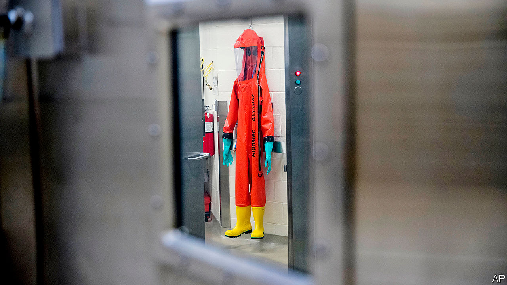

## Spore wars

# The havoc wrought by covid-19 will spark new concern over bio-weapons

> In theory they are banned, but some countries produce them covertly

> Apr 23rd 2020

Editor’s note: The Economist is making some of its most important coverage of the covid-19 pandemic freely available to readers of The Economist Today, our daily newsletter. To receive it, register [here](https://www.economist.com//newslettersignup). For our coronavirus tracker and more coverage, see our [hub](https://www.economist.com//coronavirus)

THE CORONAVIRUS that has killed over 180,000 people worldwide was not created with malice. Analysis of its genome suggests that, like many new pathogens, it originated by natural selection rather than human design. But if SARS-COV-2 had been deliberately engineered or launched into the world by malefactors, the consequences might have been much the same. “Covid-19 has demonstrated the vulnerability of the US and global economy to biological threats, which exponentially increases the potential impact of an attack,” says Richard Pilch of the Middlebury Institute of International Studies. Those concerns are prompting renewed interest in the threat from biological weapons, a lurid corner of warfare that normally languishes in happy obscurity.

In theory, bioweapons are banned. Most countries in the world are party to the Biological Weapons Convention (BWC) of 1975, which outlaws making or stockpiling biological agents for anything other than peaceful purposes. But some countries probably make them secretly, or keep the option close at hand. America accuses North Korea of maintaining an offensive biological-weapons programme, and alleges that China, Iran and Russia dabble in dual-use research. Toxins like ricin have also been bought and sold on shady recesses of the internet known as the dark web.

Germ warfare briefly rose to prominence in September 2001, when letters laced with anthrax spores were mailed to American news organisations and senators, killing five people. That was a wake-up call. Public health became part of national security. BioWatch, a network of aerosol sensors, was installed in more than 30 cities across America. But in recent years threats from chemical weapons, like the sarin dropped by Syria’s air force and the Novichok smeared on door handles by Russian assassins, took priority.

Though the Trump administration published a national biodefence strategy in 2018, it shut down the National Security Council’s relevant directorate and proposed cuts to the laboratories that would test for biological threats. Funding for civilian biosecurity fell 27% between fiscal years 2015 and 2019, down to $1.61bn—less than was spent on buying Black Hawk helicopters. “It’s the kind of thing that’s very easy to cut where you don’t see the damage you’re doing until you’re in a situation like this,” says Gigi Gronvall of the Johns Hopkins Centre for Health Security.

Biological weapons are now likely to rise up the agenda, though the lessons from covid-19 are not clear-cut. The Department of Homeland Security warns that extremist groups have sought to spread the virus deliberately, and Mr Pilch says that it “has challenged some long-standing assumptions regarding what biological agent may be used as a weapon”. Yet many pathogens used as weapons tend to differ from respiratory viruses in important ways.

Those like anthrax, caused by bacteria which form rugged and sprayable spores, but do not spread from human to human, have the advantage of minimising the risk of rebound to the attacker. With the notable exception of smallpox—a highly contagious and lethal virus that was eradicated in 1979 but preserved by the Soviet Union for use against America (but not Europe), and now exists only in two laboratories, in America and Russia—most biological weapons would therefore have more localised effects than the new coronavirus.

Even so, the slow and stuttering response to the pandemic has exposed great weaknesses in how governments would cope. “This outbreak has put stress on pretty much every element you need to respond to a biological attack,” says Gregory Koblentz of George Mason University, “and yet what we’re seeing is every part of our public-health infrastructure is either broken or stretched to the max.” The centrepiece of America’s biosurveillance programme, a network of laboratories designed for rapid testing, failed, says Mr Koblentz, while the national stockpile of face masks had not been substantially replenished in over a decade. Would-be attackers will take note.

Governments are also worried about a new generation of biological threats. In 2016 American intelligence agencies singled out genome editing as a national-security threat for the first time. Two years later a major study by the National Academies of Sciences, Engineering, and Medicine warned that synthetic biology, a potent set of methods for tinkering with or creating organisms, could, in time, be used to re-create viruses like smallpox or make existing pathogens more dangerous, such as resistant to antibiotics.

In 2011 Dutch and Japanese scientists said that they had created a version of bird flu that could be transmitted between mammals by the respiratory route—an announcement that prompted the Netherlands to treat the relevant academic papers as sensitive goods subject to export controls. In January Canadian scientists funded by an American biotech company used synthetic DNA from Germany to synthesise a microbe closely related to smallpox, indicating the ease with which it could be done. “If a potential bad actor pursues a weapons capability using SARS-COV-2, the virus is now attainable in laboratories all around the world, and blueprints for assembling it from scratch have been published in the scientific literature,” notes Mr Pilch.

The trouble is that biodefence has evolved slowly, says Dan Kaszeta, a former biological weapons adviser to the White House. Compact devices that can detect chemical threats and warn soldiers to don a gas mask have long been available. “That doesn’t exist for anthrax or any of the other aerosol pathogens,” says Mr Kaszeta. “Telling the difference between an anthrax spore and a bit of tree pollen is not something you can do in a couple of seconds.”

Internationally, the issue is largely neglected. “There’s no single facilitator in the UN system for a high-consequence biological event of unknown origin,” says Beth Cameron of the Nuclear Threat Initiative, an NGO. The BWC, she says, operates on a “shoe-string budget”.

Military labs across the world are already heavily involved in the fight against covid-19, but government money is a drop in the ocean compared with the billions of dollars of private funds now being unleashed against the virus. One hope is that the crash efforts to develop better tests and a vaccine may yield so-called platform technologies that would have utility not only against coronavirus, but also a wide range of other biological threats. Anthrax, for instance, has a vaccine but requires a cumbersome five doses. The “holy grail”, says Mr Kaszeta, would be a broad-spectrum antiviral or vaccine—a shield against natural and human foes alike.■

Dig deeper:For our latest coverage of the covid-19 pandemic, register for The Economist Today, our daily [newsletter](https://www.economist.com//newslettersignup), or visit our [coronavirus tracker and story hub](https://www.economist.com//coronavirus)

## URL

https://www.economist.com/united-states/2020/04/23/the-havoc-wrought-by-covid-19-will-spark-new-concern-over-bio-weapons
