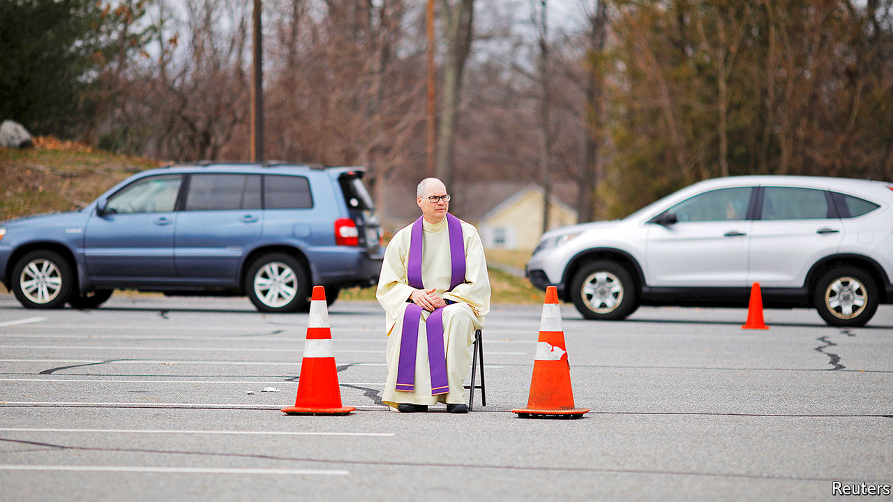

## Cathechismic

# The Trump campaign makes its pitch to Catholic voters

> Abortion may not be the clinching argument it once was

> Apr 25th 2020WASHINGTON, DC

THE TRUMP CAMPAIGN’S big push to woo Catholics, who helped elect the president in 2016, did not get off to a great start in 2020. Even before the kick-off rally for “Catholics for Trump”, scheduled for mid-March, became one of the first political casualties of social distancing, a high-profile church leader in an important swing state had given the outfit a gentle kicking. On learning that the organisation was planning to launch in his city, Archbishop Jerome Listecki of Milwaukee, Wisconsin, who had previously criticised the president’s immigration policies, declared that the church was “in no way affiliated to or sponsoring this event or campaign, locally, statewide or nationally”.

That is unlikely to deter the organisers of Catholics for Trump, which was launched this month as a mostly digital effort. The group, whose advisory board includes Newt Gingrich, a prominent conservative convert, is not trying to reach all Catholics. That is because there is no homogenous “Catholic vote” in America. Rather, members of the country’s single biggest religious group vote along a hotchpotch of social and demographic lines. Most notably, African-American and Hispanic Catholics lean Democratic while white Catholics lean Republican.

The president’s desire to appeal to white Catholics is especially pressing because they constitute a crucial constituency in the rustbelt states he won by a narrow margin in 2016. Nationally, Catholics constitute 22% of the population. In Wisconsin, which Mr Trump won by around 20,000 votes, 1.7m people—29% of the population—is Catholic. Pennsylvania, which Mr Trump won by fewer than 50,000 votes, has 3.6m Catholics. Though whites will soon be a minority among American Catholics, they are a strong majority in these states.

Mr Trump cannot rely on their support. White Catholics vote Republican by a smaller margin than white Protestants do. Some heavily Catholic counties in rustbelt states that voted Republican in 2016 did so for the first time. They could flip back.

The president’s courtship of Catholics is made more urgent by the fact that he will face one in November. Joe Biden makes frequent allusions to his Catholicism on the trail—especially when he is in areas with significant Catholic populations—including to his Catholic schooling, his fondness for nuns, and the succour his faith has given him in personal tragedy. That could play well with both devout and non-observant cultural Catholics.

Yet the Trump campaign hopes that the chief issue on which it means to appeal to Catholics—abortion—will also be its most powerful weapon against Mr Biden. The transformation of the president, who in 1999 described himself as “very pro-choice,” into an anti-abortion warrior has endeared him to some Catholic groups that once criticised him. CatholicVote.org, which in 2016 condemned Mr Trump after the release of footage in which he boasted of groping women, is mobilising Catholics to vote for him. Tim Huelskamp, a former Republican congressman from Kansas, who is involved with both organisations, says that while some areas of church teaching require interpretation, when it comes to abortion, “the teaching is the policy”.

Another high-profile anti-abortion crusader in Catholics for Trump is Frank Pavone, a priest and national director of Priests for Life, who in 2016 posted a video on social media in which he asked for votes for Mr Trump while standing behind an altar on which he had claimed to have placed the body of an aborted fetus. Mr Biden, by contrast, has a nuanced view of abortion: he dislikes it but does not want to make it illegal. This has earned him criticism on both sides of the abortion debate.

Though the former vice-president has said he supports Roe v Wade, the Supreme Court ruling which in 1973 made abortion a constitutional right, he has, for most of the past four decades, supported the Hyde Amendment, which bans the use of federal money for abortions. In 2019, to align himself with an ever more progressive Democratic Party, he changed his mind on that—a reversal Catholics for Trump is keen to exploit. During its online launch, Mercedes Schlapp, a former White House communications adviser, described Mr Biden as “an extremist” on abortion.

Yet abortion may not be quite the clinching issue for Catholics that Mr Trump hopes. Catholic Republican politicians and the United States Conference of Catholic Bishops (USCCB) paint it as a voting issue of singular importance. But even within the church hierarchy there is disagreement about that. At a recent meeting of the USCCB, a row broke out after a liberal group of bishops argued that its characterisation of abortion as the “pre-eminent” issue” (not official church teaching) should be scrapped from its voter-guidance document. Though the guide does not tell Catholics how to vote, its emphasis on abortion, echoed by many priests from the pulpit, can look like a nudge to vote Republican.

The row illustrates the two strains in the American church: one that emphasises personal morality, chiefly characterised by opposition to gay marriage and abortion, and another, promoted by Pope Francis, that focuses on issues of social justice, like the plight of immigrants. The strength of both traditions in America means that Catholics minded to follow church teaching could vote for either party.

In fact, when it comes to voting, few Catholics pay much heed to what their church tells them, even on abortion. When asked by researchers from Public Religion Research Institute if they would plump for a candidate who shared their views on abortion, less than one-quarter of white Catholics or Hispanic Catholics said they would do so.

In a closely fought battle, that minority could make a critical difference. But it also suggests that the appeal of Mr Trump for white Catholics is not so very different from his appeal for other white Americans. The online chat that constituted Catholics for Trump’s launch suggested as much. It began with a discussion about how well Mr Trump was tackling “the Chinese coronavirus” and progressed to an analysis of how the president’s values, exemplified in his immigration policies, which protected families and neighbourhoods, were in fact “Catholic values”. Mr Biden might also claim to represent Catholic values, albeit rather different ones.■

Dig deeper:

## URL

https://www.economist.com/united-states/2020/04/25/the-trump-campaign-makes-its-pitch-to-catholic-voters
