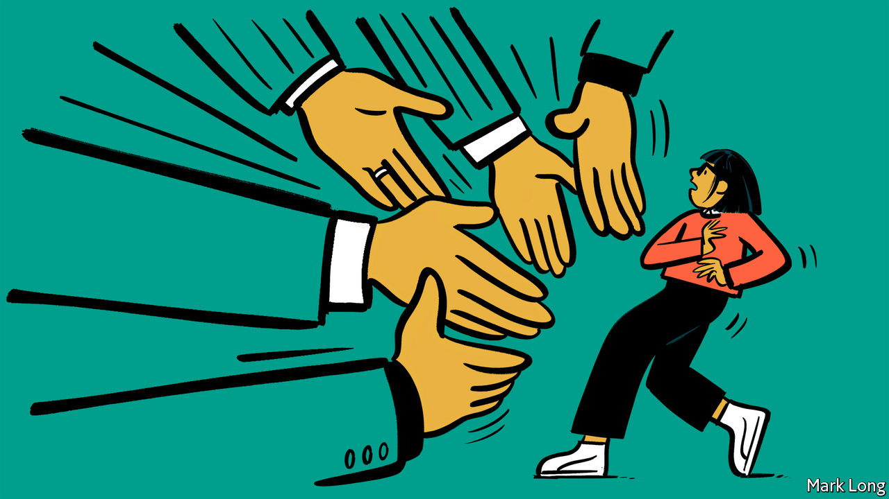

## Shake-work scheme

# Japan’s new industry: turning down jobs

> Graduates with multiple offers hire specialists to reject would-be employers

> Apr 30th 2020TOKYO

SELF-HELP books overflow with advice on how to say “no”, one of the trickiest words in any language. Doing so is a problem for Japanese university graduates in particular since, unlike their peers in many other countries, they are deluged with job offers: an average of three each last year. “They have no idea of how to deal with it,” says Shimizu Takahisa, a lawyer. His firm, Kawagoe Mizuho, is part of the mini-industry that has sprung up to take the job off their hands, so to speak.

Those who do not use a law firm offering “job-rejection services” can always turn to career consultants, who provide templates of polite no-thank-yous. There are even a few specialist job-rejection firms, such as Reccel, which for just ¥19,800 yen ($185) will convey the bad news to up to five would-be employers. Recoiling recruits need not speak a single word either to the firms they plan to jilt or to Reccel itself—the entire process can be arranged through Line, a messaging app.

An ageing population and restrictive immigration policies have left Japan with more jobs than jobseekers. Employers compete fiercely to hire talented youngsters and are reluctant to dismiss those they do manage to hire. If they need to cut costs, they are more likely to “adjust wages rather than headcounts”, says Yamaguchi Takeshi of Morgan Stanley. Firms worry that having fired staff (which the law makes difficult anyway) might put off recruits, notes Hugh Patrick of Columbia University.

Covid-19 may change things somewhat. The ratio of jobs to applicants hit a three-year low of 1.39 in March, well before the full effects of the virus were felt. Surveys suggest that firms plan to trim hiring further. Most of the pain will be felt by part-time and casual workers, who make up 38% of the workforce, are easier to sack and tend to skew younger and more female. (In late April the government announced the extension of unemployment benefits to such workers as part of its coronavirus response.) Analysts at Goldman Sachs think Japan’s unemployment rate will rise more in the coming months than it did during the global financial crisis—to 4.2%.