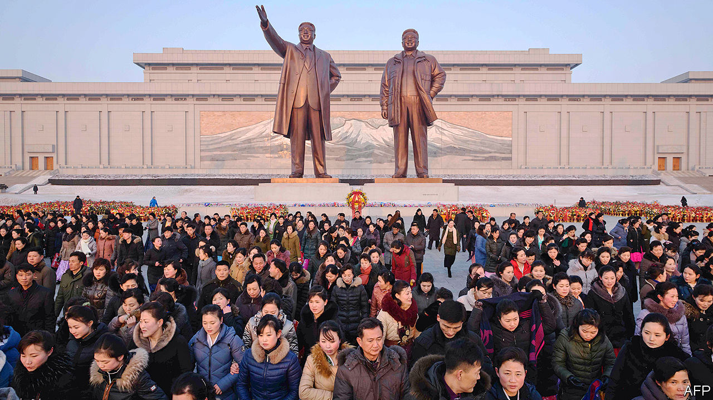

## Oh leader, where art thou?

# North Korea’s dictator has disappeared

> It has been three weeks since Kim Jong Un made any public appearances

> Apr 30th 2020SEOUL

HE IS DEAD, or brain-dead, or in a coma following botched heart surgery. He has been deposed in a coup. Maybe he has simply had a chin-lift or a tummy-tuck. Or he might just be hiding from the coronavirus at his seaside villa. Since Kim Jong Un, North Korea’s dictator, failed to make an appearance on April 15th at festivities marking North Korea’s most important public holiday (which commemorates the birthday of his grandfather, Kim Il Sung, the country’s founding despot) theories about his absence have been taking flight with the frequency and ferocity of the missiles his government so often tests.

The frenzy reflects the dearth of information on North Korea’s inner workings. It also highlights the potentially alarming implications if Mr Kim, who although only 36 is obese and fond of cigarettes and alcohol, should indeed turn out to be dead or incapacitated. Given his total authority and lack of any presumed, let alone designated, successor, a bloody political crisis might well follow.

Mr Kim’s health is a closely guarded secret to which only his inner circle has access. Anyone leaking information about it to the outside world would be risking death. His absence at and since the celebrations on April 15th is certainly unusual: he had previously attended them every year since coming to power in 2011. But observers caution against over-interpretation. “Judging from state media reporting, it looks like business as usual,” says Rachel Lee, a former analyst for the American government. “Without more information there is nothing to indicate that anything abnormal is going on.”

South Korea, too, is downplaying the disappearance. The minister in charge of relations with the North says Mr Kim is in all likelihood taking precautions against the coronavirus (of which North Korea still claims to have no cases). However, points out Andrei Lankov of Kookmin University in Seoul, given that the South Korean government is still eager for detente with the North, it may be reluctant to advertise unusual goings-on. The normal difficulty of discerning what is happening, Mr Lankov adds, is compounded by the closure of the North’s border with China to ward off covid-19, which has further reduced the flow of information. Cheong Seong-chang of the Sejong Institute, a think-tank, says: “The fact that he isn’t showing his face in public suggests there is something wrong with his health, though it’s probably not as serious as some people claim.”

Mr Kim has previously disappeared from view for long stretches. In 2014 he vanished for six weeks, inducing hyperventilated rumours, before resurfacing without official explanation. He was, however, walking with a cane when he popped up again, suggesting he had undergone surgery on his ankle.

As in 2014, Mr Kim’s prolonged absence has fuelled speculation over what might happen if he became too sick to govern. Attention has focused on Kim Yo Jong, his younger sister. She has risen to prominence in recent years, having been dispatched as an envoy to the Winter Olympics in South Korea in 2018 and put in charge of the North’s propaganda machinery. Given that all North Korea’s leaders have been members of the Kim dynasty, many observers consider her the most likely candidate to take over. But she is also a young woman, which might not endear her to her brother’s elderly, patriarchal lieutenants. That raises the possibility of a drawn-out power struggle in the case of his sudden demise. “She’d probably have to shoot a lot of people to assert her authority,” says Peter Ward of the University of Vienna.

While that would be in keeping with family tradition, it might still portend a period of instability in the North which the world is currently uniquely ill-equipped to deal with. In theory America and South Korea have contingency plans for responding to a crisis in the North, including the recovery of its nuclear weapons. But those appear to have been little discussed in recent years either between the allies or with China, which would have to be considered in any military operation. Relations between America and South Korea are tetchy amid stalled talks over South Korea’s contribution towards the cost of keeping American troops on the peninsula. America and China, for their part, are at loggerheads over everything from the pandemic to trade. If something is indeed ailing Mr Kim, the malady could quickly spread beyond the North’s borders. ■

## URL

https://www.economist.com/asia/2020/04/30/north-koreas-dictator-has-disappeared
