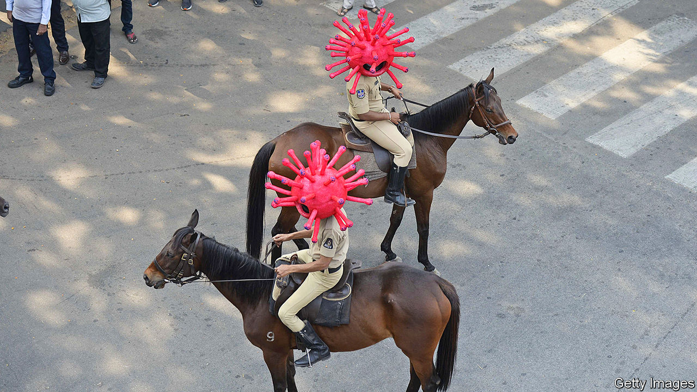

## The legitimate use of farce

# Some Asian governments are fighting covid-19 with fun

> Others prefer fear

> Apr 30th 2020SINGAPORE

Editor’s note: The Economist is making some of its most important coverage of the covid-19 pandemic freely available to readers of The Economist Today, our daily newsletter. To receive it, register [here](https://www.economist.com//newslettersignup). For our coronavirus tracker and more coverage, see our [hub](https://www.economist.com//coronavirus)

NOT ALL Malaysians are afraid of catching covid-19, judging by the sometimes half-hearted adherence to the national lockdown. But Muhammad Urabil Alias of Kemaman, a town in the state of Terengganu, thinks everyone is scared of a pontianak (the bloodthirsty ghost of a woman who has died in childbirth). Every night he dresses as one and haunts the streets, to deter his neighbours from breaking the curfew. Villagers in Indonesia have hit on a similar tactic, patrolling the streets while dressed as pocong (another type of ghost, trapped in its burial shroud). Rodrigo Duterte, the president of the Philippines, has come up with another variation on the idea of enforcing lockdowns through fear: he has told the police to shoot anyone caught breaking quarantine.

Most Asian governments are more humane. Vietnam’s pioneered the idea of helping people absorb the flood of public-health advisories by making them fun. During the epidemic’s first flush, in February, it commissioned a catchy pop song about hand-washing and social distancing. It later asked a choreographer to come up with a dance to accompany the by-then viral tune. People around the world continue to upload footage of themselves performing the routine on TikTok, a video-sharing platform.

Gurmit Singh, a Singaporean comedian, has released an anti-covid rap. He also sang “Sar-Vivor”, which the government commissioned in 2003, during an outbreak of SARS, to urge Singaporeans to “be safe, not sar-ry”. Now he tells them “wash yo hands” before, among other things, picking their noses.

Cheery traffic police in Hyderabad, the sixth-biggest city in India, have donned coronavirus-shaped helmets to remind people of the perils of leaving home (the main danger in much of India being savage beatings from the police). On government orders, many Indian mobile networks are playing a 30-second public-service announcement before connecting calls. It begins with a cough.

A resort to patriotism is yet another tactic. Streets in Vietnam have been plastered with posters proclaiming, “To stay at home is to love your country”. Le Duc Hiep, their designer, says he mimicked old-fashioned propaganda posters to “invoke patriotic emotions”. Vietnam’s claim to have brought its outbreak under control without a single death is presumably another spur to national pride.

Dig deeper:For our latest coverage of the covid-19 pandemic, register for The Economist Today, our daily [newsletter](https://www.economist.com//newslettersignup), or visit our [coronavirus tracker and story hub](https://www.economist.com//coronavirus)

## URL

https://www.economist.com/asia/2020/04/30/some-asian-governments-are-fighting-covid-19-with-fun
