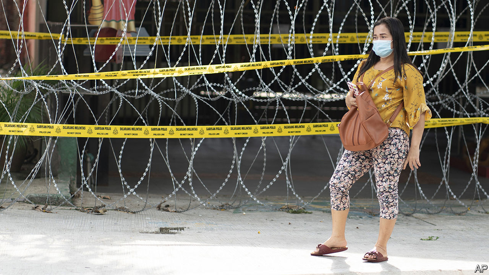

## When make-up is essential

# The reflexive sexism of Malaysia’s bureaucrats

> The sectarian political system helps to reinforce chauvinist policies

> Apr 30th 2020

“MAYBE SOME men think it’s cute, lah, but…” Rather than finish her sentence, Chelsia Ng, a Malaysian musician, simply giggles. Other Malaysian women, however, were not as amused by the government’s recent advice to wives spending more time than usual with their husbands during the country’s coronavirus lockdown. The dutiful spouses should dress nicely, put on make-up, “avoid nagging” and—the trigger for Ms Ng’s mirth—talk in the same tones as Doraemon, a robotic cat from a Japanese animated cartoon. Women’s groups slammed the government’s perpetuation of “harmful gender stereotypes”. The Ministry of Women, the Family and Community Development quickly withdrew the posters in question. It also reversed its decision to shut its domestic-abuse hotline during the lockdown.

To many Malaysians, the surprising thing about this episode was not the reflexive sexism of the bureaucracy, but the fact that the bureaucrats changed course in response to the indignation. The latest Global Gender Gap Index from the World Economic Forum, which measures progress towards parity between men and women, ranks Malaysia as 104th out of 153 countries. It lags almost all of its neighbours in South-East Asia, including Indonesia, the Philippines, Thailand and Vietnam. Less than a quarter of Malaysia’s lawmakers are female and only 26% of companies have any women among their senior managers. Only 55% of women work outside the home; 80% of men do. Many chauvinist laws endure. A Malaysian father can pass his nationality to a child born abroad but a Malaysian mother must apply to do so. There is no law against marital rape.

Malaysia’s constitution puts family law in the hands of its 13 states. For Muslims, marriage, divorce and child custody are administered by religious authorities. Men can take up to four wives but women must stick to one husband. Boys cannot marry until they turn 18, but girls can do so at 16. Islamic judges can also approve marriages at a younger age. They received almost 6,000 such requests between 2013 and mid-2018. And it is possible to dodge even that requirement: in 2018 an Islamic court merely fined a 41-year-old man for marrying an 11-year-old girl abroad.

Although the plight of child brides stirs widespread outrage, challenging the Islamic authorities is difficult given the ethnic and sectarian dynamics of Malaysian politics. Most Malaysians are ethnic Malays. Politicians tend to favour this majority, who enjoy privileges meant to make them richer. But since the law defines Malays as Muslims, criticism of Islamic edicts is easily painted by their defenders as an attack on all Malays.

The United Malays National Organisation (UMNO), which held power for 61 years, tended to tread a middle path, stoking Malay nationalism but resisting the most doctrinaire interpretations of Islam. But as UMNO grew corrupt and lost popularity, it began to pander more to religious sentiment. Although it lost power at elections in 2018, it recently managed to manoeuvre its way back into government by aligning with PAS, a conservative Islamic party. Malaysia’s one big secular party was pushed out of the ruling coalition in this realignment, as was an outfit that draws most of its support from the 24% of Malaysians who are of Chinese extraction.

The change in government has probably put paid to a bill to combat sexual harassment and may well scupper another, to promote equality for women. The new deputy minister in the women’s ministry is from PAS. She suggested in a video in March that wives “accept, remain patient and forgive” abusive husbands, even as calls to the previously suspended domestic-violence hotline shot up. “The best-case scenario is that they don’t roll back our rights,” says Honey Tan, a human-rights lawyer. ■