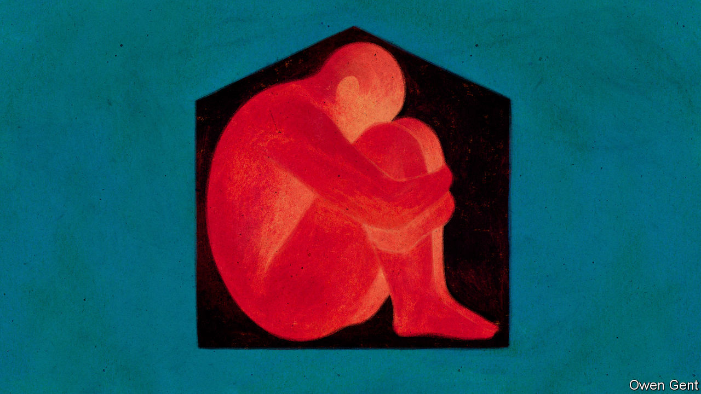
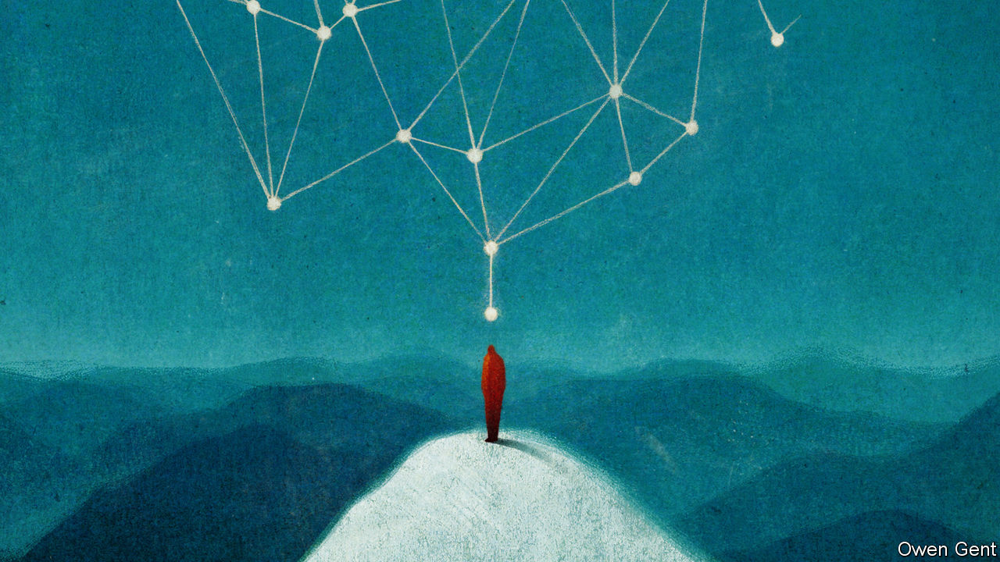

## All the lonely people

# Solitude has always been both a blessing and a curse

> Two timely books spell out its dangers and perennial allure

> Apr 30th 2020

A Biography of Loneliness. By Fay Bound Alberti. Oxford University Press; 320 pages; $25.95 and £20.

A History of Solitude. By David Vincent. Polity; 304 pages; $35 and £25.

IN HIS “POLITICS” Aristotle argued that, thanks to the gift of language, man is destined to be a social and therefore a political animal. Yet the human instinct to socialise has always been balanced by an urge to withdraw into solitude. A few hermits make their lives in isolation, but many ordinary folk believe society is only tolerable if punctuated by frequent spells on their own. “There are many modern thinkers who emphasise the individual’s dependency upon society,” John Cowper Powys, a British writer and advocate of solitude, observed. “It is, on the contrary, only the cultivation of interior solitude, among crowded lives, that makes society endurable.”

Historians are for the most part solitary creatures themselves—the sort of people who, at school, preferred reading to team sports and, as adults, desperately try to avoid committees in order to spend more time in the library. All the same, they generally focus on gregarious activities, whether politicians on manoeuvres or the masses on the march. Bucking that trend, a couple of fascinating books on social isolation have appeared in time for the lockdown. Fay Bound Alberti has tried her hand at a history of loneliness. David Vincent focuses on loneliness’s rather more interesting sibling, solitude. Both concentrate on late modern Britain, Ms Alberti because she argues, somewhat unpersuasively, that loneliness is a recent phenomenon, the product of industrialisation and secularisation; Mr Vincent because he has spent a lifetime studying the country’s modern social history. What Aristotle called the “bird which flies alone” is finally getting his due.

Medieval Christendom saw some extraordinary feats of solitude. In the late third century St Anthony spent years in the desert with only scorpions and beasts for company. St Jerome tried a similar feat but took a large library with him. St Simeon Stylites upped the ante by sitting on top of a pillar in order to be closer to heaven. (“The progress of an ulcer in his thigh might shorten, but it could not disturb, this celestial life,” Edward Gibbon wrote in a wonderful description of the saint, “and the patient Hermit expired, without descending from his column.”) Monasteries were refuges from the world that combined communal living with hours of solo prayer. Thomas Merton, a modern advocate of monasticism, claimed that “man’s loneliness is in fact the loneliness of God.”

The 18th and 19th centuries saw this cult of solitude reinvented in secular forms. Enlightenment philosophers argued that the key to a civilised life lay in mixing sociability and solitude in just the right doses: immerse yourself too deeply in urban life and you might become neurotic, but retreat for too long to the country and you might degenerate into a bearded barbarian. The Romantics thought the best way to create great art was to surround yourself with nature. John Clare began one poem: “O thou soothing Solitude/From the vain and from the rude”. William Wordsworth wandered “lonely as a cloud”. By taking long walks in remote places, such as the Lake District or the Alps, you could become what Robert Louis Stevenson later called “a pipe for any wind to play upon”.

The Romantics set off a lasting fashion for grappling with nature in the raw. In Britain intellectuals showed that scaling mountains and hiking long distances could connote brains as well as brawn (Leslie Stephen and G.M. Trevelyan thought nothing of walking from Cambridge to London for dinner). In America the march of civilisation generated a compensatory fascination with the wilderness. Henry David Thoreau retreated to Walden Pond. As a young man Teddy Roosevelt reinvented himself as a western cowboy by travelling around the Dakotas. As president he created National Parks to let ordinary Americans escape from the pressure of civilisation to a natural world of soaring peaks and wild animals. Many of the iconic images of 19th-century America capture a sense of solitude—the “lonesome cowboy” on cattle drives or the haunting sound of the train whistle in the middle of nowhere.

As Mr Vincent says, industrial society brought a spate of solitary hobbies within reach by boosting living standards and enlarging personal space. Women with a little time on their hands took up pastimes that had once been necessities, such as cooking, dressmaking and embroidery. Men tried pigeon-breeding and stamp-collecting. People of both sexes took on jigsaw puzzles and, from the 1920s, crosswords. The cult of solitude also encouraged less healthy habits. Charles Kingsley, a subscriber to “muscular Christianity”, regarded tobacco as the ideal accompaniment to the solitary life—“a lone man’s companion, a bachelor’s friend, a hungry man’s food, a sad man’s cordial, a wakeful man’s sleep, and a chilly man’s fire”. Arthur Conan Doyle’s Sherlock Holmes preferred an opium pipe to ignite his solitary reveries.

Healthy or otherwise, these hobbies united a nation that was divided by class. Britain’s allotment movement meant that, by 1910, half a million working-class men could enjoy the pleasures of gardening. Such activities also married sociability with solitude. Smokers shared their solitary vice in dedicated rooms in clubs and pubs. Angling encouraged people to collaborate on being alone. “We may club together as against others, but by the water we divide,” Morley Roberts wrote in 1932. “When I fish I am the universe.”

Yet the more civilisation has advanced, the further people have had to go to achieve that sensation. Starting with Joshua Slocum in 1895, solo yachtsmen sailed around the world, sometimes cutting themselves off from all outside help. Robin Knox-Johnston, for example, didn’t talk to anyone for five months. Mountaineers competed with each other to slip the knot of civilisation. In 2017 Alex Honnold climbed El Capitan in Yosemite with neither companions nor crampons. These extraordinary battles against nature were inspired by the belief that the best way to explore body and soul is to strip the self to its essence. “It is here, in the immense desert of the Southern Ocean,” Bernard Moitessier wrote, “that I feel most strongly how much man is both atom and god.”

And the more sophisticated civilisation has become, the more people have been willing to use its fruits to escape the enforced sociability that has mostly been humanity’s lot. In 1900 just 5% of households comprised one person. Today a quarter do in America, along with a third in Britain and perhaps half in Sweden. Sometimes the solo life is a choice: people use their money to dump an unsatisfactory partner. Sometimes it is a tragedy: in Britain a million older people say they routinely suffer from loneliness. Most feel unable to admit their plight to friends and relatives.

This points to the paradox at the heart of solitude, which, as Mr Vincent says, can be both a blessing and a curse. Loneliness and solitude are not the same: you can feel lonely in a crowd—indeed loneliness is at its darkest when you are surrounded by people having fun—but they overlap. Unwanted solitude can lead to the most miserable sort of loneliness. “I’d like to meet,” C.S. Lewis wrote to a friend after his wife died, “for I am—Oh God that I were not—very free now. One doesn’t realise in early life that the price of freedom is loneliness. To be happy is to be tied.”

Even voluntary solitude can foster mental illness. In the early modern period John Evelyn warned that solitude “creates witches”. Samuel-Auguste Tissot feared it led to masturbation and all that masturbation entails, “melancholy, sighing, tears, palpitations, suffocations and faintings”. The first great book devoted to solitude, by George III’s personal doctor, Johann Georg Zimmerman, was titled “Solitude Considered with Respect to its Dangerous Influence Upon the Mind and Heart” (1791). Joseph Conrad condemns his character Nostromo to die of solitude, “the enemy known but to few on this Earth, and whom only the simplest of us are fit to withstand”.

Given its power to break the spirit, loneliness has inevitably been used as a punishment. Pentonville, Britain’s first model prison built on Utilitarian principles, confined all prisoners in solitary cells, though it dropped the face masks that, in Jeremy Bentham’s original design, they were supposed to wear to stop them communicating during meals. The most extreme use of solitary confinement was in a wing of a state prison in Auburn, New York, where inmates were confined in total solitude, with no exercise and no human contact of any kind. Gustave de Beaumont and Alexis de Tocqueville were appalled when they visited the place in 1833: “In order to reform them they have been submitted to complete isolation; but this absolute solitude, if nothing interrupt it, is beyond the strength of man; it destroys the criminal without intermission and without pity; it does not reform, it kills.”

Ms Alberti notes that anxiety over involuntary loneliness has become a big political issue, particularly in northern European and Anglo-Saxon countries, where the breakdown of the family has gone furthest. In 2016 the BBC released a television documentary on “the age of loneliness”. In 2017 Vivek Murthy, America’s former surgeon general, declared an “epidemic of loneliness”. In 2018 Theresa May appointed Britain’s first “minister for loneliness”, declaring that “up to a fifth of UK adults feel lonely most or all of the time.”

The history of solitude is thus partly a history of extremes—of people who have willingly sat on top of pillars for decades and of prison reformers who aim to use loneliness to break men’s souls. But it is also a history of the quest for balance.

The healthiest form of solitude is a flexible kind that combines it with sociability as necessary. Modern technology has made it both easier and harder to get the balance right. On the one hand, it has introduced what Mr Vincent calls “networked solitude”. Just as St Jerome squatted in his cave surrounded by his library, so modern hermits can sit in their flats gorging on downloaded books and films or chatting with friends across the world. On the other hand, it has made it more difficult to enjoy the benefits of solitude. Distraction is always one click away. And the same technology that allows the solitary individual to engage remotely with society also allows society to engage remotely—and sometimes secretly—with the individual. Giant companies watch over you whether you are alone or in a crowd.

There is also something disturbing about the way the boundaries between solitude and sociability are blurring. Visit a gym and you see sweaty solipsists performing private workouts in public. On a train many of your fellow passengers will be insulated by headphones. Those ubiquitous devices are double-edged: they can fill your head with babble or, thanks to noise-cancelling, leave you in Trappist silence. As the two categories mingle, so the quest for balance becomes more intense. Popular modern fads offer a reacquaintance with the virtues of solitude: mindfulness provides access to peace and silence; some of the most popular pastimes in Silicon Valley, the source of so much noise and distraction, are hiking, yoga and meditation.

The lockdown has put the question of solitude at the heart of politics. Social distancing has been a tragedy for those living and, in some cases, dying alone. But for others it has proved a strange blessing. Overworked people have been able to take a break from the treadmill of commuting. Many have picked up long-abandoned hobbies, such as tending the garden or playing bridge. Solitude is both one of mankind’s greatest blessings and greatest curses—and thanks to a virus that has been carried across the world by human sociability, more people than ever are getting the chance to experience both. ■

## URL

https://www.economist.com/books-and-arts/2020/04/30/solitude-has-always-been-both-a-blessing-and-a-curse
