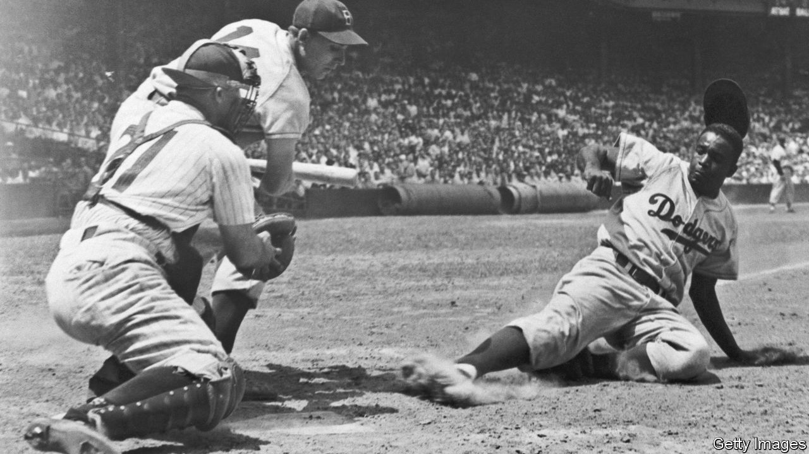

## Home Entertainment

# The comfort of old-time baseball broadcasts

> Forlorn fans can revisit past glories, and America’s history, on the internet

> May 2nd 2020

IN ADDITION TO being one of America’s best-known poets, Walt Whitman was among the earliest fans of baseball. “In our sun-down perambulations of late”, he wrote in 1846, “through the outer parts of Brooklyn, we have observed several parties of youngsters playing ‘base’, a certain game of ball.” In lines that bite in a world under quarantine, Whitman urged: “Let us go forth a while, and get better air in our lungs. Let us leave our close rooms…The game of ball is glorious.”

There is no substitute for a summer afternoon in the bleacher seats or extra innings in the shortening evenings of October. But listening to radio commentaries of memorable baseball games can help ease the ache in self-isolating fans’ hearts. By searching for “classic baseball radio broadcasts” on the internet, enthusiasts can tune in to more than 500 games played between 1934 and 1973.

Radio and baseball evolved together as both expanded and were commercialised in the first half of the 20th century. In part because of those early ties, baseball radio always feels nostalgic. The great announcers—Vin Scully, Harry Caray, Ernie Harwell—are old friends whispering in fans’ ears, filling them in on so-and-so’s nasty curveball or batting average. The relationships between listeners and their local emcees, and the intimate feel of audio description, make baseball radio seem personal in the same way that podcasts can be—and as televised sports never will.

Sports-lovers who favour action over finesse often bemoan the longueurs of baseball. But its cadence is well-suited to the lockdown. You can cook dinner or disinfect the house in the company of the Cubs (your correspondent is a native North Sider). The unhurried pace shaped the broadcasts themselves: to fill the airwaves between innings, announcers opine on players’ personal lives or how they themselves would write the ending of the game—only to be interrupted when the ball is at last hit.

Returning to classic games also provides fans with an oral history of Major League Baseball, and, obliquely, of the cities it is played in, even of America itself. Listening to Jackie Robinson (pictured), a pathbreaking African-American star, hit a single to left field for the Brooklyn Dodgers in 1951 is a reminder of earthly transience (the Dodgers moved from New York to Los Angeles in 1958), as well as of the racism that has been endemic to the country and its pastimes.

While audio from such early games is gravelly compared with today’s, some things haven’t changed at all. Announcers from 1940 and 2020 alike fall into the same rhythms: short, staccato sentences when the ball is in play; crescendos when it is hit; drawn-out vowels when home runs look certain and guttural screams from the crowd when victory or defeat looms. Unlike Whitman, fans today may not yet be able to leave their close rooms. But thanks to radio and the internet, baseball—in all its meandering, heart-fluttering glory—is still within their reach. ■

## URL

https://www.economist.com/books-and-arts/2020/05/02/the-comfort-of-old-time-baseball-broadcasts
