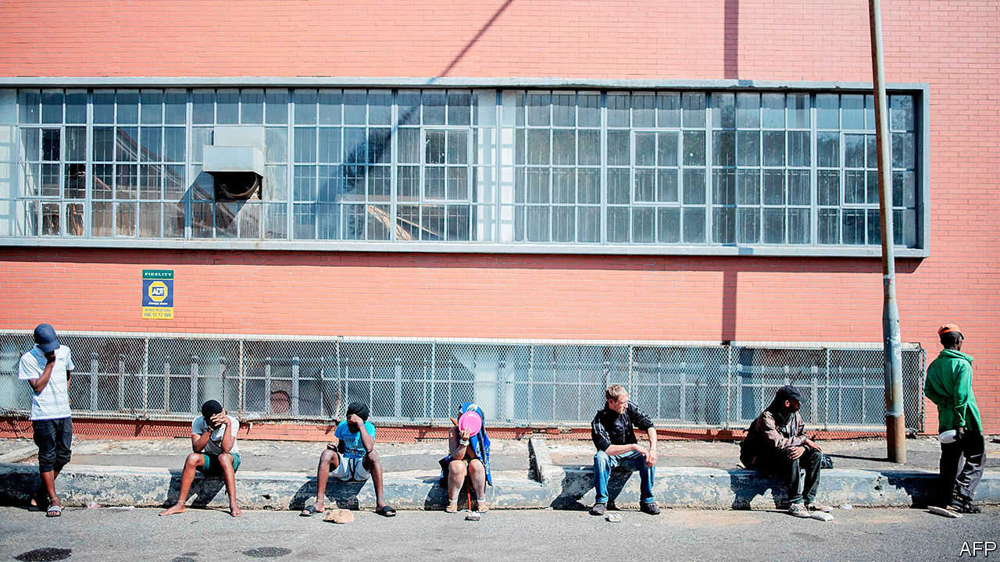
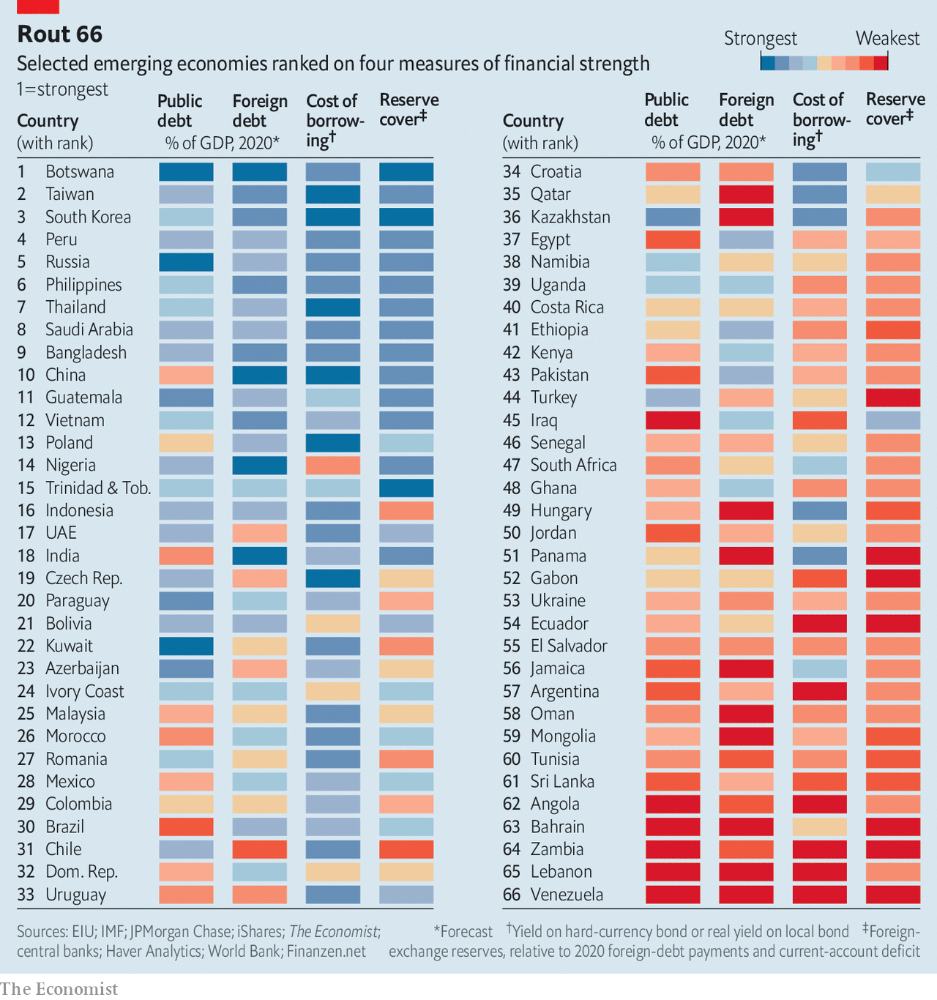

## Next in line

# Which emerging markets are in most financial peril?

> Our ranking of 66 countries shows which are in distress, and which are relatively safe

> May 2nd 2020HONG KONG

Editor’s note: The Economist is making some of its most important coverage of the covid-19 pandemic freely available to readers of The Economist Today, our daily newsletter. To receive it, register [here](https://www.economist.com//newslettersignup). For our coronavirus tracker and more coverage, see our [hub](https://www.economist.com//coronavirus)

WHAT TO WEAR? The question puzzles many people shaken out of their routines by the pandemic. It also troubles investors. The world is full of “dirty shirts”, as Bill Gross, a legendary bond trader, once put it, when contemplating the bonds on offer from heavily indebted governments. But you have to wear something. Thus many investors buy Treasuries, despite America’s less-than-sparkling public finances, because it is the “least dirty shirt”.

The grubbiest garments are found elsewhere—among the world’s emerging markets. They collectively owe $17trn of government debt, 24% of the global total. Eighteen of them have had their credit ratings cut in 2020 so far by Fitch, more than in the whole of any previous year. Argentina has missed a $500m payment on its foreign bonds. If it cannot persuade creditors to swap their securities for less generous ones by May 22nd, it will be in default for the ninth time in its history. The laundry pile also includes Ecuador, which has postponed $800m of bond payments for four months to help it cope with the pandemic; Lebanon, which defaulted on a $1.2bn bond in March; and Venezuela, which owes barrelfuls of cash (and crude oil) to its bondholders, bankers and geopolitical benefactors in China and Russia. These defaulters may soon be joined by Zambia, which is seeking to hire advisers for a “liability-management exercise”, an agreement to pay creditors somewhat less, somewhat later than it promised (see [article](https://www.economist.com//middle-east-and-africa/2020/05/02/zambia-was-already-a-case-study-in-how-not-to-run-an-economy)).

As the pandemic wreaks havoc on economies and public finances, the natural question is: who’s next? More than 100 countries, including South Africa, have asked the IMF for help. It has already approved 40 of the quick, small loans it provides after natural disasters. Some countries are repeat customers. Egypt is also seeking a new bail-out only nine months after it drew down the final instalment of a loan agreed on in 2016.

When the virus first jolted financial markets, the threat of a full-blown emerging-market crisis loomed. Since January foreign investors have withdrawn about $100bn from emerging-market bonds and shares, according to the Institute of International Finance (IIF), a banking association. That is over three times what they yanked out over an equivalent period of the global financial crisis (although these numbers do not cover all capital flows, and emerging economies have grown significantly since 2008).

The sense of panic has since begun to abate. The Federal Reserve’s swap lines to 14 central banks—including those of Brazil, Mexico and South Korea—have helped ease a global dollar shortage. Capital outflows have subsided and emerging-market bond yields have fallen. This tentative reprieve invites a more discriminating assessment of emerging-market finances. The Economist has ranked 66 countries using four indicators of financial strength (see chart). Some, such as Russia, Peru and the Philippines, look relatively robust. About 30 are in distress, or flirting with it. The alphabet of alarm runs from Angola to Zambia. But these 30 account for a relatively small share of the group’s debt and GDP.

Covid-19 hurts emerging economies in at least three ways: by locking down their populations, damaging their export earnings and deterring foreign capital. Even if the pandemic fades in the second half of the year, GDP in developing countries, measured at purchasing-power parity, will be 6.6% smaller in 2020 than the IMF had forecast in October.

The damage to exports will be acute. Thanks to low oil prices, Gulf oil exporters will suffer a current-account deficit of over 3% of GDP this year, the IMF reckons, compared with a 5.6% surplus last year. When exports fall short of imports, countries typically bridge the gap by borrowing from abroad. But the reversal of capital inflows has been matched by higher borrowing costs. In March the risk premium that emerging markets must pay buyers of their dollar bonds rose to distressed levels (over ten percentage points) for nearly 20 governments—a record number, says the IMF.

To weather the crisis, emerging economies may need at least $2.5trn, the fund reckons, from foreign sources or their own reserves. One way to ensure countries have more hard currency is to stop taking it from them. The G20 group of governments has said it will refrain from collecting payments this year on its loans to the poorest 77 countries (though the borrowers will have to make up the difference later). The G7 group of countries has urged private lenders to show forbearance too. A group of over 70 private creditors supports the idea, while noting its “complexity” and the “constraints” lenders face.

A sweeping debt standstill may also be less necessary than it seemed even two weeks ago, as investors have calmed somewhat. That may reflect over-optimism about the course of the pandemic. But even false optimism can be of true help to emerging markets, by allowing them to refinance debt on affordable terms.

The relative calm also allows for a more discerning look at emerging-market strains. Some have wide fiscal or external deficits; others have high debts. In some the weak link is the government; elsewhere it is the private sector. Debt may be largely domestic, or it may be owed to foreigners—and sometimes in foreign currency, too.

Our ranking examines 66 economies across four potential sources of peril. These include public debt, foreign debt (both public and private) and borrowing costs (proxied where possible by the yield on a government’s dollar bonds). We also calculate their likely foreign payments this year (their current-account deficit plus their foreign-debt payments) and compare this with their stock of foreign-exchange reserves. A country’s rank on each of these indicators is then averaged to determine its overall standing.

The strongest countries, such as South Korea and Taiwan, are overqualified for the role of emerging markets. Many bigger economies, including Russia and China, also appear robust. Most of the countries that score badly across our indicators tend to be small. The bottom 30 account for only 11% of the group’s GDP, and less than a quarter of both its foreign and its public debt.

The ranking also reveals the vast differences in the source and scale of potential weaknesses. Countries like Angola, Bahrain and Iraq have public debt that some reckon will exceed 100% of GDP this year. But about half of the economies we examine have debts below 60% of GDP, the threshold that euro-zone members are supposed to meet (and which few do).

The Asian financial crisis of 1997 showed that strong public finances are not enough to protect an emerging economy if private firms borrow heavily abroad. Mongolia’s public debt looks manageable (less than 70% of GDP) but its foreign debt (public and private) is almost twice GDP. Conversely, the well-known fiscal frailties of Brazil and India are mostly confined within their own borders.

Bond yields, meanwhile, show how costly foreign borrowing will be. Sixteen of the economies in our group must offer yields of over 10% on their existing dollar bonds to find takers. But over 20 have hard-currency bonds yielding less than 4%, the kind of cheap finance that used to be the preserve of rich countries. Some, like Botswana, have no dollar bonds at all, preferring to borrow in their own currency.

Over the course of 2020, the 66 economies in our exercise will have to find over $4trn to service their foreign debt and cover any current-account deficits. Excluding China, the figure is $2.9trn. But this leaves out the buffers that emerging economies have accumulated. The governments in our exercise hold over $8trn in foreign-exchange reserves (or almost $5trn, excluding China). Half have enough reserves to cover all of their foreign-debt payments due this year and any current-account deficits. The rest (including 27 of the bottom 30) have a combined reserve shortfall of about $500bn. By far the largest gap in dollar terms is in Turkey, which has swiftly depleted its reserves by intervening to prop up the lira.

The calculations for the reserve shortfall ignore the risk of capital flight, when a country’s own citizens decide to take their money out of the country. But they also assume that countries will attract no foreign direct investment and fail to roll over any of their foreign debt coming due this year. In March such a scenario seemed all too plausible. Now it looks too gloomy.

Indeed, in recent weeks 11 emerging economies have been able to sell over $44bn-worth of bonds between them, says Gregory Smith of M&G Investments, an asset manager. Even Panama, with large external debts and a big reserve shortfall, issued bonds at a yield of less than 4% at the end of March. The sale was three times oversubscribed. In a world of dirty shirts, some investors fancy a Panama hat. ■

Dig deeper:For our latest coverage of the covid-19 pandemic, register for The Economist Today, our daily [newsletter](https://www.economist.com//newslettersignup), or visit our [coronavirus tracker and story hub](https://www.economist.com//coronavirus)

## URL

https://www.economist.com/briefing/2020/05/02/which-emerging-markets-are-in-most-financial-peril
