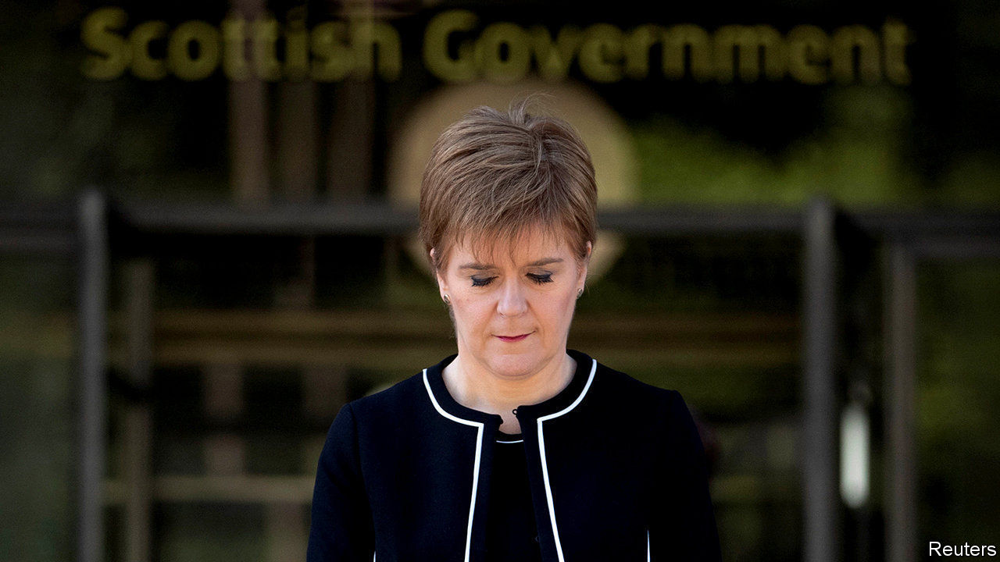

## Scotland

# Coronavirus has made Scottish independence even less likely

> The economic risks of independence look ever higher

> Apr 30th 2020EDINBURGH

Editor’s note: The Economist is making some of its most important coverage of the covid-19 pandemic freely available to readers of The Economist Today, our daily newsletter. To receive it, register [here](https://www.economist.com//newslettersignup). For our coronavirus tracker and more coverage, see our [hub](https://www.economist.com//coronavirus)

NICOLA STURGEON, Scotland’s first minister, makes it her business to find ways of highlighting differences—sometimes real, sometimes contrived—between the way that the Scottish and United Kingdom governments do things. She normally treats the UK government’s difficulties as opportunities for point-scoring.

Things have changed. During the pandemic, in her daily briefings and in interviews, she has emphasised how closely politicians and officials from the central and devolved administrations have been working together. Rather than picking fights, she makes it clear that partisan politics are inappropriate.

This softening may outlast covid-19. Some Scottish Nationalists are using the crisis to boost the cause of independence: Angus Brendan MacNeil, a Scottish National Party MP, said that Scotland would be faring better through the pandemic if the country was not “involved in the web around Cobra [the cabinet committee calling the shots] and the United Kingdom”. But the messaging coming out of the first minister’s office is very different. Those close to her say the virus has made the prospect of a second independence referendum in the medium term unrealistic.

The central problem is economics. The idea that Scotland would be richer alone, which the SNP pushed in the 2014 referendum, was undermined by the subsequent collapse in the oil price. When it emerged that in 2018-19, Scotland’s notional deficit represented 7% of GDP compared the UK’s 1.1%, the nationalists could no longer argue that independence wouldn’t come with some pain, initially at least.

The SNP takes the view that it lost the last independence referendum because people were not prepared to take an economic gamble. That was in the good times. Now oil is cheap and Scotland is running a big deficit. If it went for independence, on the basis of the deal agreed in 2014, it would have to pay 10% of the covid-19 bill. “I don’t fancy making the case for taking on the costs of independence while the country’s struggling,” says an SNP MP.

Writing in Scotland’s Herald on Sunday newspaper on April 26th, Ms Sturgeon outlined her belief that the pandemic creates an opportunity for Scots to discuss the kind of country they want in future. But nationalists should note: not once did she mention independence.■

Dig deeper:For our latest coverage of the covid-19 pandemic, register for The Economist Today, our daily [newsletter](https://www.economist.com//newslettersignup), or visit our [coronavirus tracker and story hub](https://www.economist.com//coronavirus)