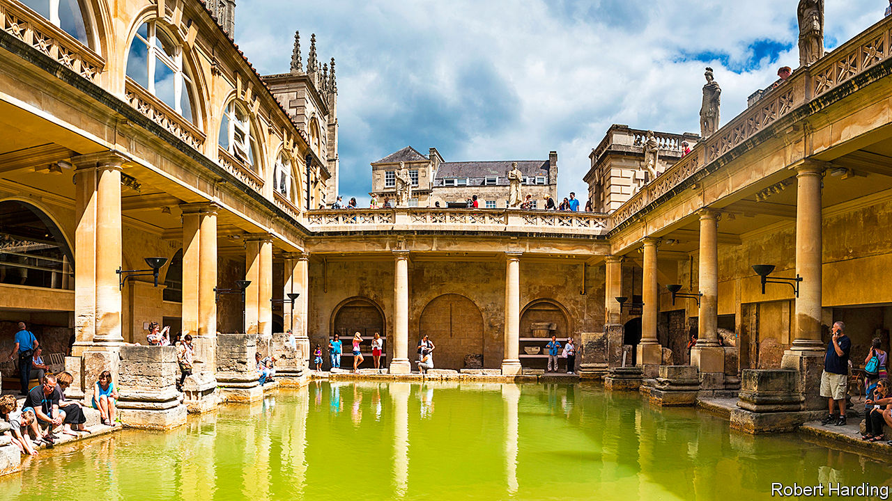

## Local government

# Councils’ outgoings are rocketing and revenues collapsing

> The crisis is hitting councils every which way

> May 2nd 2020

Editor’s note: The Economist is making some of its most important coverage of the covid-19 pandemic freely available to readers of The Economist Today, our daily newsletter. To receive it, register [here](https://www.economist.com//newslettersignup). For our coronavirus tracker and more coverage, see our [hub](https://www.economist.com//coronavirus)

IN MAY THE Roman plunge pools and saunas in Bath (or Aquae Sulis, as the builders called it) usually throng with tourists and history buffs. But for six weeks they have stood empty, thanks to covid-19. The tour guides have been redeployed by their employer, Bath and North East Somerset Council, to administer emergency grants for local traders. The baths, along with the city’s art gallery and museum, ought to have pulled in £9.6m ($11.9m) this year, mostly over the summer season. Now the council predicts a shortfall of £40m in its annual budget of £120m. The gloom may last two or three years if the tourists stay away, says Will Godfrey, its chief executive.

Britain’s town halls are doing the heavy lifting of fighting the pandemic. They fund care homes, deliver food parcels and bury the dead. They are finding hotels for rough sleepers and refuges for victims of domestic violence. Spending is up, because social distancing and sickness means employing more care staff. Mr Godfrey expects to spend £500,000 a week on protective kit.

At the same time, revenues are down sharply. There is little demand for car parks, swimming pools or school dinners. Bath forecasts a 10% fall in council-tax receipts if hard-up families fail to pay bills. Bradford Council, which runs four theatres, had expected £4.5m in ticket sales on a production of “The Lion King”, a musical, which had been due to open on April 30th.

Robert Jenrick, the communities secretary, has announced a £3.2bn bailout for English councils as well as measures to relieve cashflow. But the Local Government Association, a representative body, says three to four times that sum may be needed. Bath’s share is £10m.

The impact is exacerbated by big changes to council financing over the last decade. Since 2010 successive national governments have cut grants sharply, forcing councils to look elsewhere for income. Some turned to property. Local authorities invested £6.6bn in commercial property in the three years to 2019, a 14-fold increase on the previous period. That poses risks if asset values and rents fall, the National Audit Office warned in February. The Treasury plans to curtail cheap lending for investment in shopping centres and cinemas.

Warrington Borough Council is one of a number of big spenders, with a £700m portfolio of offices, supermarkets and distribution centres. Covid-19 is forecast to leave the council with a deficit of £35m to its £143m budget. Steven Broomhead, its chief executive, worries that rental income may fall behind borrowing costs.

Since 2013 councils have been allowed to keep at least half the business-property taxes raised locally, and since 2011, to earn bonuses for building new houses. That will leave them exposed if businesses fail to pay and housebuilding dries up. Rural district councils are particularly vulnerable because of their reliance on income from parking, leisure and waste, according to research by the Institute for Fiscal Studies, a think-tank.

By law, councils must run balanced budgets. Those that do not must declare de facto bankruptcy and freeze non-essential spending. That is rare in normal times but risks becoming more common without more support from Mr Jenrick. It may be the fate of Bradford Council, which forecasts a £60m deficit this year, of which only half will be covered by the bailout. “We are really, really stuck,” says Chris Chapman, the finance director. “What services can we feasibly cut?” ■

Dig deeper:For our latest coverage of the covid-19 pandemic, register for The Economist Today, our daily [newsletter](https://www.economist.com//newslettersignup), or visit our [coronavirus tracker and story hub](https://www.economist.com//coronavirus)