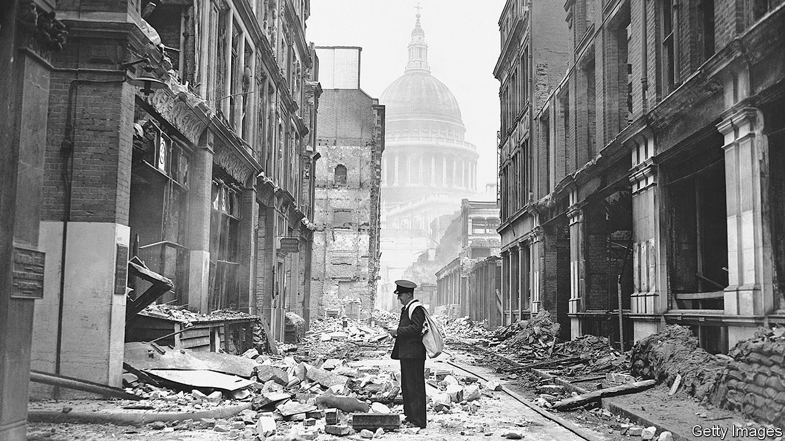

## Rivalling the Blitz

# Covid-19 is killing Londoners at a faster rate than German bombs did

> The myth and memory of the war

> Apr 30th 2020

Editor’s note: The Economist is making some of its most important coverage of the covid-19 pandemic freely available to readers of The Economist Today, our daily newsletter. To receive it, register [here](https://www.economist.com//newslettersignup). For our coronavirus tracker and more coverage, see our [hub](https://www.economist.com//coronavirus)

IN SEPTEMBER 1940, with German bombers overhead, George Orwell sat down for a haircut. His barber told him that no Nazi air-raid could stop him shaving a client’s face. “One day a bomb will drop near enough to make him jump,” Orwell forecast, “and he will slice half somebody’s face off.” Later that day Orwell met a commercial traveller fleeing the city who was a nervous wreck.

Which of the two men best represented reality is unknowable, but “Blitz spirit”, that patriotic device embedded in collective memory, favours the coiffeur. Early on in the pandemic, Matt Hancock, the health secretary, asked Britons to emulate their grandparents’ behaviour during the bombardment.

In its effect on London, covid-19 is now rivalling the Blitz. According to figures from the Office of National Statistics, it killed 4,731 people in the city in the four weeks to April 17th; by comparison, 4,677 people died in the worst four-week stretch of the Blitz in the capital. The virus has some way to go before it kills off more Londoners than the 30,000 who perished in the eight months of the Blitz, but those monthly figures may be understating its toll. They were for deaths in which covid-19 was cited on the certificate. But in those four weeks, there were around 6,000 more deaths than the average for the time of year.

Because the Blitz looms so large in the national psyche, it is startling that covid-19’s toll is already in its league. Yet the Blitz is a myth as well as a memory, and the reality was not quite as upstanding as the rhetoric suggests. Under the cover of blackout, crimes rose by 57%; there were 4,584 recorded lootings during the bombardment. Not all of the nation’s grandparents were model citizens.

Dig deeper:For our latest coverage of the covid-19 pandemic, register for The Economist Today, our daily [newsletter](https://www.economist.com//newslettersignup), or visit our [coronavirus tracker and story hub](https://www.economist.com//coronavirus)

## URL

https://www.economist.com/britain/2020/04/30/covid-19-is-killing-londoners-at-a-faster-rate-than-german-bombs-did
