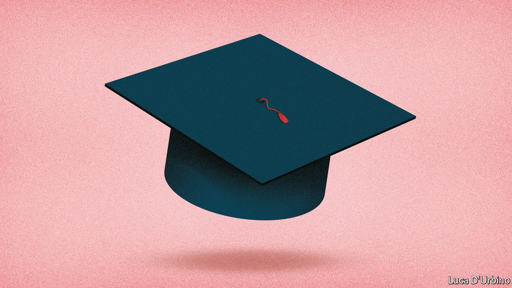

## Time to think small

# The government ponders bailing out universities

> Before the crisis, the government was keen to shrink the university sector. Covid-19 makes it likelier that that will actually happen

> Apr 30th 2020

Editor’s note: The Economist is making some of its most important coverage of the covid-19 pandemic freely available to readers of The Economist Today, our daily newsletter. To receive it, register [here](https://www.economist.com//newslettersignup). For our coronavirus tracker and more coverage, see our [hub](https://www.economist.com//coronavirus)

A QUICK FLICK through a student brochure is all it takes to see why universities are so concerned by the pandemic, and the collapse in international travel it has wrought. A British undergraduate studying classics at Oxford, as the prime minister did, pays £9,250 ($11,500) a year for tuition. A Chinese undergraduate on the same course pays £27,285, almost three times as much. Altogether, foreign students last year provided at least a fifth of the income of 48 higher-education institutions, ranging from the London School of Economics to the University of Sunderland. That is why, as a vice-chancellor puts it, “everyone is nervous as hell.”

International students are not all that Britain’s vice-chancellors have to worry about these days. Any business that brings together crowds of people faces trouble. Universities are likely to have to move either some or all of their teaching online. That may mean fewer domestic students, depending on whether the urge to dodge terrible lectures on Zoom is greater than the desire to avoid a terrible labour market. Even before the crisis, some universities were looking shaky. Large deficits were common among smaller, less prestigious institutions. And the debt taken on by some of the country’s grandest universities now looks more concerning.

Universities UK, a lobby group, has opened the bidding for government help, petitioning for a £2bn bailout. The decision about whether to provide the cash, and if so how to distribute it, will shape higher education for years to come.

Before the crisis, ministers had big ambitions. In his budget on March 11th, Rishi Sunak, the chancellor, promised almost to double research and development spending to £22bn by 2024-25. But the ambition to invest in excellent research coexists with a belief in Downing Street that the sector has grown too big. Dominic Cummings, the prime minister’s chief adviser, has previously questioned the value of “third rate HE [higher-education] institutions”. Alison Wolf, another adviser who is the country’s most influential thinker on tertiary education, has called the expansion of universities “a bad bargain for the taxpayer and for the student”.

Michelle Donelan, the universities minister, has announced that she will tackle the problem of “low-quality” university courses. The government has its sights on universities producing the fifth of graduates, as identified by the Institute for Fiscal Studies (IFS), a think-tank, who would have been financially better off had they not attended university. The earnings of those who left university a decade ago suggest that’s true, on average, of female graduates of Bolton University and UC Falmouth (now Falmouth University), and of male graduates of 39 universities, including Goldsmiths and Manchester Met.

Ministers are not rushing to pony up the cash that Universities UK wants. For the moment, the Office for Students, the higher-education regulator, has demanded a pause in all changes to existing offers until May 4th to prevent a free-for-all in which universities poach each others’ students. Though the eventual impact may be big, higher education is at less immediate risk than other sectors seeking bail-outs, for most universities are relatively insulated at least until the start of the new academic year. The government will wait for the impact on student behaviour to become clearer, allowing it to decide whether to cough up, and if so what it wants in return.

Previous Conservative universities ministers have emphasised that they are not afraid to let universities go bust. The Treasury is said to be inclined not to offer universities a bail-out, allowing them to get access to standard business support and intervening only on a case-by-case basis. The expectation is that, if the government removes restrictions on recruitment on May 4th, higher-ranking universities will suck up students from lower-ranked peers to make up for the fall in those arriving from abroad. Many of the resulting strugglers would be universities producing graduates who earn less than they would have had they not gone to university. Treasury officials would not be sad to see those shrink or disappear altogether.

Yet there are problems with such an approach. Jack Britton of the IFS notes that graduate-earnings data looks at those who left universities in the late 2000s. The post-pandemic labour market may require different skills to the one which preceded it. And letting universities in poorer parts of the country go bust would be difficult to square with Boris Johnson’s desire to “level up” struggling areas. “The preponderance of institutions [which might need saving] that are in the north and Midlands is quite embarrassing,” notes a vice-chancellor.

Universities UK’s bail-out bid carefully balances universities’ competing interests. It asks for a doubling of the main source of research funding, which would mainly benefit high-ranked ones, helping to make up for the expected shortage of foreign students. In return, these institutions would agree to restrictions on recruitment, so that they do not suck up students from lower-ranked ones. It would also include a “transformation fund”, which could be used by the government to help universities merge with other universities or even further-education colleges, thus helping it to rebalance resources from universities to vocational education. In March the government said it would lay out its plans for further education later this year.

Universities hope the bail-out plan would allow them to get through the next few years, before a demographic boom in the number of 18-year-olds comes to their rescue. But recruitment restrictions would mean the government was, in effect, banning students from attending the best institution that would have them, and thus preventing top-rated universities from taking up the slack in the system. And the bailout would give higher education some protection against the government’s desire for radical reform.

On April 29th Gavin Williamson, the education secretary, told MPs that his priorities were protecting research, students and the role universities have in local economies—which sounds like a reference to the need to look after poorer places. Those aims will have to be squared with the Treasury’s pressing need to save money and the government’s ambition to squeeze waste out of the sector. It sounds like universities with poor graduate prospects in richer parts of the country should be worried.■

Dig deeper:For our latest coverage of the covid-19 pandemic, register for The Economist Today, our daily [newsletter](https://www.economist.com//newslettersignup), or visit our [coronavirus tracker and story hub](https://www.economist.com//coronavirus)