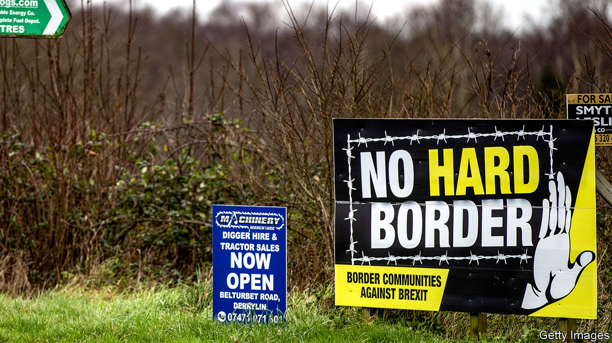

## Brexit

# The problematic Northern Ireland protocol

> Nobody knows how the province will trade with the mainland after Brexit

> Apr 30th 2020

TO THE SURPRISE of many, Northern Ireland proved the most intractable issue in the first round of Britain’s EU withdrawal negotiations. But Boris Johnson then triumphantly replaced the hated Irish backstop, which could have locked the entire United Kingdom into a customs union with the EU, with a protocol that kept Northern Ireland alone in the single market and customs union.

The inevitable consequence is border and customs checks in the Irish Sea between Great Britain and the province—although several ministers, including the prime minister, have often denied this, or at least promised that such checks will be minimal. Yet practical details on what will happen to goods moving in both directions are lacking. The first virtual meeting of the key UK-EU sub-committee concerned took place only this week.

Trade from west to east is relatively simple, as the British government wants Northern Ireland to retain unfettered access to the British market. Even here, though, single-market rules require export declarations that will impose extra costs on businesses. East-west is much trickier. When Britain diverges from EU rules, goods may be subject to both customs and rules-of-origin checks, and (for agricultural products) to food-safety inspections.

Local businesses are fretful. Great Britain is the province’s biggest trade partner, with traffic running at almost £25bn a year. Much of this is retail or small manufacturing, but a big chunk is agricultural produce. Around 98% of exporters into Britain are small enterprises unused to red tape. The logistics industry says it cannot prepare when such big questions as whether tariffs will be charged are undecided. Graham Keddie, the boss of Belfast airport, is demanding greater clarity from Whitehall. Seamus Leheny of the local freight transport association wants what he calls a soft landing for the haulage industry.

Yet the government is sending mixed messages. Colin Murray of Newcastle University says ministers often promise domestic audiences that they will tear up tiresome EU regulations. But by suggesting that only limited controls are needed in the Irish sea, they also imply that divergence from single-market rules will be small. Trust is lacking on both sides. This was shown once again when the government peremptorily rejected an EU request to open an office in Belfast to let it monitor compliance with the terms of the protocol.

Time is very short. Since the government insists that it will not extend the transition period beyond December, only eight months are left before new trade rules come into effect. Yet Katy Hayward of Queen’s University Belfast says there is little sign of such preparations as hiring new customs inspectors or creating space to accommodate lorry queues.

The biggest worry is that the trade negotiations, which both sides admit are making little progress, may end with no trade deal at all being done. If that happens, customs duties will be charged on many goods, notably food, and the protocol would still come into force. This would require, for example, applying the EU’s single-market rules against state subsidies to any companies that do significant business in Northern Ireland, even if they are based in Great Britain.

Some Tory Brexiteers reckon that after no deal the protocol could be ignored. But that would mean not just a breach of treaty obligations, but also the return of the very conundrum that the protocol is designed to solve: how to avert a hard border with Ireland. Northern Ireland may yet come to dominate the second round of Brexit negotiations just as it did the first. ■