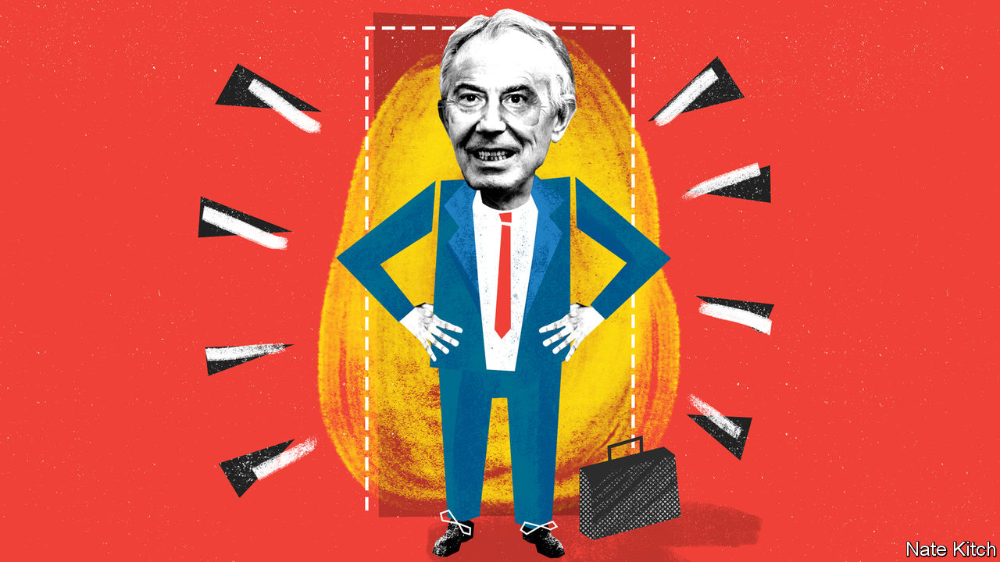

## Reforming government

# Tony Blair is having a covid moment

> Could Blairism have a new lease of life?

> Apr 30th 2020

Editor’s note: The Economist is making some of its most important coverage of the covid-19 pandemic freely available to readers of The Economist Today, our daily newsletter. To receive it, register [here](https://www.economist.com//newslettersignup). For our coronavirus tracker and more coverage, see our [hub](https://www.economist.com//coronavirus)

SINCE HE RETIRED as prime minister in 2007, Tony Blair has seemed a forlorn figure. The Iraq war rendered him so toxic that security worries prevented him from attending the launch of his own memoirs. And the greatest election winner in Labour Party history lost every big battle he was involved in, with Jeremy Corbyn and his ilk hijacking the party and the Brexiteers taking Britain out of the European Union. But now covid-19 is giving Mr Blair a new lease of political life.

The former prime minister has a well-earned reputation for messianic enthusiasm. This was evident in his approaches to the divisive issues of the Iraq war and Brexit, and it is manifesting itself just as clearly in his approach to a problem that has a potential to unite the public. He is dedicating his personal energy and the collective resources of the Tony Blair Institute for Global Change to the covid-19 pandemic.

He has received plenty of flak for using his pulling power to build an institution bearing his name dedicated to furthering his political vision. Britons regard it as rather vulgar, or American, or both, and wonder how many devils he supped with to raise the cash. But the institute is now coming into its own. By British standards, it has a lot of resources—250-300 people working all around the world, including some who were on the front line of the Ebola outbreak in 2014. It is focused on the important question of making government more effective and combines specialists in fields that are central to the fight against the virus: public policy, technology and medicine.

Mr Blair argues that Boris Johnson should be willing to reconfigure his government in the light of this all-consuming crisis. One idea might be to identify a series of core sub-portfolios—for example technological innovation or community volunteering or learning from other countries—and hand them to the best ministers available. He believes that creating a “minister for testing” would help Britain to regain some of the ground it has lost on this front. Another idea is to recruit as much talent from outside government as possible. Mr Blair is keen on distinguishing between political and operational functions, and giving operational functions to business people who have experience in things like mass production and procurement.

In some ways the government is already moving in a Blairite direction. It talks about “targets” with the same enthusiasm that New Labour once did. It is deferring to experts and justifying its behaviour in the light of something that it calls “the science”. It is also tapping business people: Lord Deighton, chairman of Heathrow (and also chairman of The Economist) has been given responsibility for improving the supply of personal protective equipment. Dominic Cummings, Mr Johnson’s chief adviser, shares much of Mr Blair’s enthusiasm for reorganising government and focusing on crisis-management. Some of the ideologues who occupied centre stage in the post-Blair years have been replaced by “heirs to Blair” who would have thrived in the Blair-Cameron years—people such as Matt Hancock, the health secretary, a Remain-supporting protégé of George Osborne, the former chancellor of the exchequer, and Robert Jenrick, the housing and communities minister, whose nickname is “Generic”.

But the government is not in a good state to deal with covid-19. The cabinet is still packed with inexperienced ministers who were selected on the basis of their enthusiasm for Brexit rather than their competence. Several ministers are so ineffectual or unreliable that they have to be kept on a short leash: Gavin Williamson, the education secretary, Alok Sharma, the business secretary, and Priti Patel, the home secretary, spring to mind. Meanwhile some of the party’s most experienced performers are confined to the backbenches. Both Greg Clark, a former business secretary, and Jeremy Hunt, a former health secretary and Mr Johnson’s main rival for the Conservative Party leadership, keep demonstrating, as chairs of the science and health select committees respectively, what a loss they are to the government.

The cabinet, cumbersome at the best of times, is ill-designed for crisis. When digital communications are crucial, the department for digital, culture, media and sports, looks even more like a bureaucratic jumble than it did before. Meanwhile, Mr Hancock is overwhelmed with responsibilities: he combines two jobs that are a stretch at the best of times—running the health-care system and the social care system—and is also one of the government’s most hyperactive spokespeople.

The interesting question is what sort of a turn politics takes after the pandemic—whether the difficulties ahead underline the need for competent centrist managers, or whether bad times widen ideological divisions. Mr Blair worries that the big winners of this crisis may be populists of both sorts, with right-wingers railing against globalisation and left-wingers against inequality, all at a time when insecurity is rife. These worries are plausible enough to be compelling. The crisis has demonstrated the fragility of global supply chains, particularly when it comes to medical supplies. Inequality is widening as brain-workers work from home while manual workers either lose their jobs or risk infection. Tory MPs are already ramping up the rhetoric against China.

But there is also a case that the crisis will drag politics back to the centre. If the government is to deliver vital public services at a time of soaring public debt, it will have to embrace reform and innovation. If globalisation is to survive, then the winners will have to do much more for the losers. The world will be shaped not just by the fight against the coronavirus but also by the fight over the best way to recover from its effects. Mr Blair is making it abundantly clear that, whatever his past sins, he wants to be at the centre of that fight. ■

Dig deeper:For our latest coverage of the covid-19 pandemic, register for The Economist Today, our daily [newsletter](https://www.economist.com//newslettersignup), or visit our [coronavirus tracker and story hub](https://www.economist.com//coronavirus)