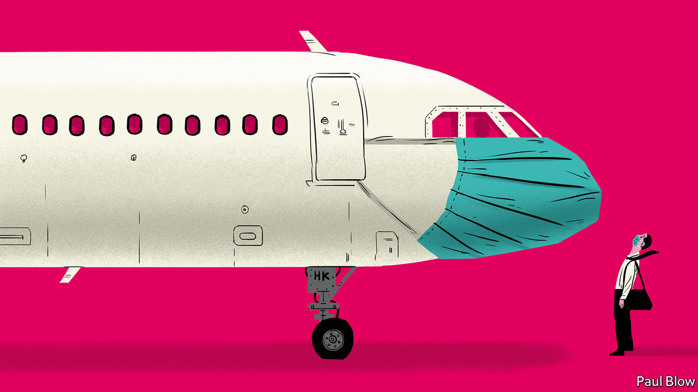

## Bartleby

# Imagine the post-pandemic misery of business travel

> The public announcements could be worrying, at the least

> May 2nd 2020

GOVERNMENTS ARE keen to get employees back to work in order to limit the economic damage of covid-19. And some companies will also be eager to send employees out in search of clients. But a vaccine is unlikely to be ready for at least another 12 months. So the next business trip you make might be an endurance test. Imagine the public announcements that travellers will hear.

Ding dong. Welcome to the renamed Heathrow Waystation 5. We decided the word “terminal” might be a little off-putting to passengers in the current circumstances. Please check in your baggage so it can be disinfected: apologies to those whose suitcases are made out of genuine leather as there will probably be stains. But never mind, it will be a good excuse to go shopping when you get to your destination. After check-in, head straight to security for your nasal swab and temperature check. As everyone needs to stand six feet (two metres) apart, the queue currently snakes around the building.

When you make it through security, head to duty-free where you can choose from our extensive selection of hand sanitisers. Hope you ate before you arrived because none of the restaurants is open. Travel safely. Ding dong.

Welcome aboard Acme Airlines flight 107 to New York. I am your pilot, Captain Richards. Social-distancing rules mean no co-pilot as there is not enough room in the cockpit for more than one person. But don’t worry; I brought a flask of coffee with me and I haven’t fallen asleep on a flight yet. If I don’t give you an update every 30 minutes, the cabin crew will hammer on the cockpit door.

We won’t be able to give you our normal in-flight food and beverage service but please enjoy the complimentary bottle of water, packets of salted nuts and crisps, and the empty seat next to you. Just a warning, though, to those of you who have chosen to sit by the window. Passengers must observe distancing rules so you won’t be allowed to squeeze past the person in the aisle seat if they fall asleep. In any case, only three people are allowed in the line for the restroom at any time. You may want to go easy on that water. If you need anything extra, the cabin crew will come and help you. Give them a few minutes as they need to don a hazmat suit first.

Ladies and gentlemen, you have arrived at JFK airport. We have good news and bad news. The good news is that passenger traffic is lower than normal. The bad news is that, given the need to disinfect the electronic passport reader after each use, the line for immigration is still two hours long. And no, you can’t use your cell phone to catch up on calls while you are in the waiting area. Welcome to the land of the free. Be brave.

Good afternoon and thanks for choosing Hotel Purgatory for your stay. Our motto: you can check in any time you like but, if we hear you coughing, you can never leave. Your disinfected room pass is already available in a disinfected envelope. Unfortunately, as only one person is allowed in the elevator at a time, the wait time to get to your room is 60 minutes. By the way, the same delay applies in the morning, so if you are heading for meetings, you had better book an early alarm call. There are no baggage porters, so we hope you packed light.

To reduce the risk to staff, the room will be cleaned only after you leave, so make your own bed. Feel free to take home the shampoo in the shower: no one else wants to touch it. The spa, pool and bar are closed for obvious reasons, and there is no room service. Enjoy your stay.

Morning all and welcome to the 2020 Risk Managers’ Conference. Or should that be the Risk Takers’ Conference? Ha ha. Rest assured this is a fully sanitised room. This year’s slogan: We Care About Your Health Because Your Employer Doesn’t. When it comes to questions, we won’t be passing round microphones, so please speak as loudly as possible. Panel sessions are difficult at the moment, so will be limited to two speakers at opposite ends of the stage.

We are afraid that a buffet lunch is unavailable so take a chance on one of the street-food carts outside the conference centre. Your choice will sort out the real risk managers from the also-rans. This wouldn’t be a conference without exhibition stands in the foyer. Our sponsors will be delighted to see you, but only from a safe distance, and wearing a mask. Finally, please familiarise yourself with the exits behind me, on the left and right. Obviously they are there in case of a fire but they could come in handy if someone has a coughing fit.