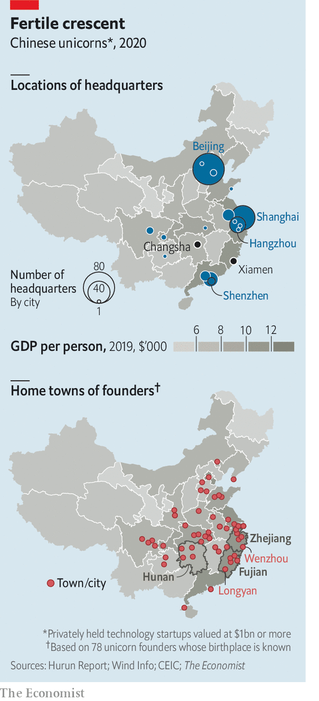
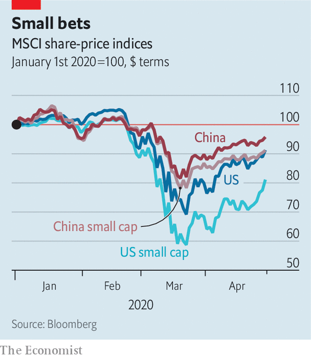

## Flowerbeds of enterprise

# Private companies have put down strong roots in China

> The pandemic and a more assertive Communist Party are testing their resilience

> Apr 30th 2020HANGZHOU, SHANGHAI AND XIAMEN

TO SAY THAT China’s economy has been hurt by covid-19 is putting it mildly. The 6.8% year-on-year fall in GDP in the first quarter ended a 28-year stretch of continuous, mostly rapid growth. The Communist Party, which derives legitimacy from rising living standards, is keen to put the slump behind it. President Xi Jinping is reversing a harsh lockdown and propping up state firms. But the world’s second-biggest economy will not heal by Mr Xi’s fiat alone.

For a collectivist state, China is remarkably reliant on private enterprise. As it ages, and its economy shifts from manufacturing for export to domestic services, the entrepreneurial class should grow in stature. Right now, though, the corona-crisis and, under Mr Xi, a more hands-on, inward-looking regime are testing private-sector resilience like never before.

The People’s Republic recognised its first private business in 1980, when a 19-year-old street hawker named Zhang Huamei registered her stall selling buttons and toys in the port city of Wenzhou. Since then the party has developed its own form of “economic gardening”—the notion, popularised in America in the 1980s, that grassroots entrepreneurs drive growth. It told business folk what not to do—certain industries, such as tobacco, were out of bounds—but otherwise let them grow unimpeded. As Jonathan Woetzel of McKinsey, a consultancy, puts it, China’s garden has had more in common with the deliberate wilderness of an English one than with manicured French lawns.

This approach has let entrepreneurship put down deep roots in China over the past 40 years. By 2017 budding business owners were registering close to 6m firms a year—or more than 15,000 a day—nearly three times the figure in 2010. Private firms contribute three-fifths of GDP and four-fifths of urban employment. Private wealth funds 70% of investment. Wenzhou’s party bosses today proudly proclaim that 99% of its businesses are privately owned and one in five locals has founded a company.

Chinese internet startups are a case in point. IT Juzi, a research firm, reckons that between 2015 and 2018 some $1.3trn in venture capital flowed into such firms. More than 130,000 have been created since 2001. Many ventures fail. The Asian Development Bank reckons that the average life expectancy of all small firms in China is less than four years, half that in America. Research by Renmin University in Beijing in 2016 found that only 2% of graduates who began a first business succeeded. Yet the same survey found that four in five still wanted to try their hand at starting one.

This zeal may stem from a belief that anyone can make it big. Chen Long, provost of the Hupan School of Entrepreneurship in Hangzhou, a startup-rich city in Zhejiang province, puts his compatriots’ entrepreneurial vim down to “countless examples of success”, which give “a sense that you can change your own fate”. In Fujian, a hive of business activity in pre-Mao days, people asked about the secret of business success recite a folk song: “Three parts of your life the heavens determine, the other seven you can if you’re hard-working.”

Tales like that of Jack Ma, who twice failed to get into university and started Alibaba, an e-commerce titan, in a cramped Hangzhou apartment, enrapture millions. Biographies of rock star founders like him or his namesake Pony Ma of Tencent, an online games-to-payments giant, fly off the shelves. Their pronouncements become aphorisms. And, as Roger King of the Hong Kong University of Science and Technology points out, their riches—the two Messrs Ma are worth a combined $88bn—provoke admiration rather than envy.

This sentiment may be reinforced by the high share of startups that turn into “unicorns”. China has 206 privately held companies valued at $1bn or more, more than any other country. Beijing alone hosts 82, more than San Francisco’s tally of 55, according to Hurun Report, a research firm. They include ByteDance, the world’s mightiest unicorn (which owns TikTok, a hit short-video app, and is valued at $90bn or thereabouts).

Unicorns are not, of course, a representative sample of private enterprise. But they nonetheless illustrate that Chinese entrepreneurship is broad as well as deep. According to Vision Plus Capital, a venture-capital firm, a big share of the herd grazes around cities with a high startup density per million residents, such as Hangzhou (31), Shenzhen (27) and Beijing (24). But their founders are a more geographically diverse bunch. Hurun lists 112 founders of Chinese startups worth $1.5bn or more. The 78 whose birthplace The Economist has been able to identify in China hail from 20 provincial-level regions (see map).

The founders of Kuaishou, a video-sharing app, Musical.ly, which became TikTok, and WeChat, a ubiquitous messaging app owned by Tencent, all came from inland Hunan province. Its capital, Changsha, houses more than 12,000 companies in the creative and cultural industries, luring more go-getters in these fields. Longyan, an otherwise unremarkable city in Fujian province, has spawned Zhang Yiming of ByteDance and Wang Xing of Meituan-Dianping, a now-listed super-app with a market capitalisation of $75bn.

Successful founders often nurture entrepreneurship in their home regions. A dozen Longyan-bred ones, including Mr Wang and Mr Zhang, have participated in a “Summit of New Rising Internet Stars from Longyan”. Cai Wensheng, a Fujianese high-school dropout who made billions trading internet domain names, has invested in dozens of local startups. In 2015 Alibaba’s Mr Ma opened the Hupan School, dreamed up in the midst of the global financial crisis a few years earlier as China’s answer to Harvard Business School (itself founded during the banking panic of 1907).

If businesspeople have been tending to the entrepreneurial garden, local authorities have been heaping fertiliser on it. Zhejiang, where Wenzhou is also located, embraced small businesses as soon as Deng Xiaoping lifted the Mao-era ban on them in 1979. Lending from Zhejiang’s state banks allowed some early stars to rise. They included Zong Qinghou, a juice-and-soda tycoon who founded Wahaha in 1987; Guo Guangchang, an industrialist who began Fosun Group in 1992; and later Ding Lei of NetEase, a gaming giant set up in 1997.

More recently Dream Town, a state-run startup village near Alibaba’s campus in Hangzhou, has been handing out cash and free office space to promising founders. Xiamen, a city in Fujian, offers the 3,000 startups in its Software Park generous subsidies for rent and research and development. Firms got preferential loans and a two-year waiver on corporate tax, plus a discount for another three.

China’s vibrant ecosystem of private enterprise faces three challenges. First, Chinese startups and small businesses, like everywhere else in the world, have been hit hard by the lockdowns. Their revenues fell by almost 60% in March, year on year, according to a survey by Tsinghua University in Beijing. CBInsights, a data provider, says the number of deals involving Chinese startups dropped by nearly 40% in the first quarter, compared with the previous one, to the lowest level since 2016. Early-stage funding declined by 70%.

To help out, Beijing has told banks that smaller companies may delay loan repayments up to the end of June. On April 23rd officials in Zhongguancun, the capital’s tech hub, teamed up with 30 venture-capital firms to launch a 30bn yuan ($4.2bn) investment campaign to support startups. Some large corporations are stepping up, too. Xiaomi, a smartphone-maker, participated in nine equity deals in the first quarter, one more than in the previous three months. Alibaba has launched the “2020 Spring Thunder Initiative” to help smaller export-oriented businesses expand into new markets. Ant Financial, its finance arm, has teamed up with hundreds of commercial banks to offer loans to tens of millions of smaller firms. Ant’s payment business, AliPay, is helping 50,000 merchants move online, in part by providing free online courses. Daniel Zhang, Alibaba’s boss, said the company must “stand arm in arm” with the little guy.

Not everyone is as obliging. State-owned lenders refuse to extend new loans to many smaller firms, favouring lumbering state-owned champions. And Beijing’s ongoing crackdown on informal sources of lending, on which most private businesses rely, has starved many of resources.

This increasingly heavy hand is the private sector’s second problem. The party looks more hostile to it than at any time since before Deng set up “special economic zones”, capitalist sandboxes for firms, in the 1980s. Mr Xi favours state-led development over private-sector effervescence, maybe seeing the cult of entrepreneurs as a rival source of authority. The former party boss in Zhejiang and provincial head of equally enterprising Fujian has disappointed those who say breakthroughs require an environment where people are free, in the words of R. May Lee, “to indulge, to daydream and to do things differently”. Ms Lee stepped down as dean of the School of Entrepreneurship and Management at ShanghaiTech University in 2018 partly out of frustration over increasing state control of the curriculum.

The third worry for many Chinese firms is the prospect of being shut off from the world. This is not wholly China’s fault; America has limited exports of certain technologies to Chinese buyers as part of a trade war between the two superpowers. But Mr Xi’s pursuit of greater autonomy from the West will make it harder for Chinese firms to procure kit and components unavailable at home, including advanced microprocessors, and, increasingly, to attract business partners abroad. Officials’ early response to the virus, when they tried to suppress reports of the original outbreak in Hubei province, has only added to foreign queasiness of all things Chinese.

It is a testament to the private sector’s strength in China that it has held up. The share prices of smaller listed firms have done only half as badly in the pandemic as those of their counterparts in America and Europe. Whereas America’s small businesses have underperformed its biggest corporations by a factor of two, in China the small fry have done nearly as well as the whales (see chart). Once the crisis passes, venture capitalists, including home-grown ones, will no doubt loosen their purse strings.

And although Mr Xi has been less green-fingered than his predecessors, he is unlikely to pave over China’s flowerbeds of enterprise. The party realises that its promise of future growth requires a robust private sector. As one veteran foreign observer adds, it is also a useful “vaccine”—one that inoculates the regime against those too wilful to serve its interests as bureaucrats. Better for them to channel energy into entrepreneurship. Luckily for Mr Xi, many are still happy to do just that.■

## URL

https://www.economist.com/business/2020/04/30/private-companies-have-put-down-strong-roots-in-china
