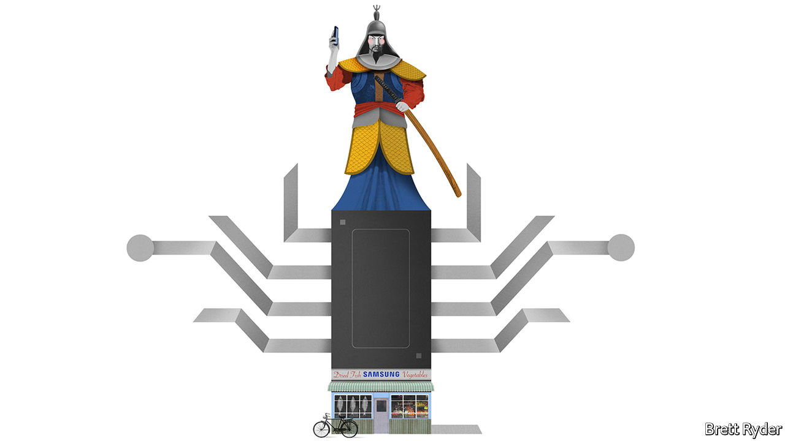

## Schumpeter

# What is weighing on Samsung?

> The business model is shockproof. But the mood is grim

> May 2nd 2020

EVEN IN A corporate world rife with despotic founders, complex cross-shareholdings and cultlike initiation rituals, Samsung stands out as the most mysterious of firms. Founded in 1938 as a provincial vegetable and dried-fish shop, it has grown into a conglomerate accounting for a fifth of South Korea’s exports. Its crown jewel, Samsung Electronics, has for years been one of the world’s biggest sellers of smartphones, televisions and chips, with a market capitalisation of more than $270bn and 310,000 workers in 74 countries. The group’s riveting story, chronicled in a new book, “Samsung Rising”, by Geoffrey Cain, is one of entrepreneurial derring-do and excruciating work habits mixed with scandals, vendettas and political intrigue. What the author (a former contributor to this newspaper) skips over is how a company with so many well-documented flaws can be such a resounding success.

To get a sense of the Samsung enigma consider first its ruling dynasty. Long before Kim Jong Un, North Korea’s dictator, disappeared from view in April, Samsung’s chairman, Lee Kun-hee, vanished into hospital. The 78-year-old has not been heard from since 2014. No one outside the family knows how ill he is. His only son and heir-apparent, Lee Jae-yong, aged 50, faces a retrial on charges of influence-peddling, for which he spent almost a year behind bars in 2017-18. Jay, as he calls himself, has exerted huge influence over Samsung Electronics despite directly owning a tiny fraction of its shares and no longer sitting on its board, thanks to an ownership structure set up around other group holdings and family foundations. It is not clear who would represent the clan’s interests if Jay were found guilty.

The chaebol’s corporate culture is no less eyebrow-raising. Mr Cain describes a leadership style at Samsung Electronics that is military-like, macho and intolerant of mistakes. When the conglomerate turned from fertilisers and transistors to semiconductors in the early 1980s, the ruling family toughened up its chip engineers with an overnight march in midwinter, followed by the usual 16-hour work shift. In 1995, to embarrass its technicians for shoddy workmanship, the elder Mr Lee ordered a bonfire of 140,000 gadgets; $50m went up in smoke. Mr Cain recounts numerous expletive-filled tirades by the firm’s top brass. And yet Samsung Electronics continues to be South Korea’s most prestigious employer and a magnet for bright graduates.

Most enigmatic of all is the success bred by this inclement environment. Within a few years of that frosty march, Samsung Electronics’ semiconductor business had caught up with its big Japanese competitors. In 2011, just two years after it had introduced its first smartphone, its Galaxy devices edged past Apple’s iPhone in sales volume. Its speed is matched by its chutzpah; competitors, like Apple and Sony, are also the biggest customers for its components, from chips to OLED screens. Samsung makes diversification seem like a virtue, not a distraction. When sales of phones and other gadgets suffer, as they did in the first quarter owing to the covid-19 crisis, the memory-chip business provides ballast; it got a boost from lockdown-related use of cloud-based servers, Samsung said on April 29th. Ten years after the Lees decided to further diversify the conglomerate by 2020, the pandemic has helped turn Samsung Biologics, a manufacturer of vaccines and other pharmaceuticals, into South Korea’s third-most-valuable company.

So what puts the fire into Samsung’s kimchi? Mark Newman, a former Samsung Electronics employee now at Bernstein, an investment firm, says the secret ingredient has always been faith in the founding family, who, for all their flaws, retain a godlike status within the firm. As in Western companies, executives bicker over where to spend money. But when a decision is taken at the top, they quickly fall into line. That helps some of Samsung’s bold, strategic bets to pay off. Others, such as Samsung cars and solar panels, have not.

Samsung executives believe it is time for another big flutter on the future—nowhere more so than at Samsung Electronics. For all its strengths, it has two big problems to grapple with. The first is how to become more than just the world’s most exemplary slicer-and-dicer of chips, screens and gadgets. It wants to triumph in higher-margin (and chicer) software and services. As smartphone sales peak, Apple is enveloping its customers in wearables, watchables and listenables. The American giant’s returns dwarf Samsung’s. Rather than develop its own operating system to rival Apple’s, the Korean firm outsourced the job to Google’s Android. Instead of software, it has recently doubled down on manufacturing non-memory chips and biopharmaceuticals. To make a success of services, especially in the era of the all-connected “Internet of Things”, it needs creative skills that it has struggled to nurture.

The second challenge is China. The country is changing both as a market and as a source of competition. Last year Samsung pulled the plug on smartphone production in China after its market share, once in double digits, fell below 1%. Big Chinese firms have the cash and long-term focus to give it a run for its money in semiconductors. Phone companies like Xiaomi are better at software and apps. As one of the biggest beneficiaries of globalisation, Samsung will draw little consolation from the prospect of supplying the West if the tech cold war gets worse.

Despite $81bn of net cash (more than the market value of Sony) to invest, a sense of gloom pervades Samsung Electronics. With the Lee family in an agonising limbo, it is unable to place big strategic wagers, jeopardising its ability to move beyond manufacturing or compete with Chinese rivals. There is a way forward. Like most dynastic firms, Samsung will eventually have to put all its faith in professional managers, rather than in its founding family. Now is as good a time as any to start. To be sure, it will take the mystery out of the firm. It doesn’t have to kill its mojo. ■