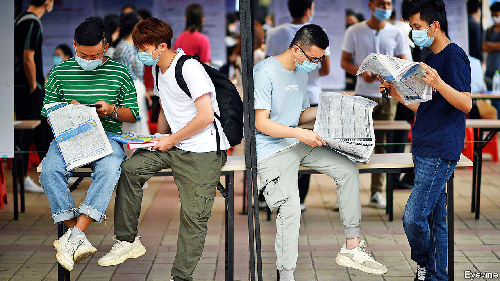

## Spring freeze

# Millions of Chinese students brace themselves for joblessness

> The government is anxious, too

> May 2nd 2020SHANGHAI

Editor’s note: The Economist is making some of its most important coverage of the covid-19 pandemic freely available to readers of The Economist Today, our daily newsletter. To receive it, register [here](https://www.economist.com//newslettersignup). For our coronavirus tracker and more coverage, see our [hub](https://www.economist.com//coronavirus)

“GRADUATION EQUALS unemployment” has long been a common saying in China (the nouns share a character). It is often used in jest by university students as final exams loom. But for the 9m or so due to graduate in June—a record high—the words convey a dark reality. As China limps back to work after covid-19, their job prospects are truly bleak. They will enter the workforce as prospective employers mull lay-offs or hiring freezes. For a middle class used to relentlessly strong economic growth, the shock will be great.

As it surveys an economy ravaged by the disease, the leadership’s biggest worry is unemployment. In February the urban jobless rate jumped to 6.2%, the highest ever. In March it fell slightly to 5.9% as businesses reopened. But official figures mask the scale of the problem. Urban unemployment could reach 10% this year, reckons the Economist Intelligence Unit, a sister company of The Economist. And that does not include the tens of millions of migrants who sat out the epidemic in their ancestral villages. Many of them now have no jobs to return to in the cities.

China’s leaders describe the problem of graduate unemployment as a matter of “paramount importance”. In recent days university officials around the country have been holding meetings to discuss how to ensure that as many as possible find jobs. They have often used similar language, stressing the “urgency” of this “political task” relating to “social stability”. Jobless migrants make officials anxious, too. But the party frets more about threats involving better-educated people with urban roots and strong social networks.

Last year just over half of entrants to China’s urban workforce were university graduates. Usually about 60% of them would be hired by small- and medium-sized enterprises. But such firms have been among those hardest-hit by the coronavirus. On April 14th Li Keqiang, the prime minister, told his cabinet that the situation for this year’s graduates was “grim”.

Companies normally begin scouring campuses for recruits soon after the spring-festival holiday (another big hiring round takes place in the autumn). This time, however, with universities shut and big gatherings banned, the entire process was “wiped out”, says a business veteran.

Some employers have gone digital, using video interviews and online tests. But many, reeling from the impact of work stoppages and still-tepid consumer demand, have cut hiring. A survey of 1m companies by Peking University’s Guanghua School of Management and Zhaopin, a job-search site, found there were 30% fewer openings in the first quarter compared with last year. Those for fresh graduates in finance fell by more than 50% this spring, according to Boss Zhipin, another recruitment website—even as the number of final-year students searching for a job rose by half. With less competition, firms that are still hiring can pick the best and brightest. But they are also likely to plump for old hands rather than trainees.

Competition for graduate jobs had already grown fierce in recent years, particularly for the most prestigious positions. Now it is cut-throat. Miriam Zhang, a graduate from Weifang, a city in the northern province of Shandong, has sent out 100 applications in the past two months and got responses only to six. One job, she heard, had attracted 3,000 hopefuls.

At least the epidemic has helpfully “weeded out” weak or dodgy companies, Ms Zhang notes. She is now keener than ever to get hired by a big firm, and is mainly searching for openings at state-owned companies. In a survey by China Youth Daily, an official newspaper, more than 60% of respondents said covid-19 had steered them towards “more stable” work. To many that means finding an employer with links to the government.

Officials are trying to satisfy such demand. They have promised more openings in the civil service (not least in rural areas) as well as in the army. They have directed state-owned businesses to boost their recruitment of new graduates. Sinopec, an oil giant, is hiring another 3,500 on top of the 6,600-odd it has already taken on—the most people it has ever signed up in a year. Other state-owned firms are also taking on record numbers. They are giving preference to graduates from Hubei province, where the outbreak began. (This is in response to an appeal from the central government that firms should stop discriminating against Hubei residents, who are often treated with suspicion because of their province’s reputation as a covid-19 disaster zone.) The government has also told universities to offer an additional 200,000 places for graduate studies.

Until recently, job-hunting involving intercity travel was hampered by quarantine-related restrictions. Even though such measures have been eased in most places, hassles remain (see [Chaguan](https://www.economist.com//china/2020/04/30/china-plans-to-crush-new-covid-outbreaks-with-tough-measures)). Wang Zheqi, who is meant to graduate this year in Shanghai, had hoped to use her dorm room as a base for job-hunting. Instead she is stuck in her hometown because her university is still closed and she cannot afford off-campus accommodation in Shanghai.

Students did not have to search for jobs until the 1990s. Instead they had to take positions assigned to them by the government. As a result of covid-19, officials are getting more involved in finding work for students than they have been since those days. Xinchao Media, an advertising company, says that the government of Chengdu, the south-western city where the firm is headquartered, has offered to recommend graduates for its job openings. The city of Beijing, among others, has launched a recruitment website for people preparing to graduate.

Many governments are also rewarding firms that hire graduates. In Shanghai, the district of Pudong is offering them subsidies and reduced social-security payments worth up to 2,000 yuan ($282) for each local graduate they take on. Others are giving refunds on social-security contributions to companies that do not lay off workers.

The government is right to worry about social stability. Well-educated young people have been in the vanguard of many of China’s biggest protest movements of the past century. Students whose futures are clouded by the unaffordability of housing and competition for jobs with immigrants from the Chinese mainland were at the forefront of last year’s unrest in Hong Kong. As the covid crisis subsides in China, social tensions are becoming more evident. Hundreds of shop owners recently took to the streets of the southern city of Guangzhou and dozens gathered outside a mall in Wuhan, the capital of Hubei, to demand rent deductions after weeks of unemployment. (Videos of the protests were swiftly removed from the internet.)

Graduating at a time of such economic hardship could be more than just a temporary setback. Studies show that it can have “a huge impact” on lifetime earnings, says Li Jin of the University of Hong Kong. That is because many will go into a different line of work from the one they had hoped to pursue, and for lower pay. In normal times, according to Zhaopin, a third of Chinese graduates aim to earn between 6,000 and 8,000 yuan a month in their first jobs, but fewer than one in five end up doing so. Their disappointment will be far greater this year—and may last well beyond it. ■

Dig deeper:For our latest coverage of the covid-19 pandemic, register for The Economist Today, our daily [newsletter](https://www.economist.com//newslettersignup), or visit our [coronavirus tracker and story hub](https://www.economist.com//coronavirus)