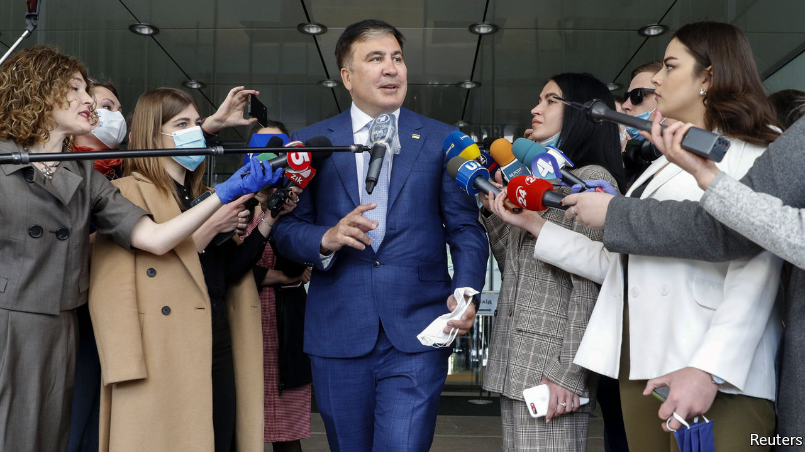

## A conviction politician

# A former president of Georgia tries to shake up Ukraine

> Mikheil Saakashvili is bidding to become Ukraine’s chief negotiator with the IMF

> Apr 30th 2020

THE LAST time Mikheil Saakashvili grabbed the headlines in Ukraine was when he was filmed climbing onto the roof of an apartment block in Kyiv, the capital, as he was being chased by security men. That was in December 2017, when the former president of Georgia, who had bizarrely become a prominent politician in Ukraine, was being hounded by Ukraine’s then president, Petro Poroshenko, a one-time friend who had invited him to Ukraine and then turned against him.

Now the tables have turned against Mr Poroshenko, who is himself under investigation, having lost the presidency nearly a year ago to Volodymyr Zelensky, a former TV comedian. Meanwhile Mr Saakashvili is back in the limelight, vying for a key job as a deputy prime minister in charge of reforms and negotiations with the IMF.

Mr Saakashvili is no stranger to controversy. As Georgia’s president, he modernised his country, lost a short war with Russia and was forced to flee after ceding power when his party lost an election in 2012. His old friend Mr Poroshenko made him governor of the Odessa region but Mr Saakashvili resigned three and a half years ago, complaining that Ukraine’s government was still too corrupt.

The news of Mr Saakashvili’s latest possible appointment has stirred up Ukrainian politics. It has also rattled Georgia’s government, which so fears his comeback that it has twice slapped lengthy jail sentences on him in absentia and threatened to recall its ambassador from Kyiv. The Kremlin, too, has unleashed its propaganda attack-dogs against Ukraine.

In any case, Mr Saakashvili has yet to muster enough support in Ukraine’s parliament to secure his post. Meanwhile Mr Zelensky has not wholeheartedly weighed in, perhaps loth to expose the disunity in his parliamentary bloc and the lack of a coherent or professional team around him.

To mark this month’s first anniversary of his presidency, Mr Zelensky has released a sleek video celebrating his victory and progress. But off-screen his performance has been shakier. Progress on his two main promises—to tackle corruption and to end the war in Donbas, a region in Ukraine’s south-east—has been limited. A welcome exchange of prisoners has been achieved, but Russia is still funnelling cash and weapons to its proxies in Donbas. Mr Zelensky has had MPs stripped of immunity from criminal charges and brought in fresh faces, but they patently lack experience or a common vision. Urgently needed structural reforms have yet to materialise.

Corruption remains widespread. An independent-minded prosecutor-general, Ruslan Ryaboshapka, has been replaced by a loyalist who is going after Mr Poroshenko. Covid-19 may make matters worse. An independent journalist, Katya Gorchinskaya, has exposed shenanigans in the procurement of medical equipment.

Mr Saakashvili argues that corruption can be stemmed only by deregulating the economy and dismantling the system that facilitates extortion. Few Ukrainians seem convinced. Many reckon that, if Mr Zelensky brings Mr Saakashvili in, it will merely be to create the illusion of activity. “We are moving into the second season of Zelensky’s presidency,” says Sevgil Musaeva, editor of Ukrainska Pravda, an online outlet. “It makes sense to bring back a character from a previous series.” ■

## URL

https://www.economist.com/europe/2020/04/30/a-former-president-of-georgia-tries-to-shake-up-ukraine
