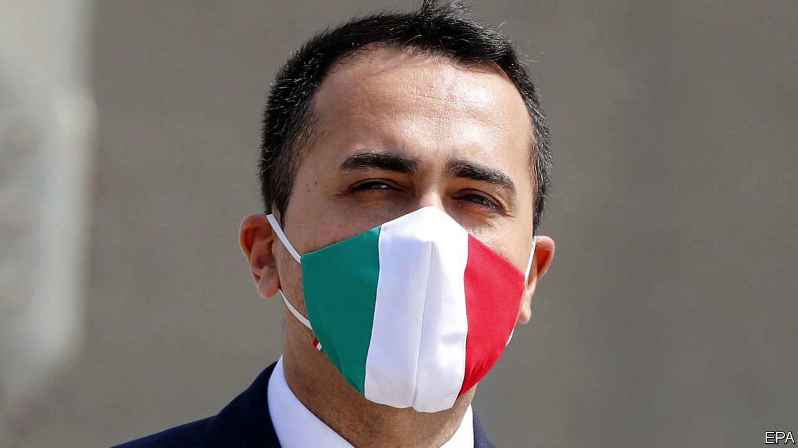

## In need of assistance

# An interview with Luigi Di Maio

> Italy’s foreign minister is pressing the EU to be generous

> Apr 30th 2020ROME

YOU MIGHT expect Italy’s foreign minister, Luigi Di Maio, to be wary of sporting allusions. One of the many jobs—none of them permanent—that he took on before his spectacular political rise was as a crowd steward for Napoli football club. It has earned the 33-year-old wunderkind more than a few snide comments. But when it comes to judging Italy’s position after last week’s European summit, he cannot resist a metaphor from football.

“We’ve had a good first half,” he says. “But now the issue is to win the game.” On April 23rd the leaders of the 27 EU member states agreed to establish a big covid-19 recovery fund linked to the EU budget—a decision that ran counter to Germany’s previously resolute opposition to ambitious spending plans. Italy’s prime minister, Giuseppe Conte, expressed delight at the outcome, which one of his aides called a “great victory”. But to say there is still much to play for is quite the understatement.

The leaders left undecided such trifling details as the fund’s size, when it would begin to function and whether cash would be lent or given outright to member states. To the delight of debt-laden countries such as Italy, which already owes almost 135% of its GDP, the European Commission president, Ursula von der Leyen, suggested both grants and loans. She has mooted a fund leveraged to €1trn ($1.1trn) or more. The obvious advantage of a grant is that it would not add to a recipient’s debt stock, and so might avoid spooking the markets and driving up its borrowing costs. Italy’s are already under upward pressure, following this week’s surprise downgrade of its debt by Fitch, a ratings agency.

The commission is due to present a plan for the new fund in the coming weeks. Mr Di Maio says Italy will press for it to be worth €1.5trn. The EU’s next seven-year budget, on which members ominously failed to agree even before the virus began to spread, is not due to come into effect until the start of next year. But, he says, “the recovery fund needs to be launched well before the approval of the new budget.”

Lobbying Brussels and its European partners is not the only challenge Italy’s government faces. At home it needs to draw the sting of a toxic debate over whether Italy should avail itself of one of three pots of cash in a previously agreed €540bn package that the European leaders rubber-stamped last week. This includes up to €100bn in loans to help governments stem unemployment, and up to €200bn of credit from the European Investment Bank to bolster companies. It also offers access to loans from the EU’s bail-out fund, the European Stability Mechanism (ESM). Italy could borrow as much as €37bn, and Mr Di Maio’s coalition partners in the centre-left Democratic Party are keen that it should.

But opposition politicians, and particularly Matteo Salvini of the hard-right Northern League, have succeeded in convincing many Italians that the ESM is a device for providing loans at extortionate rates and subject to humiliating conditions. The problem for Mr Conte is that a sizeable number of lawmakers from the Five Star Movement (M5S), the largest party in the ruling coalition, agree. It has prompted speculation that the Five Stars could split if the government borrows from the ESM, thereby robbing the coalition of its majority. Mr Di Maio, as the M5S’s former leader, has a key role to play in allaying his party colleagues’ fears. After a bitter stand-off between Italy and the Netherlands, an agreement seems to have been reached that only minimal conditions will apply to loans so long as they are for health spending. “At this point, we’re not talking about the ESM as it was,” says Mr Di Maio, though he cautions that the small print of any agreement will require close scrutiny.

Italy’s need for help has also put Mr Di Maio at the centre of another controversy, with even wider implications. The countries his ministry has tapped for medical aid include China and Russia, which sent a contingent of military doctors and decontamination experts. Mr Di Maio, whose party has a record of pro-Russian stances, brushes aside the suggestion that he may be using the pandemic to realign Italy.

“We are proudly, firmly in the Atlantic pact and the European Union,” he says. But, in what might just be a warning to Italy’s traditional allies, he goes on to remark that Italy depends heavily on exports and that “the strengthening of our relations will be linked to our desire to strengthen our economic ties.”

The M5S also has a record of intermittent Euroscepticism. But, says Mr Di Maio, its criticism has been directed more at the euro than at the EU itself. As for himself, “I was never one of those who wanted to leave Europe or weaken it.”

His hope is that, as has often happened in the past, Europe will take advantage of the current crisis to become more united. Among changes he favours, apart from the definitive scrapping of fiscal austerity and an equally definitive embracing of debt mutualisation, are greater fiscal harmonisation and a more central role for the European Parliament. With a hint of asperity he says: “We are, of necessity, heading for a Europe that learns from its mistakes.” ■

## URL

https://www.economist.com/europe/2020/04/30/an-interview-with-luigi-di-maio
