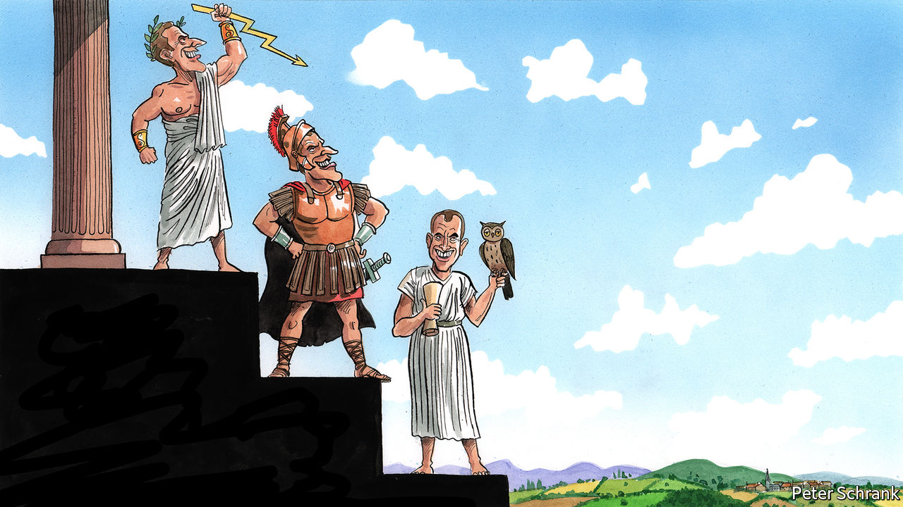

## Charlemagne

# Emmanuel Macron ditches Jupiter for other gods

> First Mars, then Minerva

> Apr 30th 2020

Editor’s note: The Economist is making some of its most important coverage of the covid-19 pandemic freely available to readers of The Economist Today, our daily newsletter. To receive it, register [here](https://www.economist.com/https://my.economist.com/user#newsletter). For our coronavirus tracker and more coverage, see our [hub](https://www.economist.com//news/2020/03/11/the-economists-coverage-of-the-coronavirus)

THE OFFICIAL presidential plane, with its crisp-white fuselage and tricolore livery, is cruising at high altitude towards Paris from Beijing. Inside his airborne meeting room, Emmanuel Macron has just finished a debrief at the end of a China trip, leaving his staff to snatch a few hours’ sleep. To the visitor’s untrained eye, the most astonishing feature in the presidential aircraft office is not the framed print fixed defiantly to the wall, nor the leather chairs bolted rigidly to the floor. It is that Mr Macron is wearing a hoodie.

Most world leaders have their signature look. Unicolour jackets for Germany’s Angela Merkel. Artfully unkempt hair for Britain’s Boris Johnson. In Mr Macron’s case, his uniform is a suit. Not the pinstriped sort he once favoured as a young investment banker. But a well cut, navy costume, with matching sober tie. He wears it to visit hospitals, to talk virtually to European leaders, even last week to drop in on a tomato farm and a supermarket. For his detractors, the sharp suit is an offensive marker of his membership of the highly educated, metropolitan elite. For Mr Macron, a long-standing theatre enthusiast, the suit is literally a costume: a way of projecting in public an aura of formality, authority and power to fit the commanding Fifth Republic presidential office.

As the covid-19 health crisis unfolds in Europe, such aspects of leadership style are being tested. Mrs Merkel’s cautious, rational manner answers the moment’s yearning for quiet competence, at least for now. Mr Johnson’s customary bluster is more jarring. Mr Macron, who slipped into a Jupiterian costume on election night in 2017, stepping out from the shadows of the Louvre palace, has opted for a metaphorical change of attire. Since the pandemic struck, the know-it-all president who used to lecture his people from on high has switched outfits twice: to that of a warrior leading the French into battle, and then to one of a self-questioning leader who uses the word “humility” 11 times in a single interview. To borrow the president’s classical allusions, he has gone from wearing the costume of Jupiter (king of the Roman gods), to that of Mars (god of war), and now Minerva (goddess of wisdom).

Mr Macron’s earlier Jupiterian costume is worth revisiting. The “Jupiterian” presidency was his response to the excessively “normal” presidency of his Socialist predecessor, François Hollande, whom he served both as an adviser and minister. The French, with their romantic national myths of glorious conquest and civilisation, sought not just competent government, argued Mr Macron before his election, but leadership that symbolised exceptional, almost mystical, power. Once in office, however, if Mr Macron imagined he was projecting authority, the French increasingly saw aloofness and disdain. He once breezily told an unemployed gardener: “I can cross the road and find you a job.” The gilets jaunes (yellow jackets) protests followed. Jupiter tumbled from Olympus with a thud.

When the pandemic first took hold, Mr Macron pulled on his combat fatigues. “We are at war,” he declared no fewer than six times in an address on March 16th, putting France into lockdown. The “enemy” was invisible; the government was in “combat”. A week later, there he was at a military field hospital in eastern France, flanked by soldiers, camouflage and khaki. “It’s Clemenceau in the trenches,” claimed an Elysée aide, referring to the former prime minister who in 1917 made regular trips to the mud and gore of the front line, dressed in a square-tailed cloth coat and gaiters, to fight defeatism and despair.

The shortcomings of Mr Macron’s martial posture, however, soon became clear. France, like everywhere else, cannot “defeat” covid-19. The exit from lockdown, déconfinement, which will start in France on May 11th, is not a battle. It is a complex process of balancing trade-offs, managing fears and securing trust—all in the face of shifting evidence and imperfect information.

Hence the president’s more recent adoption of a Minervan cloak of sagesse. In his third televised address from the Elysée palace, on April 13th, there was plenty about solidarité and fraternité to stir the spirit. But Mr Macron was also a model of humility. “We should be honest,” he said, citing “mistakes” and “failures” over shortages of masks, gowns and hand gel. It was time, he concluded mysteriously, for “reinvention, of myself first of all”. Faced with so many unknowns, the philosopher-president seems to have ditched public lectures for self-analysis and a hyper-detailed fact-finding mission: quizzing supermarket cashiers one day; flying, bizarrely, to Marseille to question a microbiologist on the use of hydroxychloroquine the other. “This moment”, he told Le Point, a magazine, “has shaken a lot of things in me.” Like the owl of Minerva, a favourite reference of his, Mr Macron seems to be waiting for the pandemic’s dusk before seeking fully to understand.

The president’s new look is more suited to the uncertain times. Covid-19 has offered a form of revenge to the rational-minded technocratic leader after the populist years. Mrs Merkel’s approval rating has soared; Mr Macron’s has jumped, though less high. Yet it would be rash to draw too many conclusions. For one thing, the political aftermath of the pandemic will be brutal, with claim and counterclaim about who took the right or wrong decision when. Many in France feel that they have been deeply misled over the use of masks and tests. Only 39% say that they trust the government to deal with covid-19. Marine Le Pen and her populist friends may be quiet for now. But nobody doubts that she will be back.

The other point is that, as a political quality, humility has its limits. Pragmatism can often be made to look like hesitation; adaptation mere improvisation. Ultimately, even the most fact-guided politician can defer only so much to scientists and experts. Decisions in the end are for them to take. After three years in office, Mr Macron knows this well. Which is why the wisest guise of all may also be the hardest: to sound humble, and act smart. ■

Dig deeper:For our latest coverage of the covid-19 pandemic, register for The Economist Today, our daily [newsletter](https://www.economist.com/https://my.economist.com/user#newsletter), or visit our [coronavirus tracker and story hub](https://www.economist.com//news/2020/03/11/the-economists-coverage-of-the-coronavirus)

## URL

https://www.economist.com/europe/2020/04/30/emmanuel-macron-ditches-jupiter-for-other-gods
