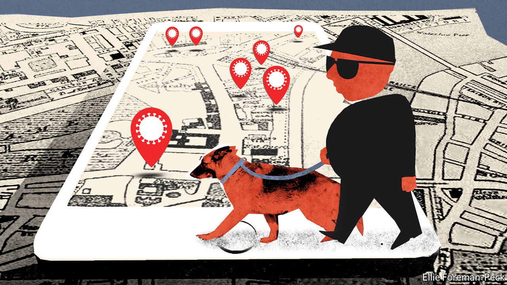

## Privacy be damned

# Some countries want central databases for contact-tracing apps

> Apple and Google say no

> Apr 30th 2020

Editor’s note: The Economist is making some of its most important coverage of the covid-19 pandemic freely available to readers of The Economist Today, our daily newsletter. To receive it, register [here](https://www.economist.com//newslettersignup). For our coronavirus tracker and more coverage, see our [hub](https://www.economist.com//coronavirus)

BY EARLY APRIL, as covid-19 spread around the world and lockdown gripped Europe, many of its governments had started building contact-tracing apps. They hoped to use smartphones to track people’s contact with each other, and to pinpoint who might have been infected. Apple and Google tried to help. They started working together to rewrite the Bluetooth protocols in their phones so that apps could gather contact data in the background, from both iPhones and Android devices, without interfering with the normal operation of the phone or running down its battery.

Building apps with that degree of interoperability and energy efficiency is vital if they are to help with the pandemic. Doing so is between hard and impossible without the new protocol. But it came with a catch. The plan from Apple and Google stated that contact data would be collected and stored privately on users’ own phones, decentralised in a way that makes it impossible to siphon it all into central government servers. Many European countries had already started building contact-tracing apps that collect data in a centralised manner. The Apple-Google update would do nothing for them. They were upset.

France’s digital minister, Cédric O, called for Apple to change its protocol to make it easier to build a “a sovereign European health solution”. The German government said it was pursuing a centralised approach, via an outfit in Berlin. Hans-Christian Boos, a member of Angela Merkel’s digital advisory council, said on April 17th that some “government leaders” would “explode in [Apple’s & Google’s] faces” if they did not get their way.

They did not get their way. On April 26th the German chancellery minister, Helge Braun, and health minister, Jens Spahn, announced that Germany’s contact-tracing app would use the Apple-Google decentralised system after all. Any explosion did little to sway the American companies.

In acquiescing, the Germans join the Swiss, Estonians and Austrians. All these countries have agreed to make their contact-tracing efforts decentralised. Others have yet to announce a decision. There are still holdouts, including Britain and France, which have not explained in any detail how they will get round the interoperability and battery-life issues, or why the centralised approach is needed when the decentralised one will do.

There is, of course, no general requirement for private firms to tune their products to the preferences of governments. A road-builder would not be expected to craft highways out of Gruyère simply because a democratically elected government asked it to. The Apple-Google decentralised protocol is the right choice when it comes to privacy. Once enabled, the centralised collection of contact data would have been open to abuse from less scrupulous governments. Yet the pandemic has highlighted the core role that digital systems play in human life. That important decisions about them seem to be made beyond the reach of democratic governance is worrying for some. For now, nations have more pressing matters to attend to. But having the terms of apps designed to help the public dictated to them by Silicon Valley is likely to irk many European governments. ■

Dig deeper:For our latest coverage of the covid-19 pandemic, register for The Economist Today, our daily [newsletter](https://www.economist.com//newslettersignup), or visit our [coronavirus tracker and story hub](https://www.economist.com//coronavirus)

## URL

https://www.economist.com/europe/2020/04/30/some-countries-want-central-databases-for-contact-tracing-apps
