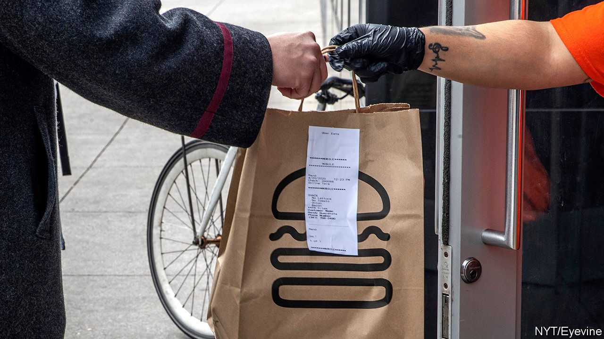

## Less than zero

# America’s cities and states face a cash crunch

> Help from the federal government and the Federal Reserve may be on the way

> May 2nd 2020WESTCHESTER COUNTY

Editor’s note: The Economist is making some of its most important coverage of the covid-19 pandemic freely available to readers of The Economist Today, our daily newsletter. To receive it, register [here](https://www.economist.com//newslettersignup). For our coronavirus tracker and more coverage, see our [hub](https://www.economist.com//coronavirus)

NO COUNTY IN New York, outside the city and Long Island, has seen more cases of covid-19 than Westchester, just north of the Bronx. For weeks tens of thousands of would-be commuters have been staying home. Bars, restaurants and other businesses have been closed.

Sales-tax revenue, usually around $500m, may be down by as much as $100m this year. With fewer people travelling, hotel-tax receipts will be lower. Meanwhile, spending on emergency and health services has soared. The county may face a shortfall of up to $160m on a $2.1bn annual budget. It can hope for at best limited help from the state of New York, which itself expects a 14% decline in revenue, due to lower corporate- and personal-income-tax receipts, requiring $7.3bn in spending cuts in the next budget. “We’ve done a variety of projections,” explains George Latimer, the county executive: “Bad, worse, even worse and totally horrible.”

Mr Latimer is not alone. Shortfalls have hit local governments across America—and not just in covid-battered places. Wyoming, for instance, claims to have around 400 confirmed cases, but may face a collapse in revenue of 30% over the next two years, driven by low oil prices and electricity demand (it is America’s leading coal-producing state). The National Association of Counties estimates that revenue declines and covid-related spending increases could take $144bn out of county budgets through the upcoming fiscal year. The Centre on Budget and Policy Priorities (CBPP), a left-leaning think-tank, reckons that states will face an even bigger shortfall, of $350bn, next year (see chart). The prospect of such shortfalls led investors to sell off municipal bonds in March, causing yields to rise sharply. Terrifying though these numbers are, there may also be grounds for hope.

Start with the horror. Most states begin their next fiscal year on July 1st. States and cities issue debt to fund long-term infrastructure projects, such as building hospitals or schools. But for the most part—because of a combination of constitutional requirement, statute and tradition—they must balance their budgets, and cannot use debt to fund operating costs. When revenues fall, therefore, states must cut spending or raise taxes. With so many people out of work, and uncertainty over whether and when consumer spending will return, states will want to keep tax increases minimal. That leaves only one alternative: deep spending cuts.

Anything remotely discretionary is probably imperilled, as is education, which was cut heavily after the 2007-09 crisis. Local governments may also have to start furloughing and firing people. High unemployment will make that especially painful. Chris Coons, a Democratic senator from Delaware who during the financial crisis ran his state’s most populous county, warns that municipal lay-offs could hit “employees processing unemployment cheques…or those who will be critical to retraining and placement of people unemployed now, or folks who provide critical community services.”

Fortunately, most states are in a better position than they were before the last recession. In mid-2019 tax revenues in every state but five had exceeded their pre-recession levels (commodity-dependent Wyoming and Alaska were among the exceptions). All states but four reported that they had collected more revenue in the year to July 2019 than expected.

Rainy-day funds also hit an all-time high, with the median covering 8% of general-fund expenditures. The healthy average, though, masks wide gaps. On the whole, western states appear in better shape than hard-hit north-eastern ones. New York’s kitty, for instance, is just 3.2% of general-fund expenditures; New Jersey’s and Pennsylvania’s are at 1% each. Drawing down around half of these funds would allow states to plug around $36bn of the shortfall. Federal aid passed to date has provided another $281bn.

More is probably coming. A Senate bill sponsored by Bob Menendez, a Democrat from New Jersey, and Bill Cassidy, a Republican from Louisiana, would disburse $500bn to state and local governments in proportion to their populations, revenue losses and number of covid-19 cases. Its chances of passing the Republican-controlled Senate are slim. But even Mitch McConnell, the majority leader—who at first suggested that states be allowed to go bankrupt—concedes that cities and states will probably receive more federal funds.

In order to calm the bond market, the Federal Reserve has said it will buy up to $500bn of state and local debt. On April 27th it amended its programme to include more states and cities. It now plans to buy investment-grade bonds issued by states and counties with a population of at least 500,000, and cities with a population of at least 250,000. That excludes smaller places, but lets states and counties use the proceeds of their sales to the Fed to help smaller entities.

Investors hope the combination of federal loans and aid can keep bond markets stable. Geoffrey Schechter of MFS Investment Management believes that a wave of defaults is unlikely: “states and local governments recognise they need access to capital markets.” An uncertain couple of months, followed by a lean few years: cautious optimism in a pandemic.■

Dig deeper:For our latest coverage of the covid-19 pandemic, register for The Economist Today, our daily [newsletter](https://www.economist.com//newslettersignup), or visit our [coronavirus tracker and story hub](https://www.economist.com//coronavirus)

## URL

https://www.economist.com/finance-and-economics/2020/05/02/americas-cities-and-states-face-a-cash-crunch
