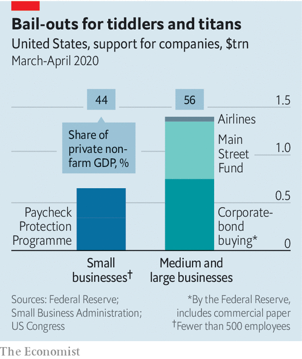

## Big bucks

# America’s large firms can count on generous government support

> But there are strings attached

> May 2nd 2020

Editor’s note: The Economist is making some of its most important coverage of the covid-19 pandemic freely available to readers of The Economist Today, our daily newsletter. To receive it, register [here](https://www.economist.com//newslettersignup). For our coronavirus tracker and more coverage, see our [hub](https://www.economist.com//coronavirus)

BAIL-OUTS ARE often a source of public ire. Americans still seethe over the rescue of banks during the crisis of 2007-09 even as homeowners went bust. The latest group in the spotlight are big firms masquerading as small ones. Companies including Shake Shack, a listed burger franchise, and Potbelly, a meaty sandwich chain, have returned funds granted to them under the $659bn Paycheck Protection Programme (PPP), a scheme primarily designed to help small firms keep employees on their payroll during the pandemic.

Big businesses have facilities of their own to tap. A “Main Street Lending Fund” will soon dispense a total of $600bn to firms with up to 10,000 employees. The Federal Reserve has set aside $750bn to buy corporate bonds.

At first glance the support might appear more generous than the cash set aside for small firms, even when you adjust for their contributions to economic activity (see chart). But the big-company schemes differ from PPP in a crucial aspect: they are loans, and must eventually be repaid. By contrast, the minnows can keep PPP funds, as long as they retain workers.

The big firms receiving the most aid are those requiring specific bail-outs. The government will spend $50bn to keep America’s airlines aloft. But that too comes with conditions. Carriers have agreed to keep staff until October, cut executive pay and halt shareholder payouts until late 2021. The more generous the aid, the more strings attached.■

Dig deeper:For our latest coverage of the covid-19 pandemic, register for The Economist Today, our daily [newsletter](https://www.economist.com//newslettersignup), or visit our [coronavirus tracker and story hub](https://www.economist.com//coronavirus)

## URL

https://www.economist.com/finance-and-economics/2020/05/02/americas-large-firms-can-count-on-generous-government-support
