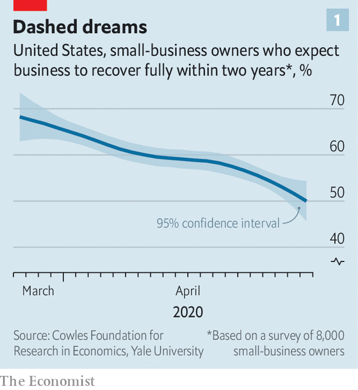
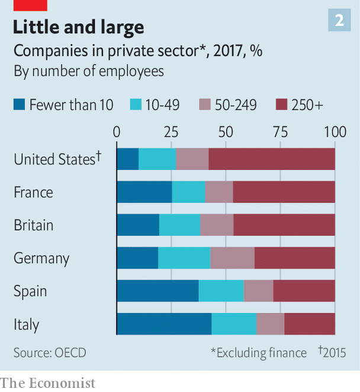

## Averting nightmare on Main Street

# Politicians in America and Europe scramble to help small firms

> But their schemes are meeting with mixed success

> May 2nd 2020WASHINGTON, DC

Editor’s note: The Economist is making some of its most important coverage of the covid-19 pandemic freely available to readers of The Economist Today, our daily newsletter. To receive it, register [here](https://www.economist.com//newslettersignup). For our coronavirus tracker and more coverage, see our [hub](https://www.economist.com//coronavirus)

RANDY HATHCOCK appeared to be out of options. The time had come for the owner of H&T Truss Mill, a construction company in Arkadelphia, Arkansas, to decide how many of his 16 employees to sack. The pandemic had led to orders drying up. Then a lifeline appeared. The Paycheck Protection Programme (PPP), a scheme administered by America’s Small Business Administration, promised enough to cover two-and-a-half months of wages. It was “an answer to our prayers”, says Mr Hathcock. If he retains his staff for two years, the $161,200 loan turns into a grant.

Voters abhor bail-outs when they involve airlines and Wall Street, but seem altogether happier to provide succour to the likes of Mr Hathcock and Main Street. Politicians in America and Europe have all the more reason to help: small and medium-sized businesses (SMEs) have been clobbered by the pandemic, even more so than their larger peers. Fully 60% of people who worked for businesses with fewer than ten employees in America at the start of the year have since been fired, according to one study. In Britain, seven in ten firms managed by their owners say they have lost over half their revenue.

Even as the share prices of listed titans have perked up—the S&P 500 index of large American stocks is up by 31% since its nadir on March 23rd—small firms are becoming ever more uncertain about their prospects. Most have cash buffers that stretch to weeks, not years. Roughly half of American entrepreneurs do not expect business to recover within two years, according to a survey by academics at Oxford, Princeton and Yale universities (see chart 1).

Schemes like the PPP should help. But rich-country bail-out schemes that were put together in a rush are experiencing sharp teething pains. As a result, lifelines that are generous on paper have been less so in practice. Aid has not reached the most distressed firms, and has been hogged by larger SMEs savvy enough to navigate the bail-out bureaucracy, if not by even bigger businesses (see [article](https://www.economist.com//finance-and-economics/2020/05/02/americas-large-firms-can-count-on-generous-government-support)).

America and Europe have adopted similar strategies to preserve the fabric of their economies. First help SMEs cut cash outgoings quickly, for example by delaying tax deadlines or even reversing past payments. Then find ways to lend or grant cash so that companies make it through the lockdown.

In Europe, the fastest way for businesses to cut costs has been to lay off workers temporarily. Britain and all members of the European Union now have temporary-unemployment schemes that allow firms to cut staff hours, sometimes to zero. Workers receive benefits in lieu of most of their salary. When lockdowns are lifted, they will go back to their old jobs. That limits the disruption to both their livelihoods and their employers’ prospects.

Such short-time working schemes, which originated in Germany and spread continent-wide after the global financial crisis, were once the purview of big firms, says Stefano Scarpetta of the OECD, a policy adviser to rich countries. Now they have been opened to SMEs. The take-up has been rapid. Nearly 11m French workers, or roughly half the salaried workforce, are temporarily unemployed. In Germany, more than 700,000 firms have applied.

America has no such federal scheme (though some states have smaller programmes in place). Hence the PPP. But the $349bn originally allocated to the programme ran out just 13 days after it was launched on April 3rd. On April 27th a further $310bn approved by Congress became available; the demand crashed the Small Business Administration’s systems. “It’s been all hands on deck trying to get the loans approved,” says Darrin Williams, the boss of Southern Bancorp, a Mississippi-delta lender, which helped unlock the PPP riches for Mr Hathcock. Even once firms’ applications have been approved, delays in receiving the cash are common.

European countries have also looked to direct cash to small firms—and faced similar delays. In Britain, Germany and Italy, among others, the smallest firms (or self-employed workers) have received handouts reasonably promptly. Bigger SMEs are entitled to low-interest loans, typically covering three months of payroll. Doling these out has proved tricky.

To ensure the money did not end up going to businesses with no hope of paying it back, bankers were roped in to assess potential recipients. Governments agreed to shoulder 70-90% of potential loan losses, limiting the downside for banks. Still, lending figures have underwhelmed. In Spain after five weeks only €13.4bn ($14.6bn) out of €100bn in state guarantees earmarked for SMEs have been tapped. Britain managed to allocate a meagre £4.1bn ($5.1bn) by April 28th. From early May it will join Germany in offering some loans that are completely underwritten by the state. Bankers can distribute cash without having to worry about the creditworthiness of the borrower.

There will still be suspicions that the money is flowing into the wrong pockets. A study by researchers at the University of Chicago finds that SMEs in the bits of America where activity had fallen most were only half as likely to receive PPP funds as those in the least-disrupted places.

In Europe, finding ways to help SMEs is economically essential. Nearly half of workers toil in firms with fewer than 50 employees (see chart 2). But many of the most troubled companies are in Spain or Italy, which have been hit especially hard by covid-19, and where governments have little fiscal space to fund large-scale bail-outs. That imbalance has raised complaints that firms in the European Union do not really compete in a single market.

Given the rush, it is perhaps not much of a surprise that neither America’s nor Europe’s schemes have achieved all that policymakers hoped. Europe’s short-timework schemes will preserve employment—but at huge cost, and at the risk of keeping employees in jobs that ought to disappear. America is now dishing out money more decisively, but unemployment there has soared (see [Free Exchange](https://www.economist.com//finance-and-economics/2020/05/02/why-the-unemployed-in-america-could-face-a-lost-decade)), in no small part owing to Main Street’s woes. Back in January, roughly half of all small firms had at least three employees on their books. By April, a similar share had none. ■

Dig deeper:For our latest coverage of the covid-19 pandemic, register for The Economist Today, our daily [newsletter](https://www.economist.com//newslettersignup), or visit our [coronavirus tracker and story hub](https://www.economist.com//coronavirus)

## URL

https://www.economist.com/finance-and-economics/2020/05/02/politicians-in-america-and-europe-scramble-to-help-small-firms
