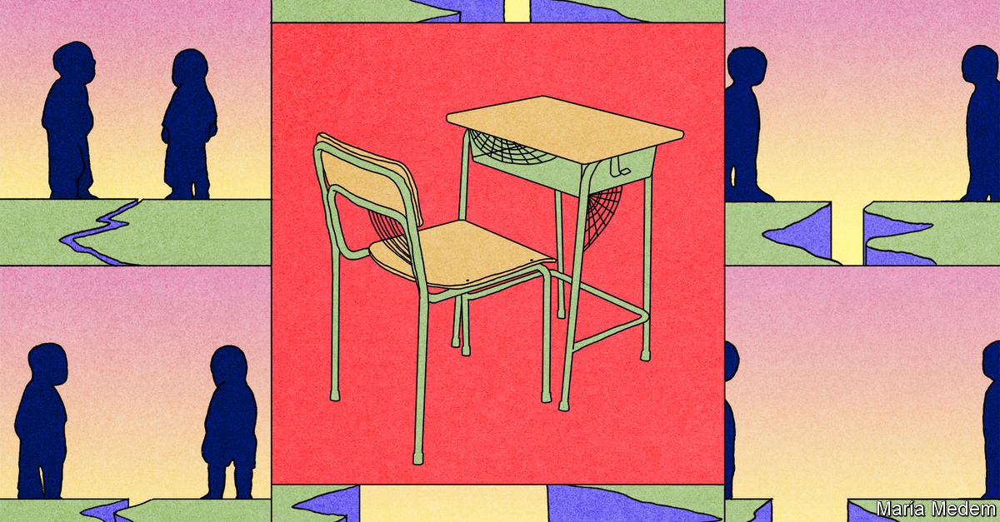
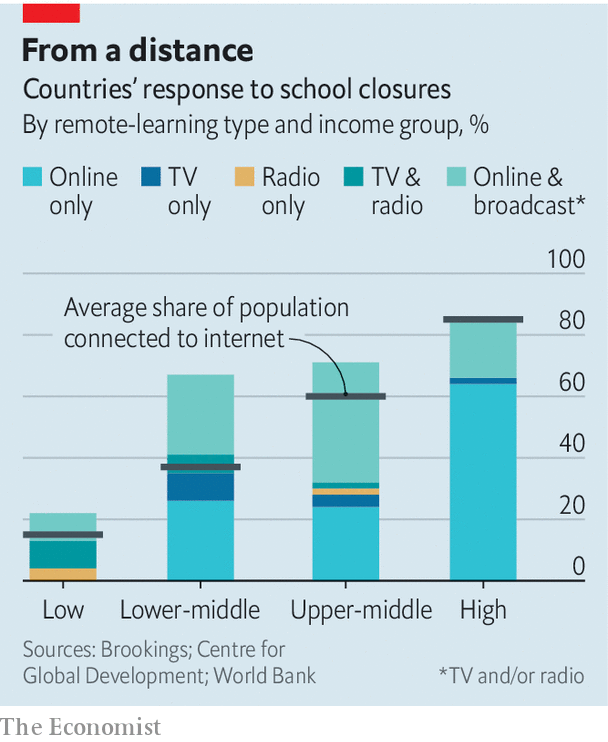

## No more pencils, no more books

# Closing schools for covid-19 does lifelong harm and widens inequality

> Primary schools in particular are vital to social mobility

> Apr 30th 2020AMSTERDAM

Editor’s note: The Economist is making some of its most important coverage of the covid-19 pandemic freely available to readers of The Economist Today, our daily newsletter. To receive it, register [here](https://www.economist.com//newslettersignup). For our coronavirus tracker and more coverage, see our [hub](https://www.economist.com//coronavirus)

IN THE STREETS of Amsterdam children spend the “corona holiday” whizzing around on scooters; their peers in Madrid are mostly stuck at home with video games; those in Dakar look after younger siblings. The one place they are not is at school. Over three-quarters of the world’s roughly 1.5bn schoolchildren are barred from the classroom, according to UNESCO, a UN agency. In most of China and in South Korea they have not darkened school doors since January. In Portugal and California they will not return before September.

Schools have striven to remain open during wars, famines and even storms. The extent and length of school closures now happening in the rich world are unprecedented. The costs are horrifying. Most immediately, having to take care of children limits the productivity of parents. But in the long run that will be dwarfed by the amount of lost learning. Those costs will fall most heavily on those children who are most in need of education. Without interventions the effects could last a lifetime.

For these reasons Singapore in 2003 cut its month-long June holiday by two weeks to make up for a fortnight of school closures during the SARS epidemic. Closing schools even briefly hurts children’s prospects. In America third-graders (seven-year-olds) affected by weather-related closures do less well in state exams. French-speaking Belgian students hit by a two-month teachers’ strike in 1990 were more likely to repeat a grade, and less likely to complete higher education, than similar Flemish-speaking students not affected by the strike. According to some studies, over the long summer break young children in America lose between 20% and 50% of the skills they gained over the school year.

Closures will hurt the youngest schoolchildren most. “You can make up for lost maths with summer school. But you can’t easily do that with the stuff kids learn very young,” says Matthias Doepke of Northwestern University. Social and emotional skills such as critical thinking, perseverance and self-control are predictors of many things, from academic success and employment to good health and the likelihood of going to jail. Whereas older children can be plonked in front of a computer, younger ones learn far more when digital study is supervised by an adult.

Then there are those who are missing crucial exams. Germany is reopening schools for final-year high-school students who face exams soon. But most countries are not willing to do that. China has postponed its Leaving Certificate exam (gaokao) until July. Britain and France have cancelled this year’s exams. Grades will in part be decided by teachers’ predictions of how a student might have performed. This fuels fears about inequality, as some experts worry teachers unconsciously discriminate against disadvantaged children and give them unfairly low marks.

Statistics Norway estimates “conservatively” that the country’s educational shutdowns—from crèches to high schools—are costing NKr1,809 ($173) per child each day. Most of that is an estimate of how much less today’s schoolchildren will earn in the future because their education has been disrupted. (It is assumed they are learning roughly half of what they normally would.) The rest is lost parental productivity today.

Of course schooling has not stopped completely, as it does during holidays. Nearly nine in ten affected rich countries are providing some form of distance-learning (compared with fewer than one in four poor countries). But video-conferencing has its limits. For poorer children, internet connections may be ropey. Devices may have to be shared and homes may be overcrowded or noisy. Of the poorest quarter of American children, one in four does not have access to a computer at home.

Less well-off children everywhere are less likely to have well-educated parents who coax them to attend remote lessons and help them with their work. In Britain more than half of pupils in private schools are taking part in daily online classes, compared with just one in five of their peers in state schools, according to the Sutton Trust, a charity (private schools are more likely to offer such lessons). In the first weeks of the lockdown some American schools reported that over a third of their students had not even logged in to the school system, let alone attended classes. Meanwhile, elite schools report nearly full attendance and the rich have hired teachers as full-time tutors.

Ashley Farris, an English teacher at KIPP high school in Denver, Colorado, says several of “her” kids are virtual truants. Her school worked hard to get students computers and Wi-Fi access, but the digital gap is only part of the story. Some must work to make up for parents’ lost wages. Others must look after younger siblings.

Closures in Britain could increase the gap in school performance between children on school meals (a proxy for economic disadvantage) and those not on school meals, fears Becky Francis of the Education Endowment Foundation, another charity. Over the past decade the gap, measured by grades in tests, has narrowed by roughly 10%, but she thinks school closures could, at the very least, reverse this progress. At least over summer, teachers are not on tap for anyone. In the current lockdown some students can still quench their thirst for education not just with highly educated parents but also with teachers; others will have access to neither.

Primary school is normally a crucial opportunity for gaps that emerged in early-years development to start narrowing, or at least to stop widening. That opportunity is now being missed. For a glimpse of the cost to the unluckiest young children, consider the Perry pre-school project of the 1960s, a study conducted in Ypsilanti, Michigan, which found that a control group of young children from disadvantaged backgrounds who did not attend pre-school suffered lifelong consequences.

Mr Doepke estimates that by the autumn the sizeable group of American children whose learning loss started when schools closed might have lost as much as a year’s learning. Since every year of education is associated with an increase in annual earnings of roughly 10%, the consequences for those children become clear. “I fear we will see further inequality and less social mobility if nothing is done,” he adds.

What can be done to limit the costs? Finland started distance learning only when it was satisfied that almost every child would be able to take part. South Korea extended its school holiday to prepare teachers and distribute devices where needed. “For my school of 1,000 students, just 13 borrowed tablets because they had several siblings in their house,” says Hyunsu Hwang, an English teacher at Inmyung Girls High School, in Incheon. Teachers now use a mixture of real-time interactive classes, pre-recorded material and homework-based digital classes. When schools began to reopen on April 9th, official attendance was 98%.

School systems where children are used to having to teach themselves will do better, reckons Andreas Schleicher of the OECD, a club of rich countries. “The real issue is if you’ve been spoon-fed by a teacher every day and are now told to go it alone, what will motivate you?” In Estonia and Japan students are used to “self-regulated activities”; across the OECD the share is nearly 40%. But in countries such as France and Spain, such autonomy is rare.

In the end, the only way to ensure all children get an education is to reopen the doors. At the Alan Turing primary school in Amsterdam, it quickly became clear that 28 of its 190 pupils could not take part in online classes. The school now opens its doors for 15 from this group three mornings a week and has found other ways to help the remaining 13, such as arranging for them to get assistance from their neighbours. “At first it felt like we were doing something illegal,” says Eva Naaijkens, the headmistress, “but how can you accept a situation where a number of children just drop out?” She estimates that, working remotely, her teachers can impart perhaps 40% of the education they would normally.

As well as letting final-year secondary-school students facing exams resume classes, Denmark has also begun to reopen crèches and primary schools. It has made a priority of the very young for several reasons. The early stage of learning is crucial. The burden toddlers place on parents is heavy. And the risk of young kids getting or spreading the virus appears low.

Around the world many parents will be hoping their children’s schools can also safely reopen soon. Some children may have mixed feelings about swapping extra Xbox time for geography lessons. Tough luck: holidays have to end sometime. For the future well-being of whippersnappers scooting around the streets of Amsterdam, it is good news that Dutch primary schools will partially reopen on May 11th.■

Dig deeper:For our latest coverage of the covid-19 pandemic, register for The Economist Today, our daily [newsletter](https://www.economist.com//newslettersignup), or visit our [coronavirus tracker and story hub](https://www.economist.com//coronavirus)