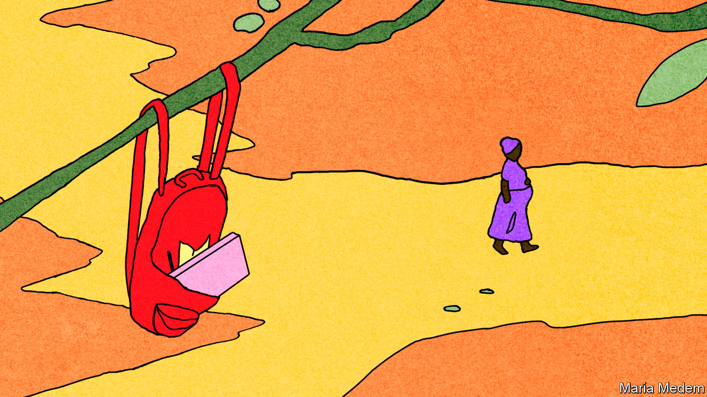

## The classless society

# School closures: lessons from the Ebola pandemic

> Children in west Africa were badly hurt when classes were cancelled in 2014

> Apr 30th 2020

SIX YEARS ago Rosaline Margai’s secondary-school education came to a halt just as it was about to begin. In 2014-15 schools in Sierra Leone were closed for nine months because of the Ebola outbreak in west Africa. Six years later her schooling has again been interrupted. Covid-19 has caused Sierra Leone to close its schools and to cancel or postpone exams. Ms Margai was determined to start college by the age of 17. “I will turn 17 soon,” she explains. “But I fear I will not be able to take exams in time.”

Across west Africa memories of the devastation caused by Ebola and the school shutdowns are still fresh. Education for 5m children was severely disrupted. The luckiest met sporadically in small groups in homes. Others listened to government-provided education programmes by radio. But for many, learning stopped altogether.

Children were more likely to go to work. Sexual exploitation increased. Unplanned teen pregnancies rose sharply. “When you live in a country that already struggles to keep kids in school, and then schools are closed and poverty goes through the roof, you quickly become a candidate for child labour,” says Hani Mansourian of UNICEF, the UN’s children’s agency. He worries about a similar dynamic now; with the government overstretched, it is easier for employers to hire cheap young labour.

In 2014 school closures crimped many essential services, such as nutrition and health programmes, information on disease prevention, and access to clean water and sanitation. According to UNICEF, nearly 1m children in Liberia were not immunised that year.

When schools did reopen, many pupils did not return. Sierra Leone’s government banned “visibly pregnant girls” from school. In a survey in 2015 of adolescent girls asked why they were not in secondary school, “my parents cannot afford it” soared as a reason, recalls Tom Dannatt of Street Child, a British charity. Ms Margai remembers many kids dropping out: “Their parents would say ‘there is no need to be in school any more.’”

The current crisis is in some ways worse. During the Ebola outbreak, clubs for girls in some places provided education and support: those attending were less likely to get pregnant than those in similarly affected areas without such groups. Social distancing means that such efforts will be hard to replicate now. Mr Mansourian fears that the long-term consequences of covid-19 in low- and middle-income countries will be “much more dire” than Ebola was in west Africa.

Though it was terrible for children overall, Ebola did have the good effect of highlighting the flaws in west African education systems. It galvanised efforts to improve schooling, increase education budgets and reduce classroom crowding. “Whilst it seems early—and almost grim—to be thinking of it now,” says Mr Dannatt, “we should also absolutely be looking at how we can reopen education on a new level after the crisis.”

## URL

https://www.economist.com/international/2020/04/30/school-closures-lessons-from-the-ebola-pandemic
