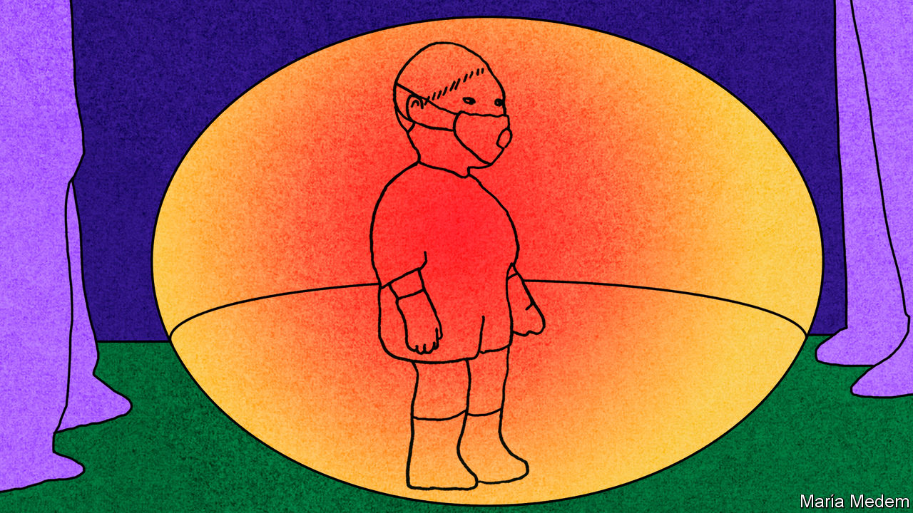

## Think of the children

# The young seem to be less likely to catch or pass on covid-19

> That boosts arguments for reopening schools

> May 2nd 2020

Editor’s note: The Economist is making some of its most important coverage of the covid-19 pandemic freely available to readers of The Economist Today, our daily newsletter. To receive it, register [here](https://www.economist.com//newslettersignup). For our coronavirus tracker and more coverage, see our [hub](https://www.economist.com//coronavirus)

WHEN COVID-19 began spreading in January, parents everywhere were terrified. Respiratory bugs thrive in children; this one kills. But children infected with the new coronavirus have had mild symptoms or none at all and deaths have been rare, says a review of nearly 80 studies published on April 22nd by an international network of child-health experts.

Whether children spread covid-19 has been less clear. Experts feared they could be easily infected but show no symptoms and so spread the disease to adults. Children pass on flu more than adults. They are more likely to catch it than adults who have some immunity from previous bouts. They are in close contact with their peers. So closing schools can slow flu epidemics.

But several studies now suggest that children are no more easily infected by covid-19 than adults, maybe less so. The most reliable ones have traced the contacts of infected people, tallying the infections in children and adults stemming from each “patient zero”. Two studies from China have just appeared in Science and the Lancet. One found similar infection rates; the other, in a different province, found that children were less susceptible.

Less conclusive studies also suggest children may be less vulnerable. In Vo, an Italian town where almost the entire population of 3,000 was tested for infection twice during its outbreak, none of the 234 children under ten was infected, compared with 1-3% of the population as a whole. In Stockholm, however, where over 700 people were tested once, 2.8% of those aged between two and 15 were infected, compared with 2.5% of the whole group.

These studies may miss infections in children who recover quickly. To catch all infections—and track when they ripple through each age group—requires frequent testing for both active infections and antibodies (the footprints of past infection), says Andrew Lover of the University of Massachusetts. Antibody-tracking studies have begun in Germany, the Netherlands and elsewhere. The first round of the Dutch study, of more than 2,000 people, found that about 2% of those under 20 had been infected, against 4.2% of those over 20. Rates among younger children were lower than among older ones.

According to the European Centre for Disease Prevention and Control, child-to-adult transmission “appears to be uncommon”. Researchers tracing chains of infections in Iceland and the Netherlands have found no cases of children infecting their families. Their samples are small but their observations chime with data from China.

But almost all these studies were done when schools were closed; most countries shut them early in the pandemic. A few recent studies have tried to disentangle the contribution of schools—with mixed results. In one French town with a covid outbreak linked to a secondary school, a study with antibody tests found that 41% of staff and students at the school had been infected, compared with 11% of their family members. A report from New South Wales in Australia that tracked close contacts of 18 infected students and teachers in 15 primary and secondary schools, however, found that of the 735 students and 128 staff, only two children contracted the disease from the initial cases. No staff member was infected. But attendance at the time was low because parents had been encouraged to keep their kids at home. More evidence will emerge as schools reopen. But so far children do not seem to be the stealthy super-spreaders once feared. ■

Dig deeper:For our latest coverage of the covid-19 pandemic, register for The Economist Today, our daily [newsletter](https://www.economist.com//newslettersignup), or visit our [coronavirus tracker and story hub](https://www.economist.com//coronavirus)