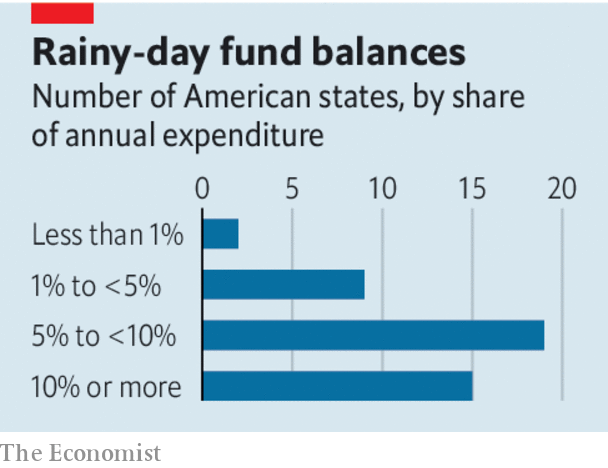

## State finances

# Congress, not the Fed, should bail out America’s state and local governments

> The federal government can provide disaster relief without underwriting profligacy

> Apr 30th 2020

FOR MOST governments the pandemic is expensive. For America’s states, counties and cities, which provide the bulk of the country’s basic government services, it is a budgetary cataclysm. Lockdowns are depriving them of tax revenues just as they must spend more on public health, threatening budget shortfalls of more than one-quarter of annual revenues (see [article](https://www.economist.com//finance-and-economics/2020/05/02/americas-cities-and-states-face-a-cash-crunch)). Investors have been dumping their bonds, making it harder to borrow. And many states are in any case required by their constitution or by law to balance their budgets, or forbidden from borrowing at all. As a result many have been drawing up plans to slash spending and lay off workers just when their services are in high demand and the economy is shrinking.

The states do have some cash stashed away for a rainy day. They have built up funds worth 8% of their annual routine spending, on average. Yet that will not be nearly enough for today’s deluge, and in any case it is unevenly distributed. In 11 states, including hard-hit New York, rainy-day funds are less than 5% of spending. Infusions from the federal government are therefore the only way to avoid ill-timed austerity. The states could need as much as $650bn (3% of GDP) to cope with the economic crash—and more to help them fight the pandemic.

Help has so far been lacking. Congress has provided about $280bn and on April 22nd Mitch McConnell, the Republican leader of the Senate, suggested that states be allowed to go bankrupt (a route available to cities but not states). He has since walked back his statement, but President Donald Trump and many Republicans, complaining of poor government in Democrat-run states, say they do not want to reward recklessness.

Their concerns are not empty. Many states have vast unfunded pension liabilities. In Connecticut, Illinois and California pension costs threaten to eat up over 10% of annual revenues. The problem is not limited to Democratic-leaning areas. In Mr McConnell’s state, Kentucky, one pension plan is only a sixth funded. It would be costly to create the impression that Congress will, in a downturn, bail out states and cities who live precariously. When local-government finances were shot in the 1830s, the federal government stayed on the sidelines for this reason. It was reluctant to intervene when New York City almost went bankrupt in the 1970s. But the pandemic is not the result of any state’s profligacy. Americans often share disaster risks nationally. Congress steps in when hurricanes or tornadoes strike. Making up tax shortfalls during lockdowns would benefit all states, not only those with extravagant pensions or bad management.

While Congress fails to act decisively, fighting the crisis has been left to the Federal Reserve. It is offering up to $500bn in loans to states, counties and cities. On April 27th it expanded eligibility to a total of 256 entities with sufficiently large populations and—at least until recently—high credit ratings.

The Fed’s loans, however, are both inadequate and undesirable. They are inadequate because bans on borrowing will restrict their uptake. They are undesirable because central banks are meant to be guardians of the financial system, not vehicles for disaster relief. The appeal of using the Fed is that it can act fast and keep costs off the government’s balance-sheet. Its $500bn of loans is underwritten by just $35bn provided by Congress to protect it against defaults. But the Fed cannot be indemnified against political risks. Its claims on state and local taxpayers will compete with those of pensioners and public-sector workers—an awkward position for an institution tasked with remaining above the fray. And the Fed has been insufficiently clear that its actions are in response to an extraordinary health emergency, rather than the new normal for fighting economic crises. That raises the risk of moral hazard.

Better for Congress to stump up. A bipartisan proposal to give a $500bn grant to states and local governments lies before lawmakers. Mr McConnell and his colleagues should pass it.■

## URL

https://www.economist.com/leaders/2020/04/30/congress-not-the-fed-should-bail-out-americas-state-and-local-governments
