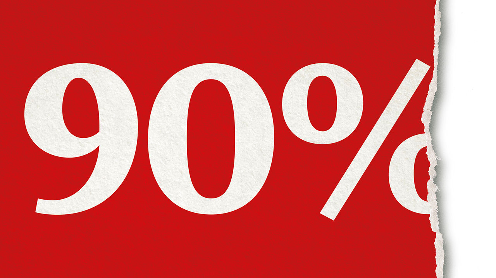

## The 90% economy

# Life after lockdowns

> It will be hard in ways that are difficult to imagine today

> Apr 30th 2020

Editor’s note: The Economist is making some of its most important coverage of the covid-19 pandemic freely available to readers of The Economist Today, our daily newsletter. To receive it, register [here](https://www.economist.com//newslettersignup). For our coronavirus tracker and more coverage, see our [hub](https://www.economist.com//coronavirus)

IN MANY THINGS 90% is just fine; in an economy it is miserable, and China shows why. The country started to end its lockdown in February. Factories are busy and the streets are no longer empty. The result is the 90% economy. It is better than a severe lockdown, but it is far from normal. The missing bits include large chunks of everyday life. Rides on the metro and on domestic flights are down by a third. Discretionary consumer spending, on such things as restaurants, has fallen by 40% and hotel stays are a third of normal. People are weighed down by financial hardship and the fear of a second wave of covid-19. Bankruptcies are rising and unemployment, one broker has said, is three times the official level, at around 20%.

If the post-lockdown rich world suffers its own brand of the 90% economy, life will be hard—at least until a vaccine or a treatment is found (see [Briefing](https://www.economist.com//briefing/2020/04/30/the-90-economy-that-lockdowns-will-leave-behind)). A plunge in GDP in America of anything like 10% would be the largest since the second world war. The more suffering covid-19 causes, the more profound and enduring its economic, social and political effects are likely to be.

How lockdowns ease will itself affect the scale of economic damage. For instance, the cost-benefit calculus points towards opening schools first (see [article](https://www.economist.com//leaders/2020/04/30/when-easing-lockdowns-governments-should-open-schools-first)). But, however sensibly restrictions are eased, powerful forces will hold economies back.

For a start, leaving lockdown is a process, not an event. Even when the worst is over, cases ebb slowly. A month after Italy’s deaths peaked at about 900 a day, the toll is still over 300. With the virus still present, some social distancing is bound to stay.

A second reason is uncertainty. After lockdowns cease, much about the disease will remain unknown, including the chances of a second peak, whether immunity endures and the prospects for a vaccine or a cure. This inhibits those who fear the disease. Even as some states ease social distancing, a third of Americans say they would be uncomfortable visiting a mall. When Germany allowed small shops to open last week customers stayed away. Danes under lockdown cut household spending on services, such as travel and entertainment, by 80%. Danish economists reckon that people in next-door Sweden, which didn’t lock down, cut spending by about as much.

Many businesses will emerge from lockdown short of money, with strained balance-sheets and facing weak demand. In a survey for Goldman Sachs, almost two-thirds of American small-business owners said that their cash would run out in under three months. In Britain the share of commercial tenants who have fallen behind on their rent has risen by 30 percentage points. This week the boss of Boeing warned that air travel would not match the level of 2019 for two or three years. Investment, which accounts for roughly a quarter of GDP, will fall, not just to conserve cash, but also because risk cannot be priced (one reason to think a recent stockmarket rally has weak foundations).

Struggling firms will deepen people’s financial worries. Over a third of respondents in America told Pew Research that, if they lost their main source of income, their savings, new borrowings or the sale of assets would sustain them for no more than three months. Because the hardest-hit industries in the 90% economy employ a lot of low-wage people, joblessness will be high and casual work hard to come by. Even now in Europe’s five largest economies, over 30m workers, a fifth of the labour force, are in special schemes where the state pays their wages. These can be generous, but nobody knows how long they will last.

The economy will also suffer from scarring. Firms that adapt to covid-19 by cutting costs and finding new ways of working may increase productivity. But if people mix less after lockdowns lift or if they are idle for months on end, they will become detached from professional networks and may lose skills. America’s unemployed could face a lost decade (see [Free exchange](https://www.economist.com//finance-and-economics/2020/05/02/why-the-unemployed-in-america-could-face-a-lost-decade)). Government schemes will save businesses in the short term, which is welcome. But those designed to preserve jobs risk eventually creating zombie firms that neither thrive nor go bankrupt, slowing the recycling of labour and capital.

The longer the world has to endure a 90% economy, the less likely it is to snap back after the pandemic. After the Spanish flu a century ago and SARS almost two decades ago, the overwhelming desire was for life to return to normal. But neither had such a large economic effect as covid-19, and citizens’ expectations of government were more modest in 1918 than they are today.

A deep, long recession will stoke anger, because the pandemic has held up an unflattering mirror to rich societies. Ill-run care homes for the elderly, high rates of death among minorities, the extra demands holding back working women and, especially in America, health care that is hard to reach for many, will all lead to calls for reform. So might the realisation that an unfair burden has fallen on ordinary people. Americans earning less than $20,000 a year are twice as likely to have lost their job to covid-19 as someone earning over $80,000. Much will depend on how fast they are rehired.

The popular demand for change could radicalise politics faster than it did after the financial crisis in 2007-09. The task for those who believe in open markets and limited government is to ensure that this energy is channelled towards the right sort of change. If the pandemic lowers the barrier to reform it will offer a rare chance to recast the social contract to favour those who have been shut out, and to peg back those who today enjoy entrenched privileges through the tax system, education and regulation. Perhaps the pandemic will enhance a sense of national and global solidarity. Perhaps the success of countries like Germany and Taiwan that have dealt with the disease thanks to strong institutions will contrast with places where populist showmen have spent their time theatrically deriding expertise.

Yet that may prove to be wishful thinking. In the next 18 months everyone with an agenda will argue that the pandemic proves their point. After 2007-09 politicians failed to deal with the grievances of ordinary people and the demand for change led to a surge in populism. The 90% economy threatens even greater suffering. The anger it creates may end up feeding protectionism, xenophobia and government interference on a scale not seen in decades. If, like this newspaper, that is an outcome you would reject, it is time to start arguing for something better. ■

Dig deeper:For our latest coverage of the covid-19 pandemic, register for The Economist Today, our daily [newsletter](https://www.economist.com//newslettersignup), or visit our [coronavirus tracker and story hub](https://www.economist.com//coronavirus)